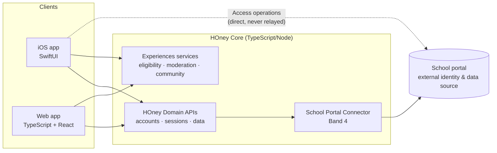
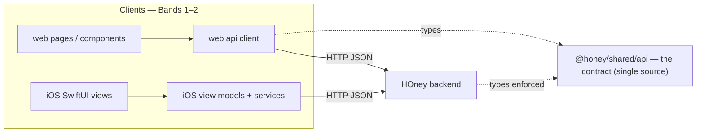

# HOney

**HOney** is a student companion app (iOS + Web) for daily school life: your timetable at a
glance, campus gate access from your phone, and **Experiences** — an anonymous, verified peer
community about lessons, teachers, classrooms and canteen food.

The school's official portal stays what it is: the source of identity and timetable data. HOney
owns everything on top — its own accounts, normalized data, derived state and community — so the
product works even when the portal is slow, down, or logged out.

> Status: **V1 ground-up rebuild in progress.** Spec-driven; see
> [`docs/honey_master_spec_v1.md`](docs/honey_master_spec_v1.md) (the source of truth) and
> [`docs/decisions-2026-08-31.md`](docs/decisions-2026-08-31.md) (binding product refinements).

## What V1 ships

| Surface | Modules |
|---|---|
| **iOS** (Swift) | Home · Experiences · Timetable (Day view) · **Access** (direct-to-school gate control) |
| **Web** (TypeScript) | Home · Experiences · Timetable (+ admin dashboard; Access is capability-gated) |
| **Backend** (TypeScript/Node) | HOney accounts & sessions · school-portal connector · normalized timetable/history · Experiences community with anonymous, fail-closed moderation |

Deliberately **not** in V1: exams, week-view timetables, rankings, AI summaries, scalar ratings of
any human (only canteen dishes can carry a 1–5), or any server relay for Access operations.

## Architecture

Four responsibility bands, one-way dependencies (spec §1.5): a UI redesign must never force a
backend rewrite, and domain rules never live in view components.



Key properties:

- **One login.** A school account is the only credential; a successful school login provisions or
  reconnects your HOney account. HOney, native-portal and WebView sessions stay independent —
  portal expiry never signs you out of HOney.
- **Zero manual re-login.** Normal portal token expiry is recovered silently (device-held
  credentials; single-flight re-auth; safe reads replay once, physical actions never do).
- **Anonymous by architecture.** Public experiences store **no author field**; eligibility uses
  one-time unlinkable credentials; moderation passes bind to content hashes, not people; users
  keep a device-held ownership key to revoke their own posts.
- **Fail-closed moderation, fast.** A deterministic policy engine + a narrowly-scoped LLM feature
  extractor issue signed publication passes; publication is async so the user never waits on a
  spinner. If moderation is unavailable, nothing publishes (drafts stay private) — never
  publish-first-review-later.

Per-stage documentation lives in [`docs/architecture/`](docs/architecture/):

| Stage | Doc | What it covers |
|---|---|---|
| M0 | [`m0-foundation.md`](docs/architecture/m0-foundation.md) | Monorepo layout, toolchain, CI |
| M1 | [`m1-portal-connector.md`](docs/architecture/m1-portal-connector.md) | Portal auth state machine, endpoints, failure matrix |
| M2 | [`m2-honey-core.md`](docs/architecture/m2-honey-core.md) | Accounts, sessions, consent, data API |
| ★ | [`canonical-school-data.md`](docs/architecture/canonical-school-data.md) | **Canonical school data** — Subject · Course · Class section · Lesson · Topic, the import resolver, real fixtures, dev reset |
| M3 | [`m3-experiences.md`](docs/architecture/m3-experiences.md) | Anonymity model, entities, ops |
| ★ | [`moderation-pipeline.md`](docs/architecture/moderation-pipeline.md) | **The moderation pipeline** — layers, LLM constraints, pass mechanics |
| M5 | [`m5-web-and-deploy.md`](docs/architecture/m5-web-and-deploy.md) | Web app, admin dash, deploy |
| — | [`acceptance.md`](docs/acceptance.md) | **Line-by-line acceptance** (§20 / §27 / §26.2) |
| — | [`regressions-2026-09-01.md`](docs/regressions-2026-09-01.md) | Live-portal fixes: timetable import, empty-body sync, admin binding |
| — | [`legacy-design-audit.md`](docs/legacy-design-audit.md) · [`access-legacy-parity-map.md`](docs/access-legacy-parity-map.md) · [`ugc-appstore-review.md`](docs/ugc-appstore-review.md) | Legacy audit, Access parity, UGC review |
| — | [`design/legacy-port-map.md`](docs/design/legacy-port-map.md) · [`design/web-style.md`](docs/design/web-style.md) | **Two design systems**: iOS carries the legacy design; web is an independent style lab (cool editorial system, selectable themes, living motion) |

## Frontend ↔ backend isolation

The **only** thing connecting the clients (web, iOS) and the backend is the **HTTP JSON API**
at `/api/*`. No client imports backend code; no backend code imports UI. Either side can be
rebuilt independently as long as the JSON contract holds — the spec's four-band change-isolation
guarantee (§20.30–33). Verified: `apps/web/src` has zero imports of `@honey/backend`, and the
backend has no view code.

The API contract is a **single source of truth** — `packages/shared/src/api/contract.ts`
(published as `@honey/shared/api`):

- The **backend** annotates its route responses with these DTOs (e.g. `/api/timetable` →
  `Promise<TimetableResponse>`), so a response that drifts from the contract **fails to compile**.
- The **web** client imports the same DTOs (`apps/web/src/api/types.ts` re-exports
  `@honey/shared/api`), so UI and server can't disagree about a shape at build time.
- **iOS** can't import TypeScript, so `ios/HOney/Models/` is a hand-maintained mirror with the
  shared contract as its reference.



Within each client, UI (Band 1) is kept separate from application logic (Band 2): web `pages/` +
`components/` vs `api/` + `lib/` + `auth/`; iOS `Features/*View` (SwiftUI) vs `Features/*ViewModel`
+ `Services/` (no SwiftUI imports). Only the api client / view-model layer talks to the backend.

### Refactoring or rebuilding the UI

Because the boundary is the HTTP contract, a UI redesign is self-contained:

1. **Web** — change anything under `apps/web/src/pages` and `components`, or swap the whole app for
   a different framework. Keep calling the same `api/client.ts` methods and the backend is
   untouched. `pnpm --filter @honey/web build` is the only thing that reruns.
2. **iOS** — restyle any `Features/*View`; the view models, `Services/`, and the backend stay put
   (Access networking already lives in `PortalSessionCoordinator`/`PortalAPI`, not the views).
3. **If the API itself must change** — edit `packages/shared/src/api/contract.ts` *first*. The
   backend won't compile until its routes produce the new shape, and the web won't compile until it
   consumes the new shape — that compiler pressure guarantees the change lands consistently on both
   sides (and flags that the iOS Swift mirror needs the same edit).

This is the spec's §20.32 acceptance test in practice: you can redesign a screen without touching a
backend rule, and change a backend implementation while preserving the contract.

## Repository layout

```
packages/shared            Domain types + portal wire contract (the API of the boundaries)
packages/portal-connector  Band-4 school-portal connector (auth coordinator, endpoints, mock portal)
packages/backend           HOney Core backend (Fastify); fixtures/school = real, roster-free import records
apps/web                   Web app (Vite + React)
ios/                       iOS app (Swift; built via GitHub Actions macOS runners)
design/                    Brand + design tokens
docs/                      Spec, decisions, per-stage architecture docs
```

## Development

```bash
pnpm install
pnpm -r build && pnpm -r typecheck && pnpm -r test
pnpm dev:backend   # or: pnpm dev:web
```

CI runs the same sequence on every push; iOS builds run on macOS runners (`.github/workflows/ios.yml`).

## License

MIT — see [LICENSE](LICENSE).
