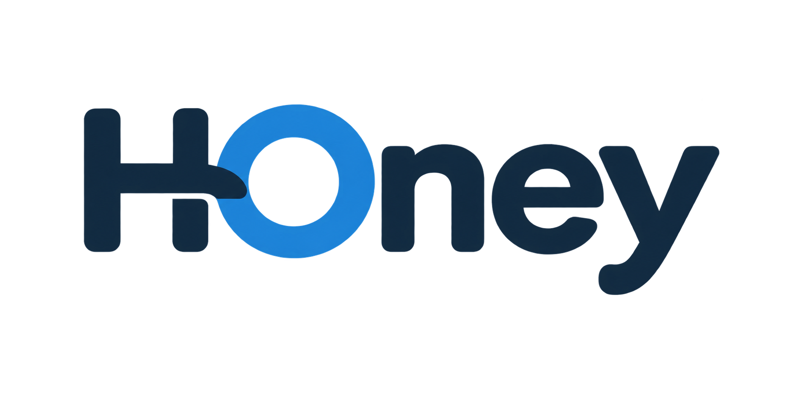
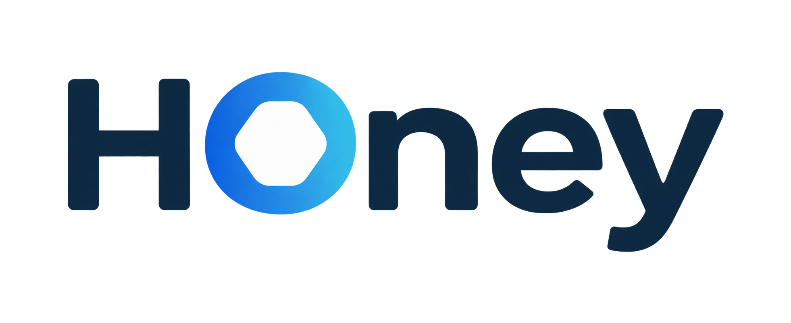
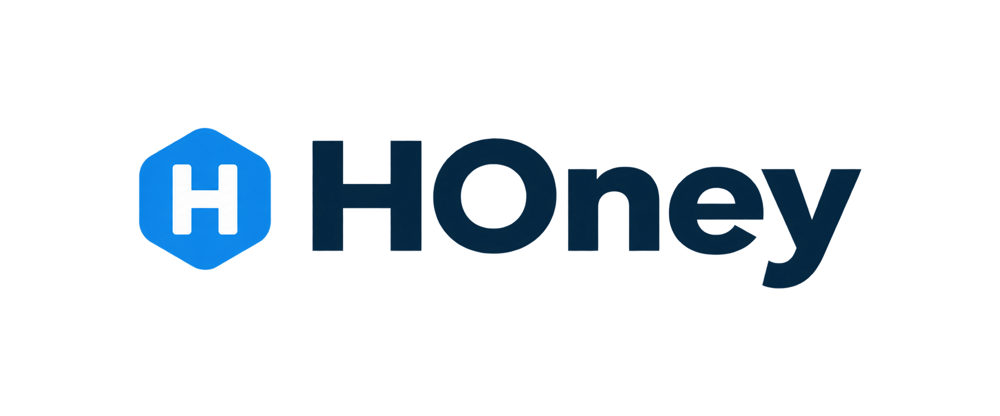
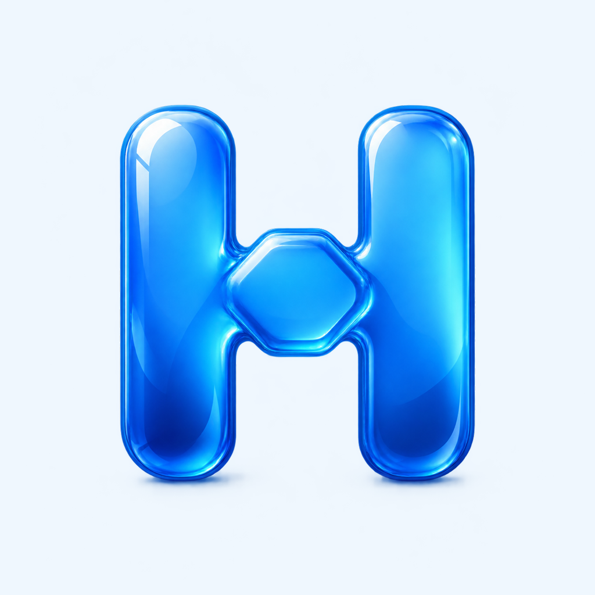

# HOney brand identity — M4 concepts

Generated 2026-08-31 for the HOney V1 rebuild. This is a **real redesign**: the legacy serif
wordmark is **not** carried forward. Continuity with the legacy feel (pale-blue gradients,
translucent white cards, navy text, ocean-blue accents) is kept through the cool-blue palette
only — every color value is freshly derived (see `../tokens/tokens.json`).

All images were generated via `codex exec` driving codex's built-in image generation tool
(non-interactive), per the workspace rule that brand/image assets come from codex imagegen.

## What was generated

Six concept PNGs, all verified valid and non-trivial:

| Asset | File | Size | Concept |
|---|---|---|---|
| Wordmark A | `wordmark-a.png` | 1774x887, 227 KB | Pure typographic geometric sans; capital H+O ligatured into one unit, ocean-blue O, navy letters |
| Wordmark B | `wordmark-b.png` | 1962x801, 273 KB | Humanist sans; the capital O's counter is a subtle rounded hexagon, cool-blue gradient on the O only |
| Wordmark C | `wordmark-c.png` | 1942x809, 179 KB | Lockup: rounded-hexagon mark with negative-space H + "HOney" in a clean modern sans |
| Icon A | `icon-a.png` | 1024x1024, 1.2 MB | Pale-to-ocean-blue gradient, bold white rounded hexagon with negative-space H |
| Icon B | `icon-b.png` | 1024x1024, 1.7 MB | Deep navy-to-blue gradient, cluster of three frosted-glass hexagons |
| Icon C | `icon-c.png` | 1024x1024, 637 KB | Pale background, dimensional glossy blue H whose crossbar forms a hexagon |

### Thumbnails

| A | B | C |
|---|---|---|
|  |  |  |
|  |  |  |

Icons are full-bleed 1024x1024 squares with no pre-applied corner mask (iOS applies the
squircle itself). Per project rules the icon may be slightly rich; internal UI stays minimal.

## How they were generated (codex invocations)

Two non-interactive runs, one per asset family, each producing three PNGs at explicit
absolute paths (prompts abridged here to the concept lines; each run instructed codex to use
its image generation tool and to write only the six named files):

```bash
codex exec --sandbox workspace-write -C /home/honey/HOney-refreshed/design/brand \
  'Use your image generation tool to create THREE wordmark/logotype concept options for a
   student companion app named exactly "HOney" ... Concept A: geometric sans, H+O ligature
   -> wordmark-a.png; Concept B: humanist sans, hexagonal O counter -> wordmark-b.png;
   Concept C: hexagon/negative-space-H mark + wordmark lockup -> wordmark-c.png ...'

codex exec --sandbox workspace-write -C /home/honey/HOney-refreshed/design/brand \
  'Use your image generation tool to create THREE iOS app icon concepts for "HOney",
   full-bleed square 1024x1024 PNG, no corner masking ... Concept A: gradient + white
   hexagon with negative-space H -> icon-a.png; Concept B: frosted-glass hexagon cluster
   -> icon-b.png; Concept C: dimensional glossy H with hexagon crossbar -> icon-c.png ...'
```

Both runs exited 0 on the first attempt; codex routed the prompts through its `imagegen`
tooling and wrote the files directly to this directory.

## Design tokens → platforms

`../tokens/tokens.json` is the platform-neutral source of truth (light + dark color roles,
type roles, 4-pt spacing, radii, motion, elevation). WCAG AA contrast ratios are recorded
inline on every text/semantic color.

- **iOS (Swift):** generate a `DesignTokens.swift` (or asset-catalog colors) from the JSON at
  build time or by a checked-in codegen step. Color roles map to light/dark variants of a
  single named color (e.g. `Color("accent")`); typography roles map to `Font.system(size:weight:)`
  with SF Pro (sizes are pt); `surfaceTranslucent` maps to the material system
  (`.thinMaterial`-style blur behind a tinted overlay); motion durations map to
  `withAnimation(.spring(response: 0.35, dampingFraction: 0.9))` for interactive transitions
  and linear-ish 120/240 ms for micro feedback.
- **Web (TypeScript/CSS):** emit CSS custom properties per mode
  (`:root` / `[data-theme="dark"]` or `prefers-color-scheme`), e.g. `--color-accent`,
  `--space-lg: 16px`, `--radius-lg: 16px`, `--duration-standard: 240ms`,
  `--easing-standard: cubic-bezier(0.2, 0, 0, 1)`; `surfaceTranslucent` pairs with
  `backdrop-filter: blur(...)`. Font stack: `system-ui, -apple-system, ...` (in the JSON).
- One JSON, two emitters — token names are identical across platforms so design discussion
  and code review use the same vocabulary.

## Gary picks (awaiting decision)

Nothing below ships until Gary chooses. Options on the table:

1. **Wordmark — pick one of:**
   - **A** — H+O ligature, most distinctive typographic play, boldest personality
   - **B** — hexagonal O counter, quietest honeycomb hint, most conventional/clean
   - **C** — mark + wordmark lockup, only option that yields a standalone mark for favicons/avatars
2. **App icon — pick one of:**
   - **A** — white hexagon + negative-space H on gradient (closest sibling to wordmark C)
   - **B** — frosted-glass hexagon cluster (most dimensional, no letterform)
   - **C** — glossy dimensional H (most playful/friendly)
3. **Open follow-ups after the pick:** vectorize the chosen direction (SVG redraw), derive the
   monochrome/small-size variants, and decide whether wordmark and icon should share one motif
   (natural pairs: wordmark C + icon A, or wordmark A + icon C).

Notes for the pick: icon A's gradient edge shows some soft blur banding at full zoom — if
chosen, it gets a clean vector redraw anyway. All wordmarks render the exact casing "HOney".
