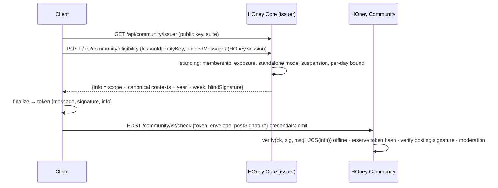

# Anonymous Control v2 — protocol and threat model

**Since:** 2026-09-02 (spec *HOney Web Access + Canonical School Data + Anonymous Control v2*, Part III).
**Status:** implemented for the focused cryptographic review that follows this round (that review is a
separate task and is **not** complete).
**Code:** `packages/shared/src/community-v2/` (protocol, shared by Web/Node and mirrored in Swift),
`packages/backend/src/community-issuer/` (issuer), `packages/backend/src/control-vault/` (vault),
`apps/web/src/lib/community-v2/` (client), `packages/community-service/` (Community process).

## What it provides

- One client-generated root `M` (32 bytes, platform CSPRNG) is the student's recovery unit.
- A stable **posting identity per school/year** lets Community know that several posts came from one
  cryptographic contributor within that scope — and nothing else.
- An **independent control key per post**, re-derivable from `M` + the post nonce: possession of the
  root is control of every post; one post's key reveals nothing about the others.
- **Blind eligibility**: HOney Core verifies standing on the account and blind-signs a token it can
  never recognise again; the scope and canonical context it verified travel as public metadata.
- **Identity-free Community**: check/publish/mine/revoke/react/report carry no HOney session, cookie,
  honeyId or account-derived header; Community has no account database.
- **Encrypted Control Vault** on Core: ciphertext the server cannot read; recovered through a
  passkey (WebAuthn PRF), another signed-in device (HPKE pairing) or 12 recovery words.
- Root rotation with retained legacy roots; account deletion that revokes public content through
  cryptographic proofs, never through an account lookup.

## Primitives (all from audited libraries; no hand-written curve/RSA/AES)

| Purpose | Primitive | Library (TS) | Swift |
|---|---|---|---|
| sub-keys | HKDF-SHA-256 | `@noble/hashes` | CryptoKit HKDF |
| posting / control / reaction signatures | Ed25519 | `@noble/curves` | CryptoKit Curve25519 |
| vault + wrappers | AES-256-GCM | WebCrypto | CryptoKit AES.GCM |
| canonical signed bytes | RFC 8785 JCS | `canonical-json.ts` | `CanonicalJSON.swift` |
| pairing / sealed session | HPKE base, DHKEM(X25519) · HKDF-SHA256 · AES-256-GCM (RFC 9180) | `@hpke/core` | CryptoKit HPKE |
| blind eligibility | RSAPBSSA-SHA384-PSS-Randomized (partially blind RSA, public metadata; CFRG draft, Privacy Pass style) | `@cloudflare/blindrsa-ts` | client-side blinding over a bignum library, vector-checked |
| passkey unlock | WebAuthn Level 3 `prf` extension | browser | ASAuthorization PRF |
| recovery words | 128-bit secret, BIP-39 English 2048-word encoding with checksum | `@scure/bip39` | shared wordlist |

## Key hierarchy (`key-labels.ts`, `derivation.ts`)

```text
schoolSalt   = SHA-256("honey/v2/school-epoch\0" ‖ schoolId ‖ "\0" ‖ academicYear)
postingSeed  = HKDF-SHA-256(IKM = M, salt = schoolSalt, info = "honey/v2/posting-signing")
postingKey   = Ed25519(seed = postingSeed)
authorTag    = hex(SHA-256("honey/v2/author-tag\0" ‖ postingPublicKey))          Community-internal only
controlSeed  = HKDF-SHA-256(IKM = M, salt = postNonce(32), info = "honey/v2/post-control\0" ‖ schoolId ‖ "\0" ‖ academicYear)
controlKey   = Ed25519(seed = controlSeed)
reactionSeed = HKDF-SHA-256(IKM = M, salt = schoolSalt, info = "honey/v2/reaction-signing")
notesKey     = HKDF-SHA-256(IKM = M, salt = deviceSalt, info = "honey/v2/private-notes-local")   never uploaded
K_prf_wrap   = HKDF-SHA-256(IKM = P (PRF output), salt = SHA-256(vaultId), info = "honey/v2/vault-prf-wrap")
K_phrase     = HKDF-SHA-256(IKM = S_phrase(16), salt = SHA-256(vaultId), info = "honey/v2/vault-phrase-wrap")
prfInput     = SHA-256("honey/v2/vault-prf-input\0" ‖ vaultId)
vault        = AES-256-GCM(key = R, iv = 96-bit random, JCS(payload), AAD = JCS({revision, vaultId, version: 2}))
wrapper      = AES-256-GCM(K_*, iv, R, AAD = "honey/v2/wrapper\0<kind>\0<vaultId>")
```

Every signed statement is signed over its JCS bytes and carries a `purpose` (`honey/v2/mine`,
`honey/v2/revoke`, `honey/v2/react`, `honey/v2/report`, `honey/v2/register-reactor`). Vectors:
`packages/shared/src/community-v2/fixtures/vectors.json` (`pnpm --filter @honey/shared vectors:write`).

## Blind eligibility (issuer = Core, verifier = Community)



`info` (`EligibilityInfo`) is the RSAPBSSA public metadata: `{v: 2, schoolId, academicYear, scope,
contexts, provenance, week}`. The issuer learns *what* an account asked for (which it already knows —
it verified it), never the token value. Community learns only the metadata and a signature it can
check with the public key. A token is redeemable for two portal weeks and consumed once
(`anonymous_token_reservations`). Issuance is bounded per account per scope per day on an
unlinkable HMAC mark (`issuance_marks`) — no token value, post or key is stored on Core.

Why partially blind RSA: a plain blind signature (RFC 9474) hides the message but cannot bind the
*scope* the issuer verified; per-scope issuer keys do not scale to lessons; a Core-signed scope
attestation without blinding would be linkable. Public-metadata blind RSA gives unlinkability and
scope binding in one signature. Key generation needs safe primes (minutes, `issuer:keygen`, once).

## Publication (identity-free)

`SignedPostEnvelopeV2` = `{protocolVersion: 2, schoolId, academicYear, primaryEntity, contexts, body,
rating, postNonce, postingPublicKey, controlPublicKey, clientNonce}` signed by the posting key over
JCS bytes. Community's content pass binds body hash, context hash, school/year, both public keys, the
post nonce, the token hash, the policy version and an expiry; any change invalidates it. Publish
verifies the pass, consumes the reservation, computes the authorTag, stores the row. Canonical course
ids (never class ids) enter scopes, envelopes, associations and feeds.

## Control Vault (Core, `vault.sqlite`)

| Local | Server | Result |
|---|---|---|
| yes | yes | unlock, verify, synchronize (newer server revision merged) |
| yes | no | offer encrypted backup |
| no | yes | restore through passkey PRF → another device → recovery words |
| no | no | create `M1` and `R` |

Writes are compare-and-swap on the revision; a conflict is merged once by stable ids (roots, epochs,
wrappers) and contradictory active roots are refused. The vault record is located by
`HMAC(server, honeyId)`; the server stores no root, no PRF output, no phrase secret and no post id.
Local Web storage: IndexedDB with a non-extractable device `CryptoKey`; iOS: Keychain. Every "ready",
"backed up" or "restored" state is shown only after a durable write was read back and decrypted.

## Honest limits

- Application-level anonymity only: the edge and host still see IP and timing. Two processes and two
  databases stop ordinary code, SQL and admin tooling from joining account and post; they do not
  make the network anonymous.
- Same-origin script on the Web can call the crypto while the vault is unlocked; non-extractable keys
  stop raw secret export, not XSS.
- Losing every recovery method loses control of the posts — HOney will not create a second root while
  a server vault exists, precisely because a new root could not remove the old posts.
- The focused cryptographic review is pending; the package for it: this document, the fixed labels,
  the wire types (`contract.ts`), the vectors, the dependency inventory above, the redaction map and
  process/DB map in `community-process.md`, and the failure/replay tests in `packages/community-service`.

## iOS (`ios-web-port/HOneyCore/Sources/HOneyCore/CommunityV2/`, 2026-09-03)

The iPhone implements the same protocol from the same shared inputs:

| Web module | Swift | primitive |
|---|---|---|
| `canonical-json.ts` | `CanonicalJSON.swift` (`JSONValue.canonical`) | RFC 8785 by hand (UTF-16 key order, ES escapes/numbers) |
| `derivation.ts` | `Derivation.swift` (`V2Derivation`) | swift-crypto `HKDF<SHA256>`, `Curve25519.Signing` |
| `vault.ts` / `wrappers.ts` | `Vault.swift` / `Wrappers.swift` | swift-crypto `AES.GCM` (ciphertext ‖ tag, same AAD strings) |
| `recovery-words.ts` | `RecoveryWords.swift` + `Bip39English.swift` | BIP-39 English encoding by hand (2048 words, 4-bit checksum) |
| `pairing.ts` | `Pairing.swift` | swift-crypto `HPKE` (X25519 · HKDF-SHA256 · AES-256-GCM, base mode, same info/AAD) |
| `blind-token.ts` (+ blindrsa-ts internals) | `BlindToken.swift` | **BigInt** arithmetic: EMSA-PSS-ENCODE (SHA-384, salt 48), MGF1, the derived exponent e′ = HKDF-SHA384("key" ‖ info ‖ 0x00, salt = n, "PBRSA"), blind/finalize/verify. swift-crypto's RSA cannot host e′ (BoringSSL refuses the large exponent), so no RSA key object is ever built |
| `contract.ts` | `Contract.swift` | Codable mirror; the envelope encodes `rating: null` explicitly because it is signed that way |
| `publish-client.ts` / `vault-client.ts` / `local-store.ts` / `account-deletion.ts` | `PublishClient.swift` / `PostControls.swift` (+ `SecretPostControlStore` over the Keychain) / `AccountDeletion.swift` | roots sealed under a per-account device secret; every server write read back and decrypted before it counts |

Interop evidence (all on Linux, `swift test`): `CommunityV2Tests` reproduces every value of `fixtures/vectors.json`, verifies the Web's Ed25519 statement signature, round-trips wrappers/vault/pairing, runs blind → blindSign → finalize → verify against `issuer-test.jwk.json`, and verifies the Web-produced `fixtures/blind-token-kat.json`; `FixtureDecodingTests` decodes the 43 checked-in contract fixtures (Core canonical data + Community v2 wire); `PublishClientTests` drives prepare → check → publish over scripted Core/Community transports and asserts the token verifies, the envelope is signed by the derived posting key, and Community saw proofs but no identity.

Not in this build: adding a passkey (PRF) wrapper from the iPhone (Web-created passkey wrappers are listed; restore on iOS uses another device or the recovery words).
