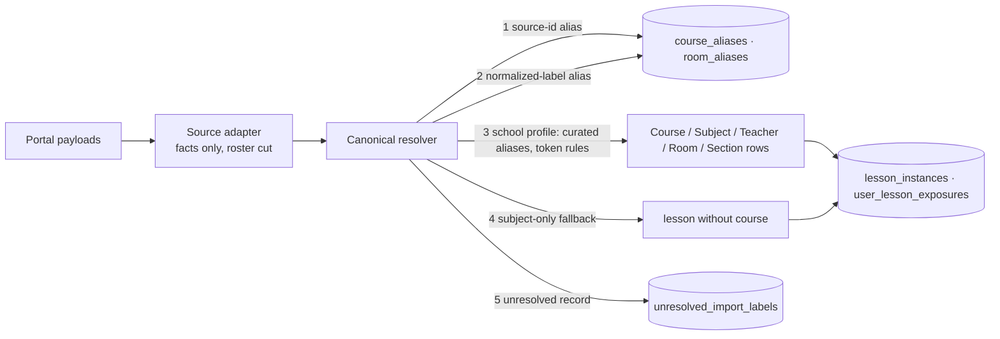

# Canonical school data

**Since:** 2026-09-02 (spec *HOney Web Access + Canonical School Data + Anonymous Control v2*, Part I).
**Replaces:** the first-cut timetable tables in `m2-honey-core.md` (`courses.name` mirrored a portal
class label; `entity_registry` copied those labels into the public Course list).

## The five objects

HOney stores the object students mean, not whichever portal string happens to contain it.

| Layer | Example | Role |
|---|---|---|
| **Subject** | Economics | broad area; search alias; timetable fallback label |
| **Course** | `AL ECON U4` | the curricular unit — the **public Experiences entity** |
| **Class section** | 2026 Autumn · Prep Class · 朱昂明 | the school's operational teaching group — stored, **never** a public entity |
| **Lesson instance** | Wed 13:30–15:00 · Room 309 | one occurrence; the "what just happened" anchor |
| **Topic** | Market structures revision | lesson text; never an entity |

Invariants (`packages/backend/src/school/canonical.test.ts` checks every one against real records):

1. a portal `class_id` never becomes a `course_id`;
2. a `class_name` never becomes a public course name;
3. `AL ECON U4` is one Course across sections, terms and teachers; U3 ≠ U4;
4. roster text reaches no canonical table (cut at the adapter, before the resolver);
5. the topic never becomes a course; the portal's "topic = subject" is stored as no topic;
6. sections are stored (course, teacher, term, academic year, safe label) but excluded from `/api/entities`;
7. every read path (timetable, Now/Next, History, directory, feed context, entity pages, search)
   returns canonical ids and names — clients never re-parse a portal string;
8. an unresolved label leaves the lesson subject-only and appears in Dash (`GET /api/admin/import/unresolved`),
   never in a browse list.

## Pipeline (write boundary)



- `school/adapter.ts` — connector `Lesson` → `ImportedLessonCandidate` (source ids + labels; `redactRoster`).
- `school/preprocess.ts` — whitespace/NFKC normalization for matching, placeholders, roster redaction.
- `school/profiles/huayaopudong.ts` — the current school: subject dictionary, **curated course aliases for
  every label the portal actually emits**, a `Board Subject-Unit` rule for unseen variants, section
  parsing (term · group type), academic-year rule, topic rule. A new label format gets a fixture first,
  then an alias/rule — no classifier on the read or write path.
- `school/resolver.ts` — resolution order 1→5 above; writes canonical rows and remembers both spellings.
- `school/import.ts` — one transaction per import: lessons, exposures, an `import_runs` row, unresolved labels.
- `school/directory.ts` — `/api/entities` is a **union over the canonical tables** (teachers · courses ·
  rooms · dishes): `canonical course row = public course entity`. Admin imports resolve through the same
  alias tables, so a spelling the timetable already produced merges instead of duplicating.

## Identifiers

Deterministic across development resets: `c_<hash(school, canonical code)>`, `t_<hash(school, normalized
name)>`, `r_<hash(school, normalized name)>`, `sec_<hash(school, source, class id)>`, `subj_<hash(school,
code)>`; lesson ids are the source lesson ids. Aliases, not re-hashing, resolve later spellings.

## Real fixture

`packages/backend/fixtures/school/oasis-2026-autumn.json` holds the two portal payloads the product reads
(lesson table + viewable weekly schedules) for the authorized test account, captured 2026-09-02. Rosters
and student lists were redacted at capture (`class_name` ends at the teacher token; `students` replaced);
teacher names are the staff display names the product shows. The acceptance tests and
`pnpm --filter @honey/backend db:reset:dev` both run it.

## Development reset

No migration bridges the pre-canonical schema: `openDatabase` refuses a file from another epoch
(`SchemaEpochError`) and the operator runs

```bash
sudo systemctl stop honey
sudo -u honey bash -lc 'set -a; . /home/honey/.secrets/honey.env; set +a; cd /home/honey/app && npx --yes pnpm@11.24.0 --filter @honey/backend db:reset:dev -- --yes'
sudo systemctl start honey
```

The reset deletes the SQLite files, recreates the schema, imports the fixture into a throwaway account,
asserts the canonicalization (`AL ECON U4` present, no class label in a course name, zero unresolved),
and removes the throwaway account. The first sign-in afterwards re-imports the live timetable.

## Wire contract

`Lesson` gained `subjectId`, `classSectionId`, `classSectionName`; `courseName` is canonical. Course
entity ids in `EntityRef`, `EntitySummary`, feed filters and eligibility scopes are canonical course ids.
`SyncResponse.unresolved` counts labels the resolver could not place.
