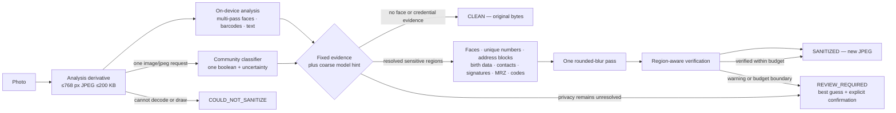

# Credential-image sanitation — prototype

Status: **standalone prototype** (spec: *HOney Credential Image Sanitation
Prototype — Test Spec*, 2026-09-04). Not wired into Lost & Found or any
publication flow. The iOS lab lives on branch `lab/credential-image-sanitation`
(`ios/SanitationLab`); the one server piece lives on the working branch.

## The split

The model answers exactly one question — *is this a credential?* — and never
supplies coordinates or field types. Deterministic face/code/MRZ/label evidence
can override a clean model verdict. Regions come from the fixed on-device
pipeline; the image that leaves the device is the small derivative, once only.

## Policy and hard gates

The policy is harm-based: faces and information that uniquely identifies,
locates, contacts or authenticates the individual must not be shown. Names,
school/employer, class/department, sex/gender, nationality/citizenship,
issue/expiry dates and generic document labels remain visible.

- End-to-end target: about 3 seconds; hard limit 4.8 seconds and never 5 seconds or more.
- Remote cost: exactly one existing classifier request per image, no model retry and no second model. This is 1x the original model-call cost and below the 3x ceiling.
- Classifier deadline: 3.2 seconds, reserving the rest of the budget for local blur and verification.
- A wider second blur is attempted only when at least 0.9 seconds of budget remains.
- `REVIEW_REQUIRED` always includes the best-guess image. The user must explicitly confirm it before continuing. Only an undecodable/undrawable image becomes `COULD_NOT_SANITIZE`.

## Server route

`POST /community/v2/image/classify`, body `image/jpeg` (≤256 KB, the edge's
cap), inside the identity-free Community process: a cookie or bearer is
refused before the model sees a byte, nothing is stored, and the response is
`{ credentialLike, uncertain, latencyMs, model }` or `503
classifier_unavailable` (no key, no answer, malformed answer — never a
made-up verdict). Settings: `image.model`, `image.timeoutMs`; the key is the
moderation key.

## Model bench (2026-09-04)

46 fixtures (18 synthetic with ground-truth regions, 28 Wikimedia Commons
cards), 768 px derivatives, two passes, judged on the 37 with a definite
expectation:

| model | valid | right | p50 | p90 | notes |
|---|---|---|---|---|---|
| `qwen/qwen3-vl-8b-instruct` | 46/46 | 35/37 | 0.23–0.29 s | 0.6 s | misses only the ISIC logo graphic and a card-shaped library sign — **default** |
| `mistralai/mistral-small-3.2-24b-instruct` | 39–43/46 (429s) | 31–34/33–37 | 0.34 s | 0.9 s | text moderation's model — **fallback** |
| `qwen/qwen3.7-flash` | 45/46 | 31/37 | 1.3 s | 2.2 s | over-calls a notebook and a decorative card |
| `z-ai/glm-5.3-flash` | 2/46 | — | 5.5 s | — | truncated JSON |
| `google/gemini-2.5-flash-lite` | 0/46 | — | — | — | 403 on this key |

Every model missed no credential; the differences are false positives and
answer validity. Uncertain fixtures (booklet covers, a bare library card, a
dorm pass table) now return their best guess as `REVIEW_REQUIRED` when fixed
evidence cannot resolve whether unique information remains.

## On the device (iOS lab)

- Derivative: long edge 768, JPEG quality stepped down until ≤200 KB.
- Detectors run concurrently with the classifier. Faces use Vision on the
  original image, a contrast-enhanced monochrome image, and overlapping crops,
  plus Core Image's independent high-accuracy detector with a small-feature
  threshold; overlapping results are deduplicated. Barcodes use
  `VNDetectBarcodesRequest`; text uses `VNRecognizeTextRequest` (accurate,
  zh-Hans / zh-Hant / en, no language correction so numbers survive).
- Face privacy is unconditional. When the classifier says clean, any locally
  detected face is still blurred; only a clean image with no face returns the
  original bytes. Credential-only text and code rules remain classifier-gated.
- Unique-number regions: a label (`Student ID`, `Student No.`, `ID No.`, `Card No.`,
  `Staff No.`, `学号`, `學號`, `编号`, `证件号`, `卡号` …) followed by a value on
  the same line → the value's own sub-rectangle; a label alone → the id-like
  line to its right or below; a label with no separable value uses a conservative
  fixed field-band blur instead of blocking. On a credential-like image, any standalone token with
  five or more consecutive digits, or eight alphanumerics with four digits, is
  hidden too (the "strongly associated with the layout" rule). Address text is
  grouped into one continuous block until the next field boundary (up to eight
  lines). Birth date/place, phone, email, guardian/parent/emergency contact,
  blood type, signatures and MRZ lines are also hidden. Names, school/employer,
  class/department, sex/gender, nationality/citizenship and validity dates remain visible.
- Sanitize: every sensitive region uses the same strong Gaussian blur clipped
  to an adaptive rounded rectangle. There are no opaque number/code masks. The
  output is redrawn and encoded afresh (no EXIF carried over).
- Verify: barcodes on the output must not decode and no hidden value may be
  recognised inside its own region. A wider retry runs only with budget headroom;
  otherwise the current best guess becomes `REVIEW_REQUIRED`.
- Classifier unavailable or uncertain does not automatically require review.
  Fixed evidence resolves the result whenever possible; review is reserved for
  genuinely unresolved privacy risk.

Instrumentation per run (`SanitationRecord`): classifier verdict + latency,
detectors used, regions by kind, classification/detection/sanitation and total
latency, verification result, review reasons and final outcome. The lab keeps before/after JPEGs per run under
`Documents/sanitation-lab/`.

## Disclosure

Images sent for classification are processed by an external provider, the
same way text moderation is (`moderation-external-processing.md`). The
derivative is small and unlinked to an account, but it is still the photo —
this is a launch-gate item to record the provider's retention terms before
any publication flow uses it.
