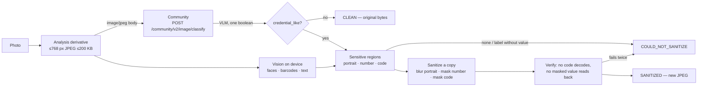

# Credential-image sanitation — prototype

Status: **standalone prototype** (spec: *HOney Credential Image Sanitation
Prototype — Test Spec*, 2026-09-04). Not wired into Lost & Found or any
publication flow. The iOS lab lives on branch `lab/credential-image-sanitation`
(`ios/SanitationLab`); the one server piece lives on the working branch.

## The split

The model answers exactly one question — *is this a credential?* — and never
supplies coordinates. Regions come from Apple Vision on the phone; the image
that leaves the device is the small derivative, and only for that question.

## Server route

`POST /community/v2/image/classify`, body `image/jpeg` (≤256 KB, the edge's
cap), inside the identity-free Community process: a cookie or bearer is
refused before the model sees a byte, nothing is stored, and the response is
`{ credentialLike, uncertain, latencyMs, model }` or `503
classifier_unavailable` (no key, no answer, malformed answer — never a
made-up verdict). Settings: `image.model`, `image.timeoutMs`; the key is the
moderation key.

## Model bench (2026-09-04)

46 fixtures (18 synthetic with ground-truth regions, 28 Wikimedia Commons
cards), 768 px derivatives, two passes, judged on the 37 with a definite
expectation:

| model | valid | right | p50 | p90 | notes |
|---|---|---|---|---|---|
| `qwen/qwen3-vl-8b-instruct` | 46/46 | 35/37 | 0.23–0.29 s | 0.6 s | misses only the ISIC logo graphic and a card-shaped library sign — **default** |
| `mistralai/mistral-small-3.2-24b-instruct` | 39–43/46 (429s) | 31–34/33–37 | 0.34 s | 0.9 s | text moderation's model — **fallback** |
| `qwen/qwen3.7-flash` | 45/46 | 31/37 | 1.3 s | 2.2 s | over-calls a notebook and a decorative card |
| `z-ai/glm-5.3-flash` | 2/46 | — | 5.5 s | — | truncated JSON |
| `google/gemini-2.5-flash-lite` | 0/46 | — | — | — | 403 on this key |

Every model missed no credential; the differences are false positives and
answer validity. Uncertain fixtures (booklet covers, a bare library card, a
dorm pass table) are called credential-like by all — the device then reports
`COULD_NOT_SANITIZE` because nothing sensitive can be located, which is the
conservative answer the spec asks for.

## On the device (iOS lab)

- Derivative: long edge 768, JPEG quality stepped down until ≤200 KB.
- Detectors run concurrently with the classifier: `VNDetectFaceRectanglesRequest`,
  `VNDetectBarcodesRequest`, `VNRecognizeTextRequest` (accurate, zh-Hans /
  zh-Hant / en, no language correction so numbers survive).
- Number regions: a label (`Student ID`, `Student No.`, `ID No.`, `Card No.`,
  `Staff No.`, `学号`, `學號`, `编号`, `证件号`, `卡号` …) followed by a value on
  the same line → the value's own sub-rectangle; a label alone → the id-like
  line to its right or below; a label with no value anywhere →
  `COULD_NOT_SANITIZE`. On a credential-like image, any standalone token with
  five or more consecutive digits, or eight alphanumerics with four digits, is
  masked too (the "strongly associated with the layout" rule). Names, school
  names, class, validity dates are never touched.
- Sanitize: portraits → Gaussian blur, radius from the face size; numbers and
  codes → opaque neutral mask with padding. The output is redrawn and encoded
  afresh (no EXIF carried over).
- Verify: barcodes on the output must not decode and no masked value may be
  recognised again; one retry with 25 % larger masks, then
  `COULD_NOT_SANITIZE`.
- Classifier unavailable: credential-like if any local signal fires (code,
  label, long id), else `CLEAN` — recorded as `classifierUnavailable` in the
  run record so the harness can count it.

Instrumentation per run (`SanitationRecord`): classifier verdict + latency,
detectors used, regions by kind, sanitation latency, verification result,
final outcome. The lab keeps before/after JPEGs per run under
`Documents/sanitation-lab/`.

## Disclosure

Images sent for classification are processed by an external provider, the
same way text moderation is (`moderation-external-processing.md`). The
derivative is small and unlinked to an account, but it is still the photo —
this is a launch-gate item to record the provider's retention terms before
any publication flow uses it.
