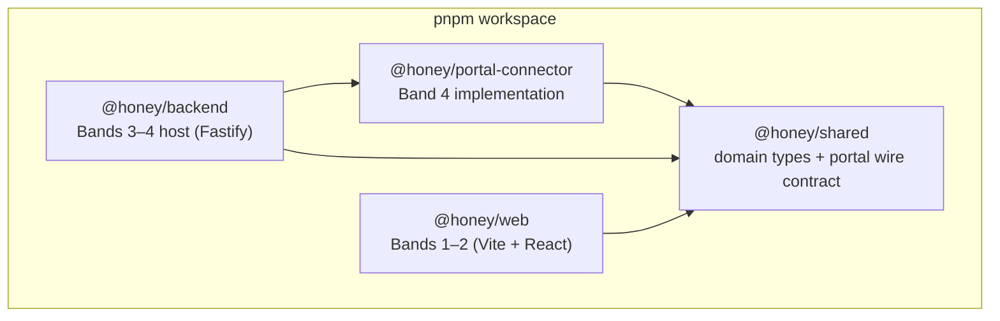

# M0 — Monorepo foundation & CI

**Goal:** a TypeScript workspace whose package boundaries mirror the spec's four bands, plus CI
that builds every surface — including iOS on macOS runners — from day one.

## Layout & boundary mapping

- `@honey/shared` holds **contracts only** (no I/O): canonical domain entities (spec §5.1/§13.2)
  and the portal wire types re-authored from the connector analysis. Everything else depends on it.
- Package boundaries are the enforcement mechanism for the spec's change-isolation test (§1.5):
  the web app cannot reach portal internals, and the connector cannot know about screens.

## Toolchain decisions

| Decision | Why |
|---|---|
| pnpm workspaces, no Turbo yet | `pnpm -r` already runs topologically; add caching only when build times hurt |
| TS `strict` + `exactOptionalPropertyTypes` + `noUncheckedIndexedAccess` + `verbatimModuleSyntax` | Cheap now, expensive to retrofit; wire data from the portal is exactly where indexing bugs live |
| Library packages emit NodeNext ESM | Consumers are Node (backend) and bundlers (web); NodeNext keeps `.js` specifiers honest |
| Type resolution: consumers build after `shared` (topo order); vitest/vite alias to `shared` source | Avoids stale-dist type skew during tests without TS project references |
| CI order: `build → typecheck → test` | `@honey/shared` exposes types via built `dist`; fresh checkouts must build first |

## CI

- `ci.yml` — Ubuntu: frozen install → recursive build → typecheck → test, per-ref concurrency.
- `ios.yml` — macOS 14 runner, path-filtered to `ios/**`; wires real `xcodebuild` in M6.
