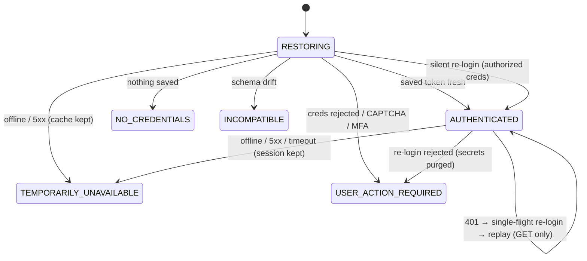

# M1 — School Portal Connector (Band 4)

**Goal:** everything HOney knows about the school portal lives behind one boundary —
`@honey/portal-connector` — implementing the observed contract of the OASIS portal with the
failure discipline the legacy app lacked.

Evidence base: the connector analysis (auth capture, OpenAPI of the 8 confirmed V1 endpoints,
failure matrix, legacy-gap list). Where the portal is quirky, the quirk is encoded and tested —
not smoothed over.

## Auth model (as observed)

- `Authorization: <32-char opaque token>` — **no** `Bearer` prefix, not a JWT.
- Expiry is server-authoritative (`user_info.data.exp`, fixed ~24 h TTL, no sliding renewal).
- **No refresh flow exists.** Recovery is always a full re-login.
- Expired session signal: HTTP 401 + `{ status: 400001 }` / `"Unauthorized"`.

## Session coordination

Rules enforced by `PortalSessionCoordinator` (each is a legacy-gap fix, each has a test):

| Rule | Why |
|---|---|
| At most one login in flight; concurrent expired reads share it | 20 concurrent GETs → exactly **one** `POST /api/login` (no lockout storms) |
| After silent re-auth, **only safe reads replay** | A gate-open must never fire twice because a token expired mid-flight |
| Mutations timing out → `outcomeUnknown`, **never auto-retried** | The door may have physically opened; only the user may retry |
| Offline / 5xx / maintenance page **preserves session & credentials** | Availability failures must never sign the user out |
| `credentialsRejected` purges stored secrets, asks once | A dead password must not hammer the portal |
| Maintenance HTML ≠ unknown HTML | The former is `serverUnavailable` (retry later); the latter `schemaIncompatible` (circuit-break) |

## Endpoint quirks encoded

- Door list success is `status === 1` with doors riding in `message[]` (not `data`).
- Commuter gate-open uses sentinel `record_id = -2`; `door_id` and `indexcode` carry the same key.
- Lesson table is an **object keyed by lesson-id string**, not an array.
- `weekIndex` is the portal's own epoch-week (Monday-aligned days-since-1970 ÷ 7), not ISO.
- Timetable = weekly lessons ⋈ lesson table on `lesson_id` (weekly brings class/display fields;
  the table brings stable `subject_id`/`topic_id`/`room_id`; teacher stays a display string —
  no stable upstream id exists).
- The portal's own web client ships **no request timeouts**; ours are mandatory per request.

## Testing

`src/testing/mockPortal.ts` is an in-process Fastify replica of the portal, quirks included, with
switchable failure modes (5xx, maintenance HTML, unknown HTML, login CAPTCHA page, door-open
hang). The 14 acceptance tests in `coordinator.test.ts` implement the doc-07 checklist and run in
CI against the mock. Facts that only a real account can confirm (exact TTL, fresh-login schema,
real door-open semantics) are tracked as pending verification — the mock encodes the documented
best evidence.
