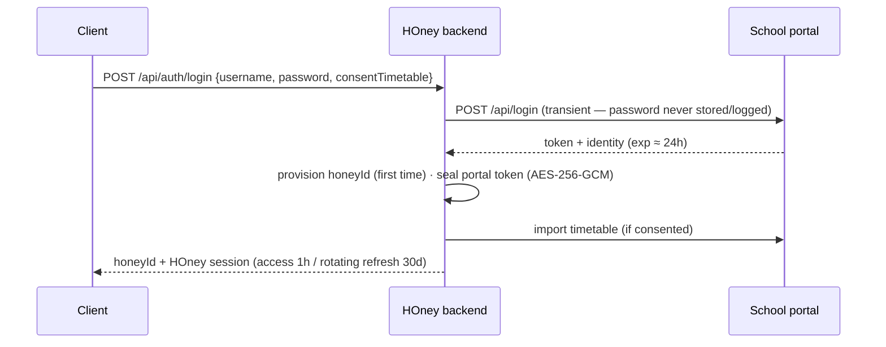

# M2 — HOney Core: accounts, sessions, data API

**Goal:** HOney's own identity and data layer (Band 3). A school login **is** signup; everything
imported is normalized into HOney-owned entities; every query is scoped to the user's own exposure.

## Account model

- **honeyId**: random 6 chars from an unambiguous alphabet (31⁶ ≈ 888M), collision-checked.
  It is the user's HOney identity — unrelated to any school identifier.
- **Session independence** (spec §3.3/§3.4): HOney sessions live entirely apart from portal
  tokens. Portal expiry flips sync to `portal_reconnect_required`; the user stays signed in.
- **Reconnect paths**: iOS pushes a client-obtained portal token (`POST /api/portal/token`,
  validated upstream before acceptance — the backend can hold a short-lived token but never a
  password); Web re-runs the login call.
- **Three actions, three meanings** (§3.7): sign out (drop HOney session) · disconnect school
  (drop portal material, keep account) · delete account (cascade everything).

## Security posture (stdlib `node:crypto`)

| Item | At rest |
|---|---|
| HOney access/refresh tokens | SHA-256 hashes only (a DB leak leaks no live session) |
| Portal token | AES-256-GCM sealed with a scrypt-derived server key |
| School password | **never** — it exists only inside the login request handler |

## Data (stdlib `node:sqlite`, WAL, STRICT tables)

`honey_users · honey_sessions · school_connections · import_consents` + the canonical school data
tables (`schools · subjects · courses · course_aliases · teachers · teacher_aliases · rooms ·
room_aliases · class_sections · lesson_instances · user_lesson_exposures · import_runs ·
unresolved_import_labels · dishes`) — see
[`canonical-school-data.md`](canonical-school-data.md) for the five-layer model and the resolver
(2026-09-02; it replaced the first-cut `teachers/courses/rooms` tables and the entity registry).
No exams table — by design (spec §0/§18). Teachers and rooms resolve through alias tables (the
portal exposes no stable teacher id). History is a query over exposures, never a second source of
truth (§13.3). Import is part of the account; imported data is deletable independently of the
account.

## API surface (Band 3, UI-agnostic)

Auth: `POST /api/auth/login · /api/auth/refresh · /api/auth/logout`, `GET /api/me`,
`POST /api/portal/token · /api/consent · /api/school/disconnect`,
`DELETE /api/imported-data · /api/account`.
Data: `POST /api/sync`, `GET /api/timetable?date= · /api/next-lesson · /api/history?q&teacherId&courseId&before&limit&order · /api/directory · /api/directory/teachers/:id/lesson-count`.

10 integration tests run the full loop against the in-process mock portal (provisioning,
rotation, sealed-token verification, consent gating, reconnect repair, day/next/history queries).
