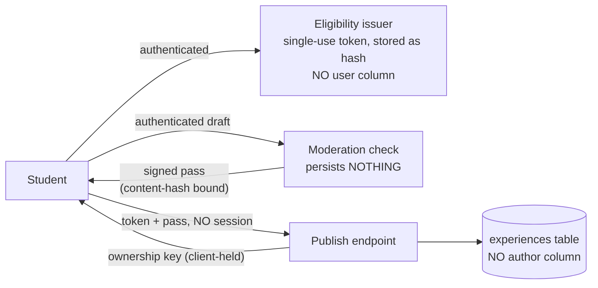

# M3 — Experiences: anonymous community with fail-closed moderation

**Goal:** peer testimony about lessons, teachers, rooms and canteen dishes that is anonymous *by
architecture*, moderated *without humans in the loop*, and fast enough to feel instant.

## What can be reviewed (product decisions, 2026-08-31)

- **Lesson** — every student has an unconditional right to review their own attended lessons,
  once per lesson. The experience is *not* pre-classified as "about" the teacher/course/room; it
  carries its lesson context and surfaces under any of them at **filter time**.
- **Teacher / Room / Dish (standalone)** — entities accrue organically from timetable imports **∪**
  admin imports (deduped by name). Eligibility per admin-configurable mode:
  `verified` (default; needs exposure) · `open` · `invite` (admin invites by studentId) · `closed`.
- **Ratings:** a 1–5 scalar exists for **dishes only**. Never for humans, lessons, or rooms —
  refused at check *and* re-checked by the policy engine.

## Anonymity model



- The `experiences` table has **no author column** — verified by a test against `PRAGMA table_info`.
- Ownership is provable only via a **client-held key** (returned once at publish; users are warned
  it is device-only — lose it, lose control of that post). History/revoke work by presenting
  keys, not identity.
- One-review-per-scope is enforced with **HMAC marks** (`HMAC(serverKey, honeyId‖scope)`) that
  join to nothing. Reactions dedup the same way. Revoking recomputes the mark transiently and
  frees the slot; nothing persisted links user→post.
- Rejected / failed-closed text is **never stored at all** (the check step persists nothing);
  revoked text is NULLed. The publish request carries no account identity — published posts are
  stored without an author ID.

## Moderation pipeline (synchronous check, then explicit publish)

```
POST /api/experiences/check  (authenticated; the draft is NEVER persisted)
  normalize (NFKC, zero-width strip, confusable de-leet, squeeze)
  → deterministic lexicon  (slurs/threats/doxxing/minor-sexual — hard block, no LLM call)
  → LLM feature extractor  (OpenRouter; strict 10-boolean JSON schema; temp 0; text is data)
  → deterministic policy engine  (THE decision-maker)
  → lane + HMAC pass bound to contentHash + entityKey + contextHash + policyVersion + nonce + expiry

POST /api/experiences/publish  (NO session auth; explicit client action only)
  verifies single-use eligibility token + pass (+ nonce) — never re-runs the LLM
```

Client-facing lanes: `publish` · `nudge` (publishable — the user chooses add-context /
publish-as-is / keep-private; the server never auto-publishes) · `cooldown` (high-arousal;
signed ticket, re-check after 24 h under the then-current policy) · `edit_required`
(injection/correctable) · `blocked_serious` · `out_of_scope` · `failed_closed` (LLM
outage — nothing publishes).

**Latency:** check is one short synchronous wait (~2–4 s). Lexical blocks skip the LLM.
Live-benchmarked default model `mistral-small-3.2-24b` (~2–4 s, 100 % schema-valid across the
bench + smoke), fallback `deepseek-v4-flash`, with 429/5xx retry + model fallback. Config
(key/model) lives in the admin dash, sealed at rest; test key path verified end-to-end.

## Ops (admin = studentId 0088)

Kill switches (`DISABLE_NEW_PUBLICATIONS`, `DISABLE_REACTIONS`, `HIDE_PUBLIC_EXPERIENCES`,
`PRIVATE_NOTES_ONLY_MODE`, per-entity freeze) · standalone-mode config · entity import (union) ·
invites · reaction-count hiding threshold · LLM key/model + live probe · report log. Reports are
**rule-based categories** that trigger automatic re-evaluation — there is no human review queue
and **no author-lookup anywhere** in admin. Reports are **category-only** — no free-text
channel exists.

## Tests (all green)

Policy lanes · lexical evasion (spacing/l33t/Cyrillic) · two-call publish with raw-first
verbatim body · check-persists-nothing proof (publish/blocked/failed lanes) · single-use
eligibility + pass replay refusals · nudge requires explicit publish · lexical block
short-circuits the LLM · outage fail-closed · cooldown ticket + re-check · one-per-lesson +
revoke-frees-slot · standalone eligibility (verified/closed/invite) · admin import union ·
from-my-classes exposure filter · category-only reports · reaction dedup + hiding · kill
switches · admin 403 · no-author column/response checks (posts AND eligibility table).
