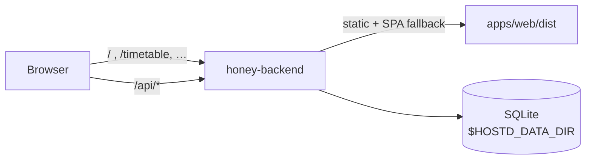

# M5 — Web app, admin dash, deployment

**Goal:** the TypeScript web client (Bands 1–2) consuming the same HOney domain API as iOS,
plus the admin dash, packaged as a single deployable Node service.

## Web app (Vite + React + TS)

Routes mirror the spec's shared deep-links (§6.3): `/login`, `/home`, `/timetable`, `/history`
(+`/lesson/:id`), `/experiences` (+`/compose`, `/teacher|course|place|food/:id`), `/settings`,
`/dash`, 404.

- **`api/client.ts`** — one typed client: session in `localStorage`, Bearer auth, single-flight
  refresh-on-401 with one retry then `onSessionLost → /login`; typed `ApiError` codes mapped to
  human copy; `portal_reconnect_required` surfaced to the UI.
- **Login is signup** — "Continue with school account" + optional import-consent; no signup link,
  a footnote explains why. All portal error states (rejected/challenge/unavailable) have copy.
- **Home** — Next Lesson (`now` / `in N min` / empty), Experiences CTAs, secondary School-Portal
  link (opens the official site in a new tab), stale `Last synced` caption.
- **Timetable** — Day view only; prev/next/Today/date-input; lesson detail modal with the three
  experience actions; Sync with `ok` / `no_consent` / `portal_reconnect_required` → reconnect dialog.
- **History** — month groups, debounced search, teacher/course filters from `/api/directory`,
  `?select=1` selection mode → `compose?lessonId=`.
- **Settings** — Account (honeyId, sign out, delete), School connection (status/last-synced/
  disconnect/reconnect), Imported data (consent toggle, delete), Experiences & privacy (anonymity
  copy + the device-only-ownership-key warning).
- **Dash** — `isAdmin` guard; wires the M3 admin API (kill switches, policy, LLM key). 
- Design tokens from `design/tokens/tokens.json` as CSS custom properties (auto dark). 7 client
  tests (login, typed errors, refresh+retry single-flight, session loss).

## Web Access — capability-gated OFF (spec §11.4)

Web does **not** ship an Access module by default: the school portal shows no confirmed CORS
support for cross-origin browser calls, and the zero-manual-login story is Keychain-native. The
module stays gated behind a real-endpoint probe; iOS is the Access surface. (Note this is separate
from HOney's *own* API, which is same-origin with the web app once deployed — see below.)

## Single-origin packaging

The backend serves the built web app (`@fastify/static`) with an `index.html` fallback for
client routes, and returns JSON 404 for unmatched `/api/*`. So the whole product is **one Node
service** — web and API same-origin (no CORS), one deploy, one TLS host.

## Deployment (hostd → honey.gaelisus.com)

Manifest [`docs/deploy/honey.yaml`](../deploy/honey.yaml): node runtime, pnpm build via pinned
`npx pnpm`, `start: node packages/backend/dist/server.js`, health `/api/health`. SQLite persists
in `$HOSTD_DATA_DIR`; the process binds `127.0.0.1:$PORT`. Secrets (`HONEY_SECRET`,
`OPENROUTER_API_KEY`) are set on the droplet by Gary; `HONEY_ADMIN_STUDENT_ID=0088`. The actual
push requires Gary's live hostd-deploy code — see [`docs/deploy/README.md`](../deploy/README.md).
