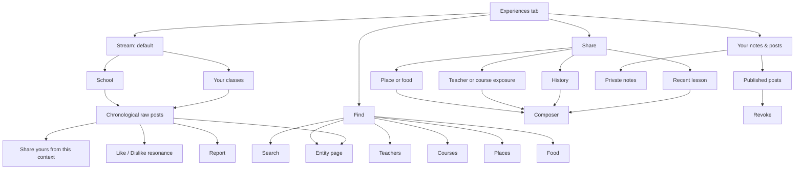
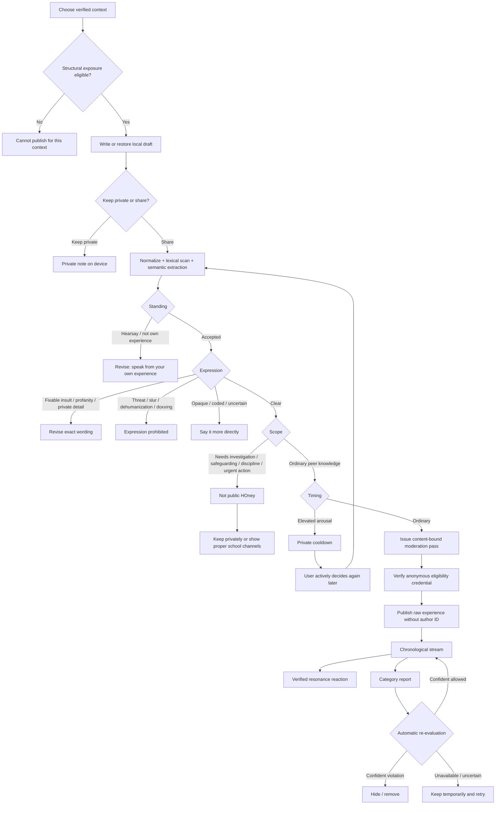

# HOney Refreshed — Main + Codex Branch Latest Review

**Repository:** `gy-yywq-s/HOney-refreshed`  
**Reviewed at:** 2026-09-01  
**`main` head:** `09c956230c2fb53e2daad154e0e2b23e50ffaf9c`  
**`codex/ios-editorial-redesign` head:** `585e35c0917c21c4dc6ab20e8b5b79ff3173270d`  
**Branch relationship:** diverged; Codex is 5 commits ahead and 6 commits behind `main`; merge base `43d662caa425621ab9c1a5f66c668356ca92ded2`.

This review treats the current UI as an implementation experiment rather than a final design. The main questions are:

1. Is the product itself now coherent?
2. Are the architecture and privacy claims true in code rather than only in copy?
3. Does Experiences feel like students exchanging lived school context, or like a searchable review database?
4. What should be preserved from `main` and from the Codex branch, and what should be redone?
5. What product style, voice, page atmosphere and promotional language are still missing?

## Evidence labels

- **Observed** — directly present in current code or repository documentation.
- **Conflict** — two current sources make incompatible claims.
- **Defect** — current behavior or contract is internally incorrect, misleading, or unsafe.
- **Recommendation** — proposed next change.
- **Product choice** — not an objective bug; it requires an explicit HOney decision.

---

# 1. Executive verdict

The repository has advanced substantially beyond a mock-up. The backend and integration architecture now have a serious foundation: HOney account sessions are separated from portal sessions; timetable data is normalized; Experiences has eligibility, moderation, publication and ownership primitives; published rows have no ordinary author field; the web and iOS clients use explicit service/view-model layers; the portal WebView recovery work on the Codex branch is materially stronger than the earlier version; and the moderation corpus is no longer token evidence.

However, the repository still has **two different products inside it**:

1. a technically careful, quiet school utility with an unusually thoughtful anonymous peer-experience layer; and
2. an editorial/product-design demo composed of stat strips, palette controls, grids, cards, animation kits and directory-first pages.

The first product is distinctive. The second obscures it.

The most important problem is therefore not that the current UI is “ugly” in isolation. It is that the UI does not consistently express the product's social model. Experiences is currently implemented primarily as:

> search → browse Teachers / Places / Food → filter → read cards

That is a useful research interface, but it is not the feeling you described: casually scrolling what people around school have experienced, the way one receives context from friends, while still having a strong search path when a specific teacher or place matters.

The correct next move is **not** another cosmetic pass over the existing Hub page. It is a product-level separation of two modes:

- **Stream:** encounter school experiences as an ongoing social record;
- **Find:** deliberately look up a teacher, course, room, dish or old lesson.

The Stream must become the default Experiences surface. Find must remain excellent, but secondary.

Architecturally, `main` should remain the integration base. The Codex branch should not be merged wholesale because it is behind the current main backend/docs and carries a separate, unresolved visual direction. Its state-management, portal, timetable, Access and local-persistence work should be transplanted selectively. Its current visual design should be treated as evidence and a component source, not as the final UI.

The P0 issues are:

1. establish one authoritative Product/Style Constitution and mark conflicting design documents superseded;
2. replace the current moderation priority model with the agreed ordered logic: **Standing → Expression → Scope → Timing**;
3. stop making stronger anonymity claims in UI than the current protocol supports, or implement genuine unlinkability before keeping those claims;
4. redesign Experiences as a stream-first social-information surface with a separate Find mode;
5. add cursor-based feed contracts and fix reaction/report correctness;
6. selectively integrate the Codex branch's nonvisual improvements onto current `main`;
7. simplify Home and remove design-demo elements that do not serve the student's day.

---

# 2. What is already structurally strong

## 2.1 The product scope is substantially clearer

**Observed:** The current README and master spec remove Exams, Week view, rankings, AI teacher summaries, scalar ratings for humans and an Access relay. iOS has four primary tabs — Home, Experiences, Timetable and Access — and the Web surface has Home, Experiences and Timetable by default.

This is the correct product direction. It reduces HOney to three kinds of value:

- immediate utility: what is next and how to enter school;
- persistent utility: timetable/history and portal access;
- social knowledge: what school is like from people who were there.

That is a coherent product. Do not broaden it again before these three values are excellent.

## 2.2 Presentation / application / backend separation is real enough to build on

**Observed:** The repository now contains clear packages and clients rather than one monolith:

- `packages/portal-connector`
- `packages/backend`
- `packages/shared`
- `apps/web`
- `ios/HOney`

The TypeScript API contract is explicitly treated as a cross-layer source of truth. iOS has separate Views, ViewModels, Services and Models. The Codex branch adds repository/state abstractions such as `TimetableRepository` and isolates more portal/access behavior from view rendering.

This is not perfect — web route components still absorb too much application logic — but the architecture is far enough along that the UI can be replaced without discarding the backend.

## 2.3 The School Portal model is correctly separated from HOney

**Observed:** HOney login provisions a HOney account; HOney has its own access/refresh sessions; portal credentials/tokens are separate. The iOS Codex branch starts the portal coordinator independently during bootstrap, and a failed portal session does not conceptually have to erase the HOney account.

The Codex Portal WebView work is worth preserving:

- persistent `WKWebsiteDataStore`;
- last safe URL;
- expiry detection;
- token injection;
- cancellable open attempts;
- absolute timeout;
- visible preparing/loading/authenticating/failure states;
- account-change reset.

This is much closer to the real requirement: as long as the school login protocol has not materially changed, ordinary portal expiry should be recovered without making the student type credentials again.

## 2.4 Experiences has a serious publication architecture

**Observed:** Current `main` separates:

1. authenticated eligibility;
2. authenticated synchronous moderation check;
3. unauthenticated publication using an eligibility token plus content-bound pass.

The post body is not persisted during check. Publication stores a raw post without an ordinary author column. A client-held ownership key controls later lookup/revocation. The pass is bound to content hash, entity/context, policy version, expiration and nonce. The database exposes only a coarse day bucket publicly.

This is a strong base. The remaining work is to make the privacy wording and the actual unlinkability level agree.

## 2.5 The moderation system is testable rather than purely aspirational

**Observed:** The backend has a versioned corpus with 89 bilingual/adversarial cases and separates deterministic lexical checks from LLM feature extraction and deterministic policy. It tests direct, spaced, leetspeak, Unicode, emoji-split and mixed-language forms, plus benign substring cases.

This is exactly the correct approach: the culture is richer than the rules, but the hard publication boundary must be executable and regression-tested.

---

# 3. The repository currently lacks one authoritative product truth

This is the first thing to fix because every later UI pass will otherwise drift.

## 3.1 Direct design conflict

**Conflict:** `docs/decisions-2026-09-01.md` says V1 should reproduce the legacy UI “wholesale”, including the serif wordmark and whole visual system. `docs/legacy-design-audit.md` says the serif mark is replaced, most surfaces are prototypes to replace, and only the cool-blue feel, card idiom, Access mental model and Day timetable should be refined. The Codex `AGENTS.md` and design audit establish yet another direction: quiet, modern, editorial, warm, with multiple selectable Surface palettes and a new wordmark.

These are not small stylistic differences. They imply three incompatible design strategies:

1. wholesale legacy reproduction;
2. preserve legacy feel, refine execution;
3. replace with a new editorial system.

The user's current instruction is closest to **#2**:

> preserve the overall feel, but make the complete UI and UX better; current UI is not final.

### Required action

Create one canonical file:

`docs/product/product-and-style-constitution.md`

At its top, state:

- this file supersedes `docs/decisions-2026-09-01.md` design section;
- legacy is a reference, not pixel parity;
- Codex editorial UI is exploratory, not approved final design;
- default decision is **Refine**;
- backend/state improvements can be merged independently from presentation.

Archive or mark superseded documents visibly. Do not let three documents remain “binding.”

## 3.2 Specification drift

**Observed/Conflict:** The repository's master spec is version 1.3, while the latest source-backed Experiences logic developed outside the repo is v2.0. Current `policy.ts`, API lane names and architecture docs still implement the older seven-lane model, including a policy order that checks serious allegations before targeted profanity.

This conflicts with the later product decision that enforcement should be ordered:

> **Standing → Expression → Scope → Timing**

### Required action

Import the three source-backed Experiences documents into the repo under a stable hierarchy:

```text
docs/product/experiences/
  moral-grounds.md
  normative-basis.md
  product-logic.md
  community-copy.md
```

Then make `product-logic.md` the source for the API policy contract and corpus version 7.

## 3.3 Acceptance status is too hard to trust

**Observed:** `docs/acceptance.md` contains strong useful evidence, but combines old branch descriptions, later deployment state, conflicting UI scoring language, and updated appendices. It reads partly as a history and partly as current truth.

### Required action

Split it into:

```text
docs/status/current-acceptance.md      # generated/current only
docs/status/acceptance-history.md      # append-only narrative
```

The current file should be generated from:

- branch/head SHAs;
- test outputs;
- policy version;
- corpus count;
- live portal probe status;
- design acceptance result.

Do not hand-edit repeated claims in three places.

---

# 4. Product identity: what HOney should feel like

Before page design, HOney needs a product style constitution. “Cool palette”, “editorial”, or “copy legacy” is not enough.

## 4.1 Product personality

HOney should feel:

- **quiet** — it does not compete for attention with school life;
- **warm but not cute** — human without becoming childish;
- **academically credible but not institutional** — precise, not bureaucratic;
- **frank** — it allows students to say what was genuinely good, bad, awkward or hard to explain;
- **small-scale and trusted** — like useful context circulating among people who share a place;
- **restrained** — no gamification, streaks, engagement bait, or ornamental analytics;
- **alive** — not sterile, but life comes from student words and school context, not ambient animation.

It should not feel:

- like the official portal;
- like a review marketplace;
- like a campus complaint platform;
- like a productivity dashboard;
- like a luxury editorial portfolio;
- like a social-media growth product;
- like an AI-generated design-system showcase.

## 4.2 The visual principle

> **Content carries the warmth; the interface carries the calm.**

Student experiences should be the most expressive element. The shell should be quiet enough that raw words feel immediate.

## 4.3 Recommended visual direction

Preserve the legacy family rather than literal tokens:

- cool navy / ocean / blue-gray remains the recognisable HOney temperature;
- background should be a quiet off-white or very light cool paper, not an obvious dot-grid canvas;
- cards should be used only when the object is genuinely self-contained, not around every row;
- body typography should be highly readable system sans on iOS and a neutral humanist sans on Web;
- a serif may exist in the wordmark or occasional brand display role only after the brand is settled; it should not turn the app into an editorial magazine;
- radius should be modest and consistent;
- shadows should be rare;
- separators, whitespace and typographic rhythm should do more work than boxes;
- dark mode should be designed, but users should not need to choose among four Surface palettes in V1.

### Recommendation: remove V1 appearance theatre

Current Web tokens expose Stone, White, Mist and Night plus neutral/editorial font modes. Codex proposes multiple user-selectable Surface palettes. This is disproportionate to the product problem and makes visual identity less coherent.

For V1:

- one canonical light theme;
- one canonical system dark theme;
- optional development-only theme preview;
- no persistent appearance switch in the main top bar;
- no pointer-follow glow, parallax, count-up statistics, or decorative scroll reveals unless a concrete state-transition benefit is shown.

Motion should communicate:

- new content arrival;
- navigation transition;
- pull-to-refresh;
- expansion/collapse;
- successful save/publication;
- current lesson progression.

It should not exist to prove the interface is “alive.”

## 4.4 Copy voice

HOney's voice should be:

- direct;
- short;
- humane;
- nonjudgmental;
- precise around privacy and serious matters;
- lightly conversational, never chirpy.

Avoid:

- excessive exclamation marks;
- institutional terms in student-facing screens (`moderation lane`, `policy version`, `verified provenance`);
- moralizing language (`be kind`, `be fair`);
- inflated claims (`completely anonymous`, `the truth about teachers`);
- self-conscious literary slogans repeated everywhere;
- technical privacy mechanics in primary task copy.

---

# 5. Product wording and promotion

## 5.1 Whole-product positioning

### Recommended master line

> **Your school day, made easier.**

### Supporting line

> **See what’s next, open the gate, and learn the things students only learn from each other.**

This explains all three product pillars without sounding like a feature checklist.

### More restrained alternative

> **The school day, with less friction.**

Supporting:

> **Timetable, access, the official portal, and experiences from people who were there.**

## 5.2 App Store / landing-page description

> **HOney brings the parts of school you use every day into one calmer place. See your next class, use Access, return to the official portal without signing in again, and read what other students experienced in the classes and places you share.**

> **Experiences are raw, anonymous student accounts — not rankings or final verdicts.**

Do not advertise:

- “Rate teachers anonymously”;
- “Find the truth about your teachers”;
- “Expose bad teaching”;
- “The student review platform.”

Those phrases create exactly the wrong community before the first post is written.

## 5.3 Login wording

Current iOS copy — “Your school day, in one place” — is acceptable but generic. Recommended:

**Headline**

> **Your school day, without the portal friction.**

**Support**

> **Use your school account. HOney creates no separate password.**

**Credential note**

> **On this iPhone, your school login can be kept securely so ordinary portal expiry is handled automatically.**

Keep the detailed Keychain/data explanation behind `How sign-in works` rather than placing a long paragraph under the primary action.

## 5.4 Experiences positioning

### Primary headline

> **What school feels like, from people who were there.**

### Supporting line

> **Read what others experienced. Share what it was like for you.**

### Culture line

> **People are more than one experience. Experiences still matter.**

### Secondary line

> **Specific details can help. A feeling can matter too.**

“A shared memory, read slowly” is aesthetically intentional but too self-conscious and passive. It sounds like an editorial project rather than an ordinary social place. Keep “shared memory” for About/manifesto copy, not the primary feed title.

## 5.5 Privacy wording

The current UI often says some version of “nothing links the post back to you.” That is stronger than the current protocol warrants because `/check` is authenticated and receives both `honeyId` and body in the same request, and current HMAC marks are not cryptographically blind issuance.

Until genuine protocol unlinkability is implemented, use:

> **Published posts are stored without an author ID. Eligibility and publication are handled separately.**

And:

> **What you write may still make you recognisable to someone who knows the situation.**

After real blind/unlinkable issuance and identity-free moderation are implemented, wording may become:

> **Your school account proves you can contribute. It is not attached to what you publish.**

Do not put ownership-key mechanics in the main feed/composer footer. Present them after publication and in a dedicated `How control works` explanation.

## 5.6 Composer wording

**Title**

> **Share an experience**

**Prompt**

> **What was it like for you?**

**Helper**

> **Specific details can help someone understand. A feeling can matter too.**

**Actions**

- `Share anonymously`
- `Keep this for yourself`

Do not show all Six Checks in a permanent form section. The moral framework should shape contextual interventions, not feel like a school policy acknowledgment.

## 5.7 Outcome wording

### Optional context nudge

> **This can be shared as it is. Is there anything that would help someone understand what you mean?**

Buttons:

- `Share as written`
- `Add a little context`
- `Keep private`

### Cooling period

> **Your words are saved. Come back after the pause if you still want to share them.**

Secondary:

> **This is a pause, not a judgment about your experience.**

### Expression revision

> **This wording can’t be shared here yet. Remove the insult or private detail, then say what happened or how it felt.**

### Unclear / coded wording

> **We couldn’t understand part of this well enough to publish it. Say it more directly.**

### Out of scope

> **This sounds like something that needs real support or action, not a public post.**

> **HOney won’t publish it or send it to the school. You can keep it privately or use one of the school channels below.**

### Empty feed

> **Nothing from your classes yet. A small honest note is enough.**

### Empty entity page

> **No one has shared an experience here yet.**

---

# 6. Experiences needs two distinct product modes

The current Hub mixes lookup and encounter into one page. Search and three browse cards come before the feed. That structurally tells the user:

> “This is a database. Search for an object.”

The desired feeling requires a different default:

> “This is what people around school have been experiencing.”

## 6.1 Mode A — Stream

Purpose: passive/social encounter.

The user opens Experiences and immediately sees a continuous chronological stream. They do not need a target or query.

Two stream scopes are sufficient:

- **Your classes** — posts associated with teachers, courses and rooms in the user's verified history;
- **School** — the whole school feed.

No engagement ranking. No opaque “For You.” No popularity algorithm.

### Why it can feel social without authors, replies or ranking

The social unit is not a profile; it is a shared context.

Each post says, implicitly:

> “Someone who was there experienced this.”

The school entity/course context plays the role avatars and handles play elsewhere. This is appropriate because HOney is not trying to create student celebrities or public identities.

The feed feels conversational through:

- raw first-person language;
- chronological arrival;
- shared contexts;
- lightweight resonance reactions;
- “Share yours” entry points;
- recurring teachers/classes/places;
- a visible sense that new experiences have appeared since the last visit.

It does **not** need comments or reply threads to feel social.

## 6.2 Mode B — Find

Purpose: deliberate research.

Accessible from a prominent search icon/button, not placed above the default stream.

Find includes:

- universal search;
- Teachers;
- Courses;
- Places;
- Food;
- History picker for one's own lessons;
- entity pages;
- filters and chronological sorting.

This is where the current Hub's strongest ideas belong.

## 6.3 Recommended iOS Experiences top-level layout

```text
Experiences                         [Search] [Share]
What school feels like, from people who were there.

[ Your classes ] [ School ]

────────────────────────────────────
Ms Chen · Further Mathematics
Verified class context · Yesterday

She explains difficult proofs really clearly, but I
always feel a bit nervous when she calls on people
without warning. I know she doesn't mean it badly.

[thumb up 12] [thumb down 3]             [•••]
────────────────────────────────────
Room 403
Place · Monday

Always too warm after lunch, especially near the back.

[thumb up 8] [thumb down 1]              [•••]
────────────────────────────────────
```

Important:

- stream starts near the top;
- no grid before the feed;
- no segment for Newest/Oldest on the main social stream — chronological is the product behavior;
- Search and filter belong to Find/entity pages;
- Share is always visible but not a giant promotional card.

## 6.4 Recommended Web layout

At narrow width: the same single-column stream.

At desktop width:

```text
Left navigation      Main stream (620–700px)       Quiet right rail
Home                 Your classes / School          Search school
Experiences           chronological posts           Recent contexts
Timetable             load-more/infinite scroll      Your notes & posts
Settings                                             Community principle
```

The right rail is optional and disappears first. It must not turn into analytics, trending, top teachers or popular posts.

The main stream remains the visual center.

---

# 7. Feed design in detail

## 7.1 Post anatomy

The current cards lead with a provenance chip and often wrap every post in a bordered rounded surface. That makes posts feel like moderated records.

Recommended hierarchy:

1. **Entity/context name** — strongest metadata;
2. **raw body** — visually dominant;
3. **course/lesson/place context** — supporting;
4. **coarse date and verification signal** — quiet;
5. **reaction and report actions** — lowest hierarchy.

Example:

```text
Ms Chen · Further Mathematics
Yesterday · from a verified class context

She is genuinely very kind, but I found the pace hard
at first and felt awkward asking her to slow down.

[like]  [dislike]                     [more]
```

Avoid a bright `Verified retrospective` capsule as the first thing the eye sees. Verification is important for trust but not the emotional content of the post.

## 7.2 Cards versus continuous conversation

Do not put every post in an isolated floating card. Use:

- one calm page surface;
- generous vertical whitespace;
- thin separators;
- occasional grouping surface where multiple posts concern the same entity/context;
- cards only for Home previews, composed callouts, or truly separate interactive objects.

This is one of the largest visual changes required to make Experiences feel social rather than catalogued.

## 7.3 Scrolling behavior

Required:

- cursor-based pagination;
- automatic prefetch before the user reaches the end;
- scroll-position restoration when opening an entity/post and returning;
- pull-to-refresh on iOS;
- `New experiences` pill/divider rather than snapping the user to the top;
- skeletons that preserve feed geometry;
- no count-up animation or card reveal sequence for ordinary posts;
- stable ordering under refresh.

### Cursor contract

Use an opaque cursor based internally on `(published_at, id)` or equivalent. Do not use offset pagination; new posts will otherwise duplicate or skip rows while the user scrolls.

Public date remains coarse. Internal pagination can use precise ordering without exposing it.

## 7.4 Burst handling

If many posts about the same entity arrive consecutively, preserve chronology but consider visual grouping:

```text
Ms Chen — 2 experiences
[first]
[second]
Show 4 more from this context
```

This is grouping, not ranking. All raw items remain available.

## 7.5 No engagement optimization

Never use:

- dwell time;
- reaction count;
- controversy;
- report activity;
- sentiment;
- predicted engagement;

to order the main stream.

The social feeling should come from relevance and recency, not algorithmic amplification.

---

# 8. Find and entity pages in detail

## 8.1 Search

Search should cover:

- teacher names;
- courses/subjects;
- rooms/places;
- food items;
- raw experience text where appropriate.

Results should be grouped by entity type first, then matching experiences.

Recommended search page:

```text
Search school
[ ______________________________ ]

Recent
Ms Chen · Further Mathematics
Room 403
Canteen curry

Teachers
...
Courses
...
Places
...
Food
...
```

## 8.2 Course should become first-class

Current API explicitly says Course is not a standalone Experiences entity, while the Web exposes `/experiences/course/:id` as a context-filter page. This is conceptually awkward.

Students naturally think:

- teacher;
- course/subject;
- lesson;
- room;
- food/place.

Recommendation: add `course` to `EntityType` and make course pages first-class, while retaining the rule that direct course contributions must be grounded in verified course exposure or a selected lesson.

Do not make a fake entity page in the router while denying it in the entity model.

## 8.3 Teacher page

Header:

- teacher name;
- school role/subjects if known;
- `Share your experience`;
- no score;
- no AI summary;
- no “positive/negative percentage.”

Body:

- raw chronological feed;
- filter by course, year/term, lesson-linked vs retrospective;
- optional context counts that are descriptive only (`18 experiences across 3 courses`) and not quality metrics.

## 8.4 Course page

- course name;
- teachers/context relationships;
- raw experiences from relevant lessons/course contexts;
- filters by teacher/term;
- `Share from one of your lessons` entry.

Current wording “Review one of these lessons” should be replaced. `Review` keeps pulling the product toward a rating form.

## 8.5 Place / food pages

Places use raw text and tags/context. Food may retain scalar rating.

Do not let the food-rating component leak into generic `ExperienceRow` in a way that makes human ratings easy to re-enable later.

---

# 9. Composer redesign

The current Web composer has good logic but too much visible product policy. The current iOS composer uses `Form` and includes “A few things to keep in mind,” which feels like submitting an institutional evaluation.

The composer should feel like writing a note to people who share the same school context.

## 9.1 Recommended structure

```text
Cancel                Share an experience

[ Ms Chen · Further Mathematics · Aug 31 ]

What was it like for you?
┌────────────────────────────────────────┐
│                                        │
│                                        │
└────────────────────────────────────────┘
Specific details can help someone understand.
A feeling can matter too.

[ Keep this for yourself ] [ Share anonymously ]
```

## 9.2 Context target

The target should be selected before the editor and displayed as a light removable context chip/header.

Entry options:

- recent lessons;
- History;
- teacher/course with verified exposure;
- places/food.

Do not open a targetless composer and then present a generic “pick target” error state.

## 9.3 Stable culture copy, not random copy

Current Web chooses random placeholder and footer hints per mount. This makes the product voice inconsistent and may create different perceived rules for identical submissions.

Use one stable primary prompt. Contextual hints should appear only when relevant.

## 9.4 The Six Checks stay behind the interaction

The Six Checks are valuable as the policy design source and optional explanation page. They should not appear as six persistent mini-policies beneath every editor.

Use them only when triggered:

- hearsay → “Say what you experienced yourself.”
- private detail → “Remove information that is not yours to share.”
- insult → “Say what happened or how it felt without the insult.”
- serious matter → “This needs a real support/action channel.”

## 9.5 Draft and private note model

Keep:

- draft autosave before network calls;
- first-class private note;
- publish later;
- no automatic publication.

Simplify presentation:

- ordinary users should not be asked to understand ownership keys during composition;
- key recovery should be an exceptional post-publication recovery screen;
- `Your notes & posts` should present simple statuses and actions;
- put cryptographic details under `How post control works`.

---

# 10. Home review

## 10.1 Current issue

Web Home currently combines:

- a large next-lesson hero;
- an animated three-stat strip;
- three numbered action cards;
- Experiences preview.

Codex iOS Home is better structured but still adds a “What do you need?” two-card action area before Experiences.

This makes Home feel like a dashboard. The master spec says Home should be deliberately small.

## 10.2 Recommended Home

```text
Good morning, Gary
Tuesday, September 1

NOW / NEXT
Further Mathematics
09:40–11:00 · Ms Chen · Room 403
[Open lesson]

From your classes                         See all
[first experience preview]
[second experience preview]

School Portal                                      >
```

That is enough.

### Remove

- stats for lessons today / minutes until next / recent post count;
- count-up animation;
- numbered action cards;
- dedicated Timetable quick action already available in tab navigation;
- decorative parallax/pointer effects;
- “What do you need?” section unless real testing shows it materially improves Access discoverability.

### Keep

- current/next lesson as dominant object;
- one clear lesson action;
- two or three Experiences previews;
- one School Portal row;
- settings/profile control.

Access already has a primary tab. It does not need a large Home card unless usage data shows students require it.

---

# 11. Timetable, Access and Portal

## 11.1 Timetable

The Codex branch's responsiveness/caching/race-safety work is more important than its visual restyle.

Keep:

- one Day view;
- adjacent-date responsiveness;
- repository cache/invalidation;
- stale response protection;
- visible current lesson line/state;
- direct path from a lesson into Experiences;
- History as secondary route.

Refine visually from the legacy day timeline, but do not add another Week view or ornamental statistics.

## 11.2 Access

Keep the legacy mental model and the Codex state separation:

- permit state/load state separate from physical mutation state;
- physical actions single-flight;
- explicit gate name and confirmation;
- direct client → school API;
- no HOney relay.

The UI can be redone, but operation safety is not a visual detail.

## 11.3 Official Portal WebView

The Codex branch is the stronger implementation base. Preserve its:

- persistent WebView data store;
- safe-URL restoration;
- visible opening/authenticating/failure state;
- timeout/cancellation;
- account reset;
- independent portal session.

Refine:

- expiry route detection should use known host/path patterns, not any URL containing `login`;
- unsafe URL checks should be structured URL rules, not broad substring matching;
- JavaScript patching of global `fetch` and history should be minimized and versioned to the observed portal behavior;
- add tests for changed portal routes and false-positive login substrings.

---

# 12. Architecture review and concrete corrections

# 12.1 Branch integration strategy

Do not merge `codex/ios-editorial-redesign` wholesale into `main`.

`main` is 6 commits ahead of the merge base and contains the current backend, Web, policy v6 and documentation. Codex is 5 commits ahead with useful iOS runtime/state work but a separate visual program.

Recommended integration branch:

```text
main
  └── product/experiences-stream-v7
          ├── transplant Codex state/runtime changes
          ├── moderation policy v7
          ├── feed/API changes
          └── final UI replacement
```

### Keep/cherry-pick selectively from Codex

- Portal WebView responsiveness, timeout, cancellation and recovery;
- Timetable repository/caching/invalidation and race fixes;
- Access load/mutation state separation and physical-action safety;
- local draft/private-note/ownership recovery correctness;
- Experience target labels/metadata cache;
- tests accompanying those behaviors;
- accessibility and error-state improvements that are independent of visual style.

### Do not merge as final product direction

- the entire editorial Surface palette system;
- placeholder wordmark/brand direction;
- current Home composition;
- current Experiences filter-first/card-stack composition;
- permanent Six Checks section in composer;
- design audit documents as binding product truth.

### Merge order

1. rebase/select patches onto current `main`;
2. resolve models/contracts first;
3. merge tests and state machines;
4. compile and run tests;
5. then replace presentation against stable application contracts.

---

# 12.2 Web frontend responsibility split

The repository states four-band separation, but Web pages still perform substantial application logic directly:

- fetch orchestration;
- grouping;
- local sorting/filter control;
- target resolution;
- ownership/private-note merging;
- composer state machine.

This will make a full UI replacement harder than necessary.

Recommended feature structure:

```text
apps/web/src/features/experiences/
  domain/
    models.ts
    policy-copy.ts
  application/
    useExperienceStream.ts
    useExperienceSearch.ts
    useEntityExperienceFeed.ts
    useComposerMachine.ts
    useMyPostsAndNotes.ts
  presentation/
    ExperienceStream.tsx
    ExperiencePost.tsx
    Composer.tsx
    EntityHeader.tsx
    SearchPanel.tsx
  routes/
    ExperiencesRoute.tsx
    ExploreRoute.tsx
    EntityRoute.tsx
    ComposeRoute.tsx
```

Presentation receives view state and emits intents. It should not know endpoint sequencing.

The same principle already works better on iOS through ViewModels/Services; use that as the conceptual standard.

---

# 12.3 Shared contract and schema generation

TypeScript has one shared wire contract, but Swift mirrors it manually. Contract drift is already a recurring risk.

Recommendation:

- define OpenAPI/JSON Schema from the shared contract or generate both TS and Swift DTOs from one schema;
- keep client domain models separate from generated wire DTOs;
- run contract fixtures through both Web and iOS decoding in CI;
- version breaking API changes explicitly.

Do not import backend implementation code into clients.

---

# 12.4 Login and consent must be structurally separate

The UI correctly presents sign-in and import consent as two steps. However, `LoginInput` and backend `/api/auth/login` still accept optional `consentTimetable`, which leaves the old combined path structurally possible.

Recommendation:

- remove `consentTimetable` from `LoginInput`;
- remove consent mutation from `/api/auth/login`;
- keep `/api/consent` as the only consent-changing endpoint;
- run first sync only after explicit consent action.

Do not rely on clients behaving correctly when the backend contract can enforce the invariant.

---

# 12.5 Web session storage

Current Web stores HOney access/refresh tokens in `localStorage`. Since the Web frontend and backend are packaged same-origin, this is unnecessary exposure to XSS.

Recommendation:

- use `Secure`, `HttpOnly`, appropriate `SameSite` cookies for Web sessions;
- keep native bearer-token/session storage for iOS;
- use separate session adapters per client;
- keep `/experiences/publish` explicitly free of ambient cookies/credentials;
- consider an isolated publication endpoint/subdomain only if needed to make credential omission mechanically obvious.

This is separate from Experiences author anonymity; it is ordinary Web session security.

---

# 12.6 Experiences feed contract needs to become a real stream contract

Current feed endpoints accept `before` and `limit`, but Web entity pages commonly request a fixed `limit: 100`, and the public response has no explicit cursor/`hasMore` model.

Recommended API:

```text
GET /api/experiences/stream
  ?scope=my_classes|school
  &cursor=<opaque>
  &limit=20

GET /api/experiences/search
  ?q=
  &type=teacher|course|room|dish
  &cursor=

GET /api/experiences/entities/:type/:id
  ?cursor=
  &courseId=
  &provenance=

GET /api/experiences/contexts/recent
```

Response:

```json
{
  "items": [],
  "nextCursor": "opaque-or-null",
  "hasMore": true
}
```

Each feed item should include resolved display context to avoid the client fetching a complete directory and doing multiple local joins:

```json
{
  "id": "...",
  "primaryEntity": { "type": "teacher", "id": "...", "name": "Ms Chen" },
  "context": {
    "course": { "id": "...", "name": "Further Mathematics" },
    "room": { "id": "...", "name": "403" }
  },
  "body": "...",
  "publishedDay": 20697,
  "provenance": "verified_lesson",
  "reactions": { "likes": 12, "dislikes": 3, "viewerValue": 1 },
  "capabilities": { "canReact": true, "canShareFromContext": true }
}
```

Public author identity remains absent.

---

# 12.7 Reaction correctness

Current clients maintain reaction selection locally for the session, while the endpoint returns only `{ok}`. The displayed count is not reliably updated and the client cannot restore the viewer's existing reaction.

Recommendation:

- reaction endpoint returns authoritative state:

```json
{
  "value": 1,
  "counts": { "likes": 13, "dislikes": 3 }
}
```

- stream response may include `viewerValue` because reactions are already authenticated/deduplicated; this does not identify the post author;
- optimistic update must rollback on failure;
- counts remain hidden under the cohort threshold.

### Concrete backend bug

For lesson-linked posts, the stored `lesson_id` is an opaque lesson token, but reaction eligibility code also attempts to compare it to raw `user_lesson_exposures.lesson_instance_id`. Those values are in different namespaces and cannot match. It usually falls back to teacher exposure, but fails for contexts without a teacher.

Fix by checking only safe context/exposure relationships, or maintain a separate non-public eligibility scope mapping that does not leak the raw lesson on public rows.

---

# 12.8 Report behavior has a dangerous transient-failure property

Current report logic automatically re-runs moderation and hides a previously published post on **any** non-publishable result, including `failed_closed` when the classifier is unavailable.

This creates a bad failure mode:

> one report + temporary LLM outage → previously accepted post disappears.

Recommendation: report re-evaluation must be tri-state.

```text
CONFIDENT_VIOLATION -> hide
CONFIDENT_ALLOWED   -> keep
UNAVAILABLE/UNCERTAIN -> keep temporarily + schedule retry
```

Because the post already passed the publication boundary, transient inability to classify should not itself reverse that decision.

Also add:

- reporter dedup HMAC per account/post/category;
- report rate limits;
- idempotent report state;
- no repeated paid LLM call from the same user/report category;
- report kill switch if abuse emerges.

No human queue is required, but “no human queue” does not mean every uncertain automatic result should delete content.

---

# 12.9 Current anonymity copy overstates current protocol

Current DB design achieves strong **stored separation**: published posts have no author field. It does not yet establish genuine cryptographic protocol unlinkability:

- eligibility issuance is authenticated;
- `/check` is authenticated and receives the body plus `honeyId`;
- HMAC marks are generated with a server-held key and can be recomputed for known users/scopes;
- the same server controls issuer and community logic.

Therefore current copy such as “nothing links the post back to you” is not accurate.

Two coherent options exist:

### Option A — pragmatic stored separation

Keep current architecture and say exactly:

> Published posts are stored without an author ID. HOney does not maintain a normal author lookup for them.

### Option B — genuine protocol unlinkability

Implement blind/unlinkable eligibility issuance (Privacy Pass-style), make moderation check identity-free, and prevent issuer/redemption correlation from protocol data.

Given the prior decision that this should be designed correctly from V1 if cost is modest, **Option B is recommended before public launch**.

Possible flow:

```text
Authenticated account
  -> obtains blind/scoped eligibility credential
  -> moderation request uses credential, not HOney session
  -> moderation pass bound to exact content/context
  -> publish redeems credentials without ambient account auth
```

Network metadata is still not absolute anonymity; the product need not claim that.

### External moderation provider disclosure

If candidate text is sent to a third-party LLM provider, the privacy page must say so accurately and the provider's retention/logging setting must be an explicit deployment decision. “HOney never stores the draft” does not imply the model provider never receives or retains it.

---

# 13. Moderation logic must be redesigned, not merely renamed

Current policy v6 is a priority list of booleans:

1. rating invalid;
2. serious allegation/targeting/privacy;
3. slur/dehumanizing;
4. hearsay/profanity/injection/uncertain;
5. high arousal;
6. low information;
7. publish.

This is exactly why the process felt arbitrary. It treats every concern as one competing “lane” rather than separating distinct questions.

The agreed conceptual model should become policy v7.

## 13.1 One semantic extraction, ordered enforcement

Classification can happen in one LLM call, but enforcement is ordered:

1. **Standing** — does the person have direct experiential standing, rather than rumor/hearsay?
2. **Expression** — can HOney carry this exact wording?
3. **Scope** — is the substance still ordinary peer knowledge, or does it require institutional casework?
4. **Timing** — if publishable, should the publication decision happen now or after a pause?

This order matters. A sentence containing `bitch` should first receive an expression intervention rather than being processed publicly as a serious institutional allegation.

## 13.2 Proposed semantic schema

```json
{
  "experientialBasis": "firsthand | observed | inference | hearsay | unclear",
  "speechType": "feeling | evaluation | firsthand_account | pattern_impression | allegation",
  "expression": {
    "state": "clear | fixable | prohibited | opaque",
    "issues": [
      "directed_profanity",
      "targeted_insult",
      "slur",
      "dehumanization",
      "sexualization",
      "threat",
      "pii",
      "student_identification",
      "evasion",
      "coded_language"
    ]
  },
  "scope": {
    "consequence": "ordinary_peer | investigation | safeguarding | discipline | urgent_action"
  },
  "timing": {
    "arousal": "ordinary | elevated"
  },
  "semanticConfidence": "clear | uncertain"
}
```

The model still does not output `allow`.

## 13.3 Proposed deterministic decision object

Avoid encoding all concepts into one lane name.

```json
{
  "standing": "accepted | revision_required | ineligible",
  "content": "publishable | revision_required | prohibited_expression | not_public_honey | unavailable",
  "timing": "now | cooldown",
  "reasonCodes": []
}
```

The client can derive the current actionable screen without losing semantic distinctions.

## 13.4 Ordered policy

```text
A. Structural eligibility
   - no relevant exposure -> ineligible

B. Experiential standing
   - hearsay / unclear ownership of account -> revision_required

C. Expression
   - fixable insult/profanity/private detail -> revision_required
   - clear threat/slur/dehumanization/sexualization/doxxing -> prohibited_expression
   - opaque/coded/evasive/semantic uncertainty -> revision_required (say it directly)

D. Scope
   - investigation/safeguarding/discipline/urgent action -> not_public_honey
   - otherwise -> publishable

E. Timing, only after publishable
   - elevated arousal -> cooldown
   - ordinary -> now
```

## 13.5 Priority examples

### Example 1

> “This bitch keeps standing too close to me and it makes me uncomfortable.”

First result:

- standing: accepted;
- expression: revision required (`targeted_insult`);
- scope is not shown as the current user action.

After revision:

> “She keeps standing too close to me and it makes me uncomfortable.”

- expression: clear;
- scope: ordinary peer experience;
- publishable.

### Example 2

> “This bitch takes money to change grades.”

First result:

- expression revision first.

After revision:

> “She takes money to change grades.”

- expression: clear;
- scope: investigation/discipline;
- not public HOney.

## 13.6 Corpus changes

Current corpus mostly asserts one flag at a time. That cannot adequately test priority/order.

Add combined cases:

- insult + ordinary discomfort;
- insult + serious allegation;
- hearsay + slur;
- PII + serious allegation;
- high arousal + ordinary criticism;
- high arousal + serious allegation;
- opaque language + potential threat;
- quoted slur in a legitimate account;
- facility safety versus institutional allegation.

Each combined case must assert the **first user-visible intervention**, not only the internal feature vector.

---

# 14. Proposed end-to-end Experiences information architecture



---

# 15. Revised moderation flow



---

# 16. File-by-file work order

## P0 — product truth and correctness

### Documentation

- `docs/decisions-2026-09-01.md` — mark design direction superseded.
- `docs/legacy-design-audit.md` — update to current Preserve/Refine/Replace truth.
- `docs/honey_master_spec_v1.md` — update to latest source-backed Experiences v2/v7 logic.
- `docs/architecture/moderation-pipeline.md` — replace old lane model and update policy version.
- `docs/acceptance.md` — split current state from history.
- `README.md` — remove overclaims such as literal unlinkability/async publication if implementation remains pragmatic/synchronous.

### Moderation/backend

- `packages/backend/src/experiences/policy.ts` — policy v7 ordered enforcement.
- `packages/backend/src/experiences/llm.ts` — structured schema update.
- `packages/backend/src/experiences/corpus/regression.json` — combined priority cases.
- `packages/backend/src/experiences/service.ts` — new decision object; tri-state report recheck; reaction eligibility bug; optional identity-free check flow.
- `packages/shared/src/api/contract.ts` — replace legacy lanes, add cursor stream DTOs, course entity, authoritative reaction responses.
- `packages/backend/src/db/database.ts` — clean stale status/comment schema and add report dedup/state migration.

### Auth/session

- `packages/shared/src/api/contract.ts` — remove `consentTimetable` from `LoginInput`.
- `packages/backend/src/routes/auth.ts` — remove consent mutation from login endpoint.
- `apps/web/src/api/client.ts` — separate Web cookie session strategy from native bearer semantics.

## P1 — selective Codex integration

- `ios/HOney/Features/Home/PortalWebView.swift` — keep runtime/recovery architecture, tighten route detection.
- `ios/HOney/Services/PortalWebSessionBridge.swift` — keep token bridge, minimize global JS monkey-patching.
- `ios/HOney/Services/TimetableRepository.swift` — merge.
- `ios/HOney/Features/Timetable/*ViewModel.swift` — merge state/race fixes.
- `ios/HOney/Features/Access/*ViewModel.swift` — merge separated load/mutation states.
- local draft/private-note/ownership recovery services and tests — merge.
- target metadata/cache — merge.

Do not finalize the accompanying UI composition.

## P1 — Experiences stream architecture

### Backend/API

- add cursor stream endpoint;
- add first-class Course entity;
- add resolved context to feed DTO;
- return viewer reaction state and counts;
- add search endpoint;
- add recent-context endpoint;
- support scroll-safe cursor pagination.

### Web

- replace Hub grid-first page with Stream route;
- move search/browse to Find route or panel;
- extract application hooks from route components;
- replace card grid with continuous post rows;
- remove stats/count-ups/parallax/pointer glow from core utility/social flows;
- preserve scroll position and prefetch.

### iOS

- replace filter-first Experiences screen with stream-first screen;
- keep Search/Share in toolbar;
- move filters to Find/entity pages;
- replace SwiftUI `Form` composer with custom note-like composer;
- move ownership/privacy technical copy to progressive disclosure;
- show context first, provenance second.

## P1 — Home simplification

- remove Web stat strip and action-card grid;
- remove or demote iOS “What do you need?” cards;
- add direct focal lesson action;
- retain only next/current lesson, Experiences preview and Portal row;
- use same `/stream?scope=my_classes&limit=2` data source as Experiences.

## P2 — final visual system and brand

- one canonical light/dark system;
- final wordmark and small mark;
- final type scale and spacing;
- card-to-separator reduction;
- motion only for state transitions;
- full iOS/Web screenshot audit using the same canonical product states;
- remove design-lab controls from production UI.

---

# 17. Acceptance criteria for the next review

## Product

- Opening Experiences immediately shows a chronological stream, not a directory grid.
- A user can scroll continuously without selecting a teacher first.
- Search/Find remains reachable in one action and supports teacher/course/place/food lookup.
- The product never displays a human/lesson scalar rating.
- A post's raw text is visually dominant over verification/policy metadata.
- Home is visibly simpler than both current implementations.
- Composer feels like sharing a note, not completing an evaluation form.
- Culture copy recognizes both peer usefulness and the contributor's own desire to share an experience.

## Architecture

- `main` contains the selected Codex state/runtime fixes without wholesale UI merge.
- docs name one current design authority.
- course is either a genuine entity or its non-entity status is consistently removed from UI/routes.
- feed uses cursor pagination.
- reaction UI is authoritative and restorable.
- report outage cannot remove a previously accepted post.
- moderation follows Standing → Expression → Scope → Timing.
- corpus includes combined priority cases.
- login cannot mutate timetable consent.
- privacy wording exactly matches protocol behavior.
- Web sessions are no longer unnecessarily exposed in localStorage, or the risk is explicitly accepted and documented.

## Design/voice

- no persistent V1 theme laboratory;
- no stat count-up, parallax or pointer-glow in core pages;
- HOney is recognisable as the legacy product's more mature continuation;
- all primary copy follows the voice principles in this review;
- teacher pages feel informational and humane, not judicial;
- Experiences feels active even when no one is searching.

---

# 18. Final recommended direction

Do not treat the next phase as “make the current UI prettier.”

Treat it as four deliberate corrections:

1. **Make the product truth singular.** Resolve docs and branch direction first.
2. **Make Experiences stream-first.** Encounter before lookup; Find remains excellent but secondary.
3. **Make the architecture claims literal.** Fix policy order, report failure behavior, reactions, consent contract and anonymity wording/protocol.
4. **Make the design quieter.** Let the human raw content provide social energy; remove the dashboard/editorial-demo layer around it.

The most distinctive version of HOney is not a more beautiful school portal and not a smaller RateMyProfessors. It is:

> **a calm school utility whose social layer feels like useful, honest context circulating among students who share the same place.**

That is the product the backend is now capable of supporting. The next UI should finally make that product obvious.

---

# 19. Repository evidence index

## Branch state

- `main`: `09c956230c2fb53e2daad154e0e2b23e50ffaf9c`
- `codex/ios-editorial-redesign`: `585e35c0917c21c4dc6ab20e8b5b79ff3173270d`
- merge base: `43d662caa425621ab9c1a5f66c668356ca92ded2`

## Product/docs reviewed

- `README.md`
- `docs/acceptance.md`
- `docs/audit-2026-09-01-repo-and-next-plan.md`
- `docs/decisions-2026-09-01.md`
- `docs/legacy-design-audit.md`
- `docs/honey_master_spec_v1.md`
- `docs/design/web-style.md`
- `docs/design/legacy-port-map.md`
- `docs/architecture/m1-portal-connector.md`
- `docs/architecture/m2-honey-core.md`
- `docs/architecture/m3-experiences.md`
- `docs/architecture/m5-web-and-deploy.md`
- `docs/architecture/moderation-pipeline.md`

## Architecture/code reviewed

- `packages/shared/src/api/contract.ts`
- `packages/backend/src/routes/auth.ts`
- `packages/backend/src/routes/experiences.ts`
- `packages/backend/src/experiences/policy.ts`
- `packages/backend/src/experiences/llm.ts`
- `packages/backend/src/experiences/service.ts`
- `packages/backend/src/experiences/corpus/regression.json`
- `packages/backend/src/db/database.ts`
- `apps/web/src/App.tsx`
- `apps/web/src/api/client.ts`
- `apps/web/src/components/AppLayout.tsx`
- `apps/web/src/pages/HomePage.tsx`
- `apps/web/src/pages/LoginPage.tsx`
- `apps/web/src/pages/experiences/HubPage.tsx`
- `apps/web/src/pages/experiences/EntityPage.tsx`
- `apps/web/src/pages/experiences/ComposePage.tsx`
- `apps/web/src/pages/experiences/useComposer.ts`
- `apps/web/src/pages/experiences/MinePage.tsx`
- `apps/web/src/pages/experiences/shared.tsx`
- `apps/web/src/styles/tokens.css`
- `apps/web/src/lib/motion.tsx`
- `ios/HOney/App/AppModel.swift`
- `ios/HOney/DesignSystem/AppTheme.swift`
- `ios/HOney/Features/Main/MainTabView.swift`
- `ios/HOney/Features/Home/HomeView.swift`
- `ios/HOney/Features/Home/PortalWebView.swift`
- `ios/HOney/Features/Experiences/ExperiencesView.swift`
- `ios/HOney/Features/Experiences/ComposeExperienceView.swift`
- `ios/HOney/Features/Experiences/ExperienceRow.swift`
- `ios/HOney/Features/Experiences/InteractiveExperienceRow.swift`
- `ios/HOney/Services/PortalWebSessionBridge.swift`
- Codex design audits under `DESIGN-IS-2026-09-01*`
