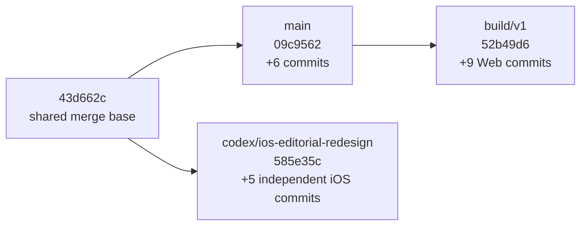
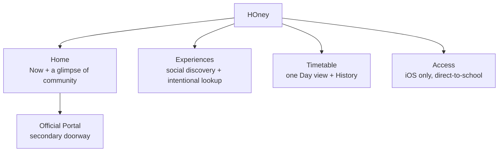
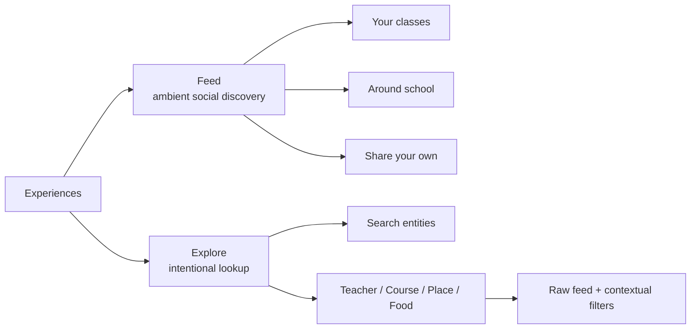
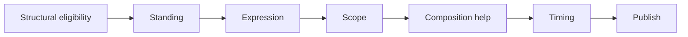
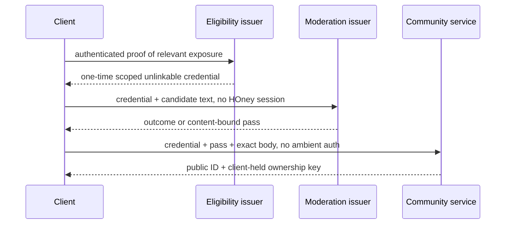

# HOney Refreshed
## `main` / `build/v1` / `codex/ios-editorial-redesign` 最新仓库 Review 与下一阶段重构方案

**Review date:** 2026-09-01  
**Repository:** `gy-yywq-s/HOney-refreshed`  
**Review type:** Product, information architecture, UX/UI, backend/domain architecture, Portal integration, Experiences social model, copy/brand and branch-integration review  
**Design-strategy revision:** Web and iOS are treated as parallel design labs; cross-platform visual convergence is deliberately deferred.  
**Cross-pollination rule:** borrowing may be small or large in either direction — copy, interaction, page composition, component grammar, typography, palette, motion, or even most of a complete direction may be transplanted when it works better. Borrowing does not create a parity obligation or make the donor direction final.  
**Synthesis inputs:** the prior full repository review, `honey_main_codex_latest_review_2026-09-01.md`, the source-backed Experiences moral/normative/product documents, and the latest branch heads rechecked at this revision.
**v3 revision:** adds a formal Mobile Web Screen Composition / Scroll Ownership model and acceptance matrix. This is a targeted hardening of the existing React/PWA direction, not a migration to Ionic, Framework7, Capacitor, or a custom scroll runtime.

**Exact branch heads reviewed:**

- `main` @ `09c956230c2fb53e2daad154e0e2b23e50ffaf9c`
- `build/v1` @ `52b49d66f134513dc67e78019d6fa3d8a5ea1519`
- `codex/ios-editorial-redesign` @ `585e35c0917c21c4dc6ab20e8b5b79ff3173270d`
- `preview/audit-p0` @ `c2f03b80ebb371ac8d4c7811c790d60e24cc9700`，仅作为历史材料

`build/v1` 是 `main` 的直接后继，领先 9 个提交、落后 0 个；真正的 Codex 分支 `codex/ios-editorial-redesign` 在 review 期间出现，它与 `main` 已经 diverge：相对 `main` 领先 5 个、落后 6 个；相对 `build/v1` 领先 5 个、落后 15 个。它不能被当成“更完整的新版本”直接合并，只能作为 **iOS behavior/performance fixes 与独立视觉实验的 donor branch**。

---
# 0. 结论先行

> **本版相对上一稿的关键修正：** 不把Web/iOS的差异视为需要马上解决的问题；允许两边从局部到整套大量互借；Web字体／调色／宣传语仅作为反广告感的候选实验；Experiences必须常驻student-to-student身份说明，并提供完整可读的moral-ground/community入口；同时纳入另一份review指出的report三态、reaction namespace、login-consent contract、Web session与外部LLM disclosure等P0问题。

## 0.1 一句话判断

目前的 HOney 已经有一个相当扎实的**工程骨架**，同时仓库里也已经自然长出了四套不同的 presentation experiments：

1. Legacy iOS 的浅蓝、圆角、卡片化 utility feel；
2. `main` 上 wholesale legacy port 的 iOS；
3. `main/build/v1` 上独立的 Web editorial experiment；
4. `codex/ios-editorial-redesign` 上另一套 quiet/editorial iOS。

**在当前阶段，“四套不一样”本身不是问题。** Web 和 iOS 现在本来就应该允许作为两个独立 design labs 并行推进；两边都还没有达到 owner 完全满意，因此现在强行统一字体、调色、surface、motion、wordmark 或 component grammar，反而会过早锁死探索空间。

真正的问题是另外三件事：

1. repo 里的 design docs 经常把某一轮实验写成了 binding product truth；
2. 产品模型、信息架构、community semantics、privacy/moderation copy 等**非视觉真相**还没有被稳定地表达为两边都必须尊重的 shared substrate；
3. 两边缺少一种明确的 cross-pollination 方法：不是要限制成只借一点点，也不是为了 parity 而复制；而是允许从一个按钮到整套页面／视觉系统的大规模移植，但每次都要重新判断它在接收平台上是否真的更好。

所以这份 review 的设计目标不是立即产出 one unified HOney visual system，而是建立**双轨并行探索 + 可大规模互相借鉴 + 后续再收敛**的治理方式。两边不需要为了显得“独立”而刻意保持不同；某一边如果大部分方案明显更好，另一边完全可以大量采用。

隐藏在 UI 下面的部分明显更成熟：Portal session coordinator、真实 OASIS reverse engineering、normalized timetable、前后端 HTTP contract、Experiences 的 `eligibility → check → publish` skeleton、fail-closed moderation、iOS View／ViewModel／Service 分层，以及 Codex 分支新增的 timetable cache／stale-response protection／Portal state machine／Access 状态拆分，大体值得保留。

真正需要重做的是：

1. 把 Home 从 dashboard/card collection 收回成“看懂今天下一步”的安静入口；
2. 把 Experiences 从 directory/filter-first 的评价资料库，改成一个可以自然滑动、像与同学交换近况和经验的 living social stream；
3. 同时保留一个明确、强大的 Explore/Entity 模式，满足“我就是要查某位老师／课程／地点”的 intent；
4. 明确 Web 与 iOS 是两个并行 design labs：共享产品语义与安全边界，但 typography、palette、surface、motion、shell 和 brand expression 暂时都可独立探索，并允许互相借鉴；
5. 将最新 normative moderation 顺序真正写入 policy engine：`Standing → Expression → Scope → Timing`；
6. 把 Codex 分支的 behavior/performance fixes 从其尚未批准的 visual direction 中拆出来，移植到最新 integration base；
7. 对 privacy、session security、local persistence 和 moderation 的用户文案只陈述实现真正保证的东西。

因此下一阶段不应该是：

> 继续在任何现有 UI 上调色、改圆角、加 theme、做 design score。

而应该是：

> **以 `build/v1` 为最新 integration base，选择性移植 Codex 的 iOS hardening；冻结“任何现有 UI 已经是 final”的假设，而不是冻结两边的设计探索。先固定 Home／Experiences 的产品意义、信息架构、domain semantics、privacy/moderation truth 与 copy boundaries；Web 和 iOS 各自继续形成完整方案、互相借鉴，等至少一边真正令人满意后再进入 cross-platform convergence。**

## 0.2 当前成熟度判断

| Layer | 当前状态 | 结论 |
|---|---|---|
| Portal integration | 已有真实 portal 验证、约 24h opaque token、无 refresh、single-flight re-login、WebView token bridge、安全重试边界 | **保留；以真实设备验证为主继续 harden** |
| HOney backend/domain | Account/session/import/timetable/history 基础完整，Fastify service boundary 总体合理 | **保留；补 runtime schema、cookie security、backup/observability** |
| Experiences backend | check/publish split、content-bound pass、无 public author field、category-only reports 已存在 | **保留 skeleton；重写 taxonomy、ordered enforcement 与部分 privacy claim** |
| `build/v1` Web functional layer | PWA、cache、portal reconnect 等有价值，但视觉仍沿用未批准 editorial product | **保留功能，presentation 重写** |
| Codex iOS behavior layer | cache/coalescing、stale guards、Portal timeout/recovery、Access state separation、metadata cache 很有价值 | **选择性移植，不整支 merge** |
| Codex iOS visual layer | quiet editorial、四套 surfaces、quick-action cards、placeholder wordmark；比 wholesale legacy 更克制，但仍未解决 social model | **视为实验，不是 source of truth** |
| Home product design | Web 仍是 hero/stats/actions；Codex iOS 仍有 lesson card + quick actions + preview + portal 的 section stack | **重做；只保留 orientation hierarchy** |
| Experiences product design | Web search/directory-first；main iOS filter/list-first；Codex iOS仍是标题＋筛选＋card list | **重做成 feed-first social surface** |
| Design direction | Legacy、main iOS、Web editorial、Codex iOS 多套解释并存；当前没有任何一套被完全批准 | **保留双轨探索；建立 shared product invariants + Web/iOS 各自 design brief，不做当前阶段的强制视觉统一** |
| Product copy | 有不少聪明句子，但散、偏自我解释；privacy copy有 overclaim 风险 | **建立 copy hierarchy 与 approved claims** |
| Documentation truth | decisions、style docs、scorecards、audit folders互相覆盖，且部分状态只由 source inference 支持 | **重建 source-of-truth hierarchy；audit 与 approval 分开** |

---

# 1. 分支、拓扑与合并策略

## 1.1 当前拓扑



关键事实：

- `build/v1` 是 `main` 的线性后继，适合作为最新 integration base；
- `codex/ios-editorial-redesign` 不是基于当前 `main/build` 做的小增量，而是在更早的 `43d662c` 上独立发展；
- Codex 相对 `main` 落后 6 个提交，相对 `build/v1` 落后 15 个提交；
- Codex branch 没有包含后续 policy v6 lexicon fixes、Web consent/anonymity fixes、Web audit refinements，也没有包含 `build/v1` 的 9 个 Web/PWA/portal-continuity commits；
- 因此直接 deploy 或 merge Codex branch 会产生 regression 风险。

## 1.2 `main` — 当前稳定工程骨架

`main` @ `09c9562` 已包含：

- live OASIS portal reverse engineering；
- normalized timetable/history import；
- HOney account/session；
- Experiences P0 check/publish split；
- policy v6 bilingual/obfuscation corpus fixes；
- iOS legacy-style port；
- Web independent editorial system；
- acceptance/status docs。

它已经不是旧 prototype，而是当前稳定的完整骨架。但它的 UI “通过”状态不能被理解成 product approval。

## 1.3 `build/v1` — 最新 Web/integration base

`build/v1` @ `52b49d6` 领先 `main` 9 个提交、落后 0 个，新增主要集中在 Web：

- PWA manifest、service worker、icons；
- Web portal seamless reconnect；
- browser-side portal credential persistence；
- API cache/SWR 行为；
- Home/Login/Settings/Timetable/shell 的修改；
- School Portal destination 修正；
- visual asset polish。

判断：

- 它适合作为下一条 integration branch 的基础；
- PWA、cache、portal continuity 等 functional work可以保留；
- 它没有解决产品定位与 Experiences social model；
- 当前 Web visual direction应被明确标记为 scaffold/experiment，不再做局部精修。

## 1.4 `codex/ios-editorial-redesign` — iOS hardening donor + visual experiment

`codex/ios-editorial-redesign` @ `585e35c` 包含 5 个独立提交，大量修改 iOS presentation、state handling、storage、performance 与测试。它的价值必须拆成两类。

### A. 建议移植的 behavior/performance work

1. **TimetableRepository actor cache**
   - app-wide day cache；
   - same-date request coalescing；
   - request/scope generations；
   - stale response protection；
   - invalidation；
   - 10-minute freshness；
   - bounded capacity；
   - adjacent-day prefetch与 input debounce由相关 ViewModel配合完成。

2. **Portal WebView state machine hardening**
   - prepare/warm reuse；
   - one attempt generation；
   - explicit timeout/cancellation；
   - process failure/retry；
   - account reset coordination；
   - portal token injection/recovery仍保持和 HOney session 分离。

3. **Access state separation**
   - read loading 与 physical mutation work 分离；
   - permits 与 doors error 独立；
   - mutation不 replay；
   - timeout明确为 outcome unknown；
   - success banner不会被 refresh盲目覆盖。

4. **Experiences local resilience**
   - ownership-key recovery journal；
   - multiple unresolved keys；
   - local private note/draft lifecycle；
   - target label/metadata cache；
   - stale publication pass recovery。

5. **测试资产**
   - timetable stale/A-B-A/prefetch tests；
   - surface contrast tests；
   - publication/recovery state tests；
   - account lifecycle tests。

### B. 不应整包接受的 visual/product choices

- `quiet editorial direction` 被 branch audit直接视为约束，但用户并未批准这套产品人格；
- Paper / Neutral White / Cool Mist / Soft Gray 四套 persistent Surface palettes，是当前阶段的 product noise；
- placeholder wordmark/small mark未完成；
- Home仍是 `lesson focus → two quick-action cards → experiences preview → portal row` 的 section stack；
- Experiences仍是 explanatory header、segmented sort、filter chips、每条 card的 list，不是 social stream；
- design audit score并不等于真实用户/owner approval；
- branch包含大量 audit artifact和截图，不能替代 fresh signed-in iPhone runtime evidence。

### C. Codex 分支仍有必须修的 correctness/honesty问题

Codex自己的 post-fix audit已经指出：

- composer draft save失败可能被吞掉，但 UI仍声称草稿安全；
- recovery-journal read/clear failures被 `try?` 弱化；
- Keychain/session/portal credential persistence失败可能被隐藏；
- `startupNotice` 可能跨 session残留；
- publish success copy曾声称 `nothing links the post back to you`，但 client-held ownership key与 mine endpoint仍构成控制关系，文案过强；
- Access permit refresh失败后旧 permit row仍可能看似可操作；
- 缺少新的 signed-in physical-iPhone、VoiceOver、Dynamic Type、Portal cold/warm timing、Release build证据。

这些不应因为 branch叫 editorial redesign 就被忽略。

## 1.5 `preview/audit-p0`

只保留历史价值。建议打 tag/archive，不再作为工作、acceptance或merge base。

## 1.6 推荐的合并方案

不要把任何现有 branch 直接当成最终产品分支。

推荐：

```text
build/v1 @ 52b49d6
  └── integration/product-v2
        ├── selectively port Codex behavior/performance fixes
        ├── keep latest main policy/backend fixes
        ├── freeze current visual implementations
        ├── update contracts/product IA
        └── build new presentation from approved product model
```

具体顺序：

1. 给 `main`、`build/v1`、Codex head打临时 tag；
2. 从 `build/v1` 新建 `integration/product-v2`；
3. 不直接 merge Codex；按文件/hunk移植 cache、state machine、Access concurrency、recovery等；
4. Codex中混合了 design与behavior的 commit使用 `cherry-pick --no-commit` 或手工 port；
5. 不移植四套 Surface palette、placeholder brand和未经批准的 Home/Experiences composition；
6. 合并后跑 main/build已有 backend/Web tests与Codex iOS tests；
7. 再从 integration branch开 `product/experiences-social-reset` 或直接在严格 presentation boundary内重写 UI；
8. 产品 owner批准新的核心 screens之后才合回 `main`。

---

# 2. 现在真正做得好的部分

## 2.1 Portal Connector 是目前最成熟的一层

`docs/architecture/m1-portal-connector.md` 中已经把真实 OASIS 行为转化成清楚的 state machine：

- opaque 32-char token；
- 无 `Bearer`；
- 约 24h TTL；
- 无 refresh token；
- expiry 为 401 + portal error code；
- single-flight re-login；
- 只 replay safe reads；
- door-open 等 mutation 不自动重试；
- timeout 后使用 `outcomeUnknown`；
- 5xx／offline 不清除 credential；
- schema drift 与 maintenance 分离。

这不是 UI 风格问题，应完全保留。

特别正确的是：

> **Portal expiry 不等于 HOney logout。**

以及：

> **Physical mutation 在未知结果时绝不自动 replay。**

这两条应该继续作为系统级 invariant。

## 2.2 前端 UI 与 backend/domain 的方向基本正确

当前仓库已经有：

```text
UI / Views
  ↓
ViewModel / hooks / API client
  ↓
HTTP JSON contract
  ↓
Backend domain services
  ↓
Portal connector
```

Web 没有直接 import backend implementation；iOS 也已经分成 `Features/*View`、`*ViewModel`、`Services`、`Models`。这正是我们希望的：

- UI 可以整套重写；
- backend business rules 不跟着改；
- portal 变化封装在 connector；
- Access networking 不塞进 SwiftUI View。

因此 UI 再差，也不构成推倒 backend 的理由。

## 2.3 Shared contract 是正确方向

`packages/shared/src/api/contract.ts` 使 Web 与 backend 在 TypeScript build 时共享 DTO，这比三份手抄 type 强很多。

保留这个原则，但需要进一步补：

- runtime schema validation；
- Swift models code generation；
- contract versioning；
- cursor-based feed contract；
- 更 domain-oriented 的 Experience context payload。

## 2.4 Timetable import 已经从“能跑”进入“理解真实 portal”

当前实现已根据 live portal 行为把：

- `lesson_table` 作为 current/future term 主来源；
- weekly schedule 用于最近历史和补充字段；
- 请求数从 13 降到 4；
- real import 覆盖完整 term；
- unavailable old weeks 不再被误判为 schema break。

这部分不需要随着 UI reset 返工。

## 2.5 Experiences 的 check/publish split 值得保留

目前流程：

```text
eligibility → check → publish
```

并且：

- check 不存 draft；
- publish 才 public persist；
- publish request 不带普通 session；
- pass 绑定 content hash／context／policy version／nonce；
- publish 不重跑 LLM；
- nudge 不会 server-side 自动 publish；
- failed check 保留 client draft；
- no author column；
- reports category-only；
- kill switches 存在。

这个结构本身是好的。要修改的是：

- claim 是否说得过强；
- eligibility／check 是否真的 unlinkable；
- policy taxonomy 是否对应最新 normative model；
- UI 如何呈现这些状态。

---


## 2.6 Codex 分支证明了 iOS application layer 可以独立演进

Codex 分支没有改 backend contract，却能够对 iOS cache、Portal lifecycle、Access concurrency、local persistence和页面 composition做大量修改。这实际证明了当前 `UI → application logic → HTTP/domain` 分层是有价值的。

尤其值得保留的工程原则：

- global data repositories不属于 View；
- request coalescing／cache freshness／stale result suppression属于 application/service layer；
- physical mutation有独立的 in-flight truth，不和页面的 read loading混为一谈；
- Portal WebView有自己的 lifecycle state machine，而不是把 auth logic塞进 View；
- Experience target name/cache是 domain presentation data，不应该由每个 row临时多次抓取。

换句话说：这次 UI可以完全重写，而不用重新发明 backend和connector。这恰好符合 HOney master spec 的 isolation原则。

---
# 3. 当前最严重的问题：产品哲学没有进入产品表面

仓库文档写了很多正确的话：

- `More context, fewer verdicts`
- `A shared memory`
- `Raw-first`
- `Negative is allowed`
- `Verified exposure, not verified truth`

但当前页面并没有让用户**自然感觉到**这些原则。

目前更像：

- Home：一个强调视觉设计的 dashboard；
- Experiences Web：搜索框 + Teachers/Places/Food 目录 + 一组 review cards；
- Experiences iOS：segment、filter chips、cards；
- Compose：一组随机显示的哲学提示 + 技术隐私解释；
- Entity page：传统 review listing；
- Design docs：Web style lab 与 iOS legacy port 分道扬镳。

用户会理解成：

> “这是一个有匿名机制的校内 RateMyTeacher。”

而不是：

> “这是一个我每天会随手滑一滑、看看同学最近在学校里经历了什么，也可以把自己的体验放进去的地方。”

这才是下一阶段必须改的核心。

---

# 4. 产品模型重新收敛

## 4.1 HOney 的核心不是“很多模块”

建议把产品说明压成：

> **HOney makes the school day easier to navigate — what is next, how to get in, and what people here have experienced.**

对应三种用户价值：

1. **Orientation**：我现在／下一步要去哪里；
2. **Access**：我怎样进入学校；
3. **Context**：这门课、老师、地方、东西对别人来说是什么体验。

School Portal 是 fallback doorway，不是第四个主产品支柱。

## 4.2 产品层级



## 4.3 V1 不应该新增的东西

继续维持：

- no Exams；
- no week timetable；
- no school-news dashboard；
- no attendance analytics；
- no recommendation leaderboard；
- no human scalar rating；
- no comments／DM／followers；
- no AI teacher summary；
- no theme playground as a core product feature；
- no decorative statistics on Home。

---

# 5. Design Exploration Framework — 双轨推进，暂不强制品牌收敛

当前最大的 design governance 问题，不是“为什么 Web 和 iOS 不像”，而是仓库经常把**某一轮未批准的实验**误写成“HOney 的最终设计系统”。

目前至少有四套可观察方向：

1. **Legacy iOS utility**：navy/ocean、translucent cards、rounded、近乎静止；
2. **main iOS wholesale legacy port**：把 Legacy 直接当 presentation source；
3. **main/build Web editorial experiment**：Space Grotesk + Fraunces、巨大标题、dot grid、pointer glow、parallax、theme/font controls、numbered rail；
4. **Codex iOS quiet/editorial experiment**：system typography、Paper/Cool Mist 等 surfaces、flat canvas、lesson-first cards、较成熟的 runtime states。

现在不应选一套作为“全平台 source of truth”。更合理的解释是：**这些都是 evidence pool。**

Web 和 iOS 在这个阶段可以、也应该分别形成足够完整的方案。只有当其中至少一个方向真正达到 owner approval，并且我们能清楚指出“为什么它对”，才值得开始做跨平台统一。

## 5.1 现在共享什么：Product substrate，而不是 Visual skin

两边当前应该共享的东西，是不会因为 font 或 palette 改变而改变的产品事实：

- V1 IA 与 feature scope；
- Home 的 primary job 是 school-day orientation，不是 feature dashboard；
- Experiences 默认是 feed-first social surface，Explore 是 deliberate lookup mode；
- raw-first、no human scalar ratings、verified exposure、no replies/DM/followers；
- moderation 的 ordered semantics：`Standing → Expression → Scope → Timing`；
- private note / publish / cooldown / revision / out-of-scope 的真实状态含义；
- Portal / HOney session independence；
- Access direct-to-school 与 physical-action safety；
- privacy copy只能陈述实现真正保证的内容；
- accessibility floor、touch target、contrast、reduced motion等质量底线；
- backend/domain contract 不为某个 screen composition 服务。

这些是 **shared product invariants**。

它们应该控制两个平台“在做什么”和“说什么是真的”，但**不规定两个平台必须长什么样**。

## 5.2 现在明确不要求共享什么

以下全部可以暂时独立：

- font family；
- display scale；
- serif 是否存在；
- exact palette；
- dark-mode aesthetic；
- cards vs hairlines vs open canvas；
- corner radius；
- nav shell；
- icon treatment；
- motion vocabulary；
- density；
- wordmark／small mark；
- home composition；
- Experiences post visual anatomy；
- desktop Web 与 native iOS 的整体 spatial grammar。

也就是说，不要因为 Web 选了某个 font，就让 iOS跟；也不要因为 Codex iOS 做了某套 surface palette，就让 Web 为了“品牌统一”复制。

## 5.3 两个 design labs 的工作方式

### Web lab

目标是找到一个在 desktop/PWA/mobile browser 上成立的 HOney 方向。

它可以大胆探索：

- typography；
- information density；
- responsive layout；
- continuous feed；
- keyboard/focus；
- side rail vs compact header；
- search/explore 的 desktop affordance；
- PWA standalone experience。

但每次实验要明确区分：

- **Product hypothesis**：例如 Experiences default 应该是 feed-first；
- **Presentation hypothesis**：例如正文用 Source Sans 3 会不会比 Fraunces更自然；
- **Implementation**：CSS/React如何实现。

不能因为一个视觉实验“看起来完成了”，就反向把产品假设写死。

### iOS lab

目标是找到一个在真实 iPhone school-day context 中自然的 native experience。

它可以独立探索：

- native type hierarchy；
- TabView / NavigationStack / sheet rhythm；
- scroll density；
- current lesson focal object；
- Access physical-action presentation；
- Dynamic Type / VoiceOver；
- system material vs flat surface；
- light/dark；
- haptics / motion；
- local-state recovery UX。

Codex 分支中的 runtime hardening可以被保留，即使它的视觉方向最终被放弃。

## 5.4 Cross-pollination：允许大量借鉴，甚至重建接收端

这里需要修正上一版 review 里“借 pattern，不借整套身份”的限制。那个表述太保守，也不符合现在真正的工作方式。

**Web 与 iOS 可以互相大量借鉴。** Borrow 的单位可以是：

1. 一个词、一段copy或一个interaction；
2. 一个component family；
3. 一个完整页面的信息层级与composition；
4. 一整套feed、composer或navigation grammar；
5. typography、palette、surface与motion的组合；
6. 在极端情况下，另一边绝大部分视觉方向。

关键约束不是“只能小规模借”，而是：

- **不为了统一而借。** 只有在接收平台上确实更好才借；
- **不为了独立而拒绝借。** 两边相似并不是失败；
- **不把 donor 当权威。** 被大量采用的方向仍然只是接收端的新hypothesis，直到真实使用与owner approval；
- **不把视觉借鉴和工程merge绑在一起。** 可以借Codex iOS的Home composition而不merge它的storage code，也可以借Web的feed rhythm而不复制CSS；
- **允许重新解释。** Web可以把iOS的whole page hierarchy重做成desktop split layout；iOS也可以把Web的continuous feed几乎完整移植成native scroll；
- **不制造 parity debt。** 一边后续改掉某个设计，另一边没有义务同步。

### 大规模借鉴的几个合理例子

- 如果Web重做后的Experiences stream真正成立，iOS可以直接采用相同的post anatomy、header culture line、feed scopes、new-content behavior和composer sequence，只把interaction与type换成native实现；
- 如果Codex iOS的lesson-first Home在真实iPhone上明显最好，Web可以放弃自己的hero/action-grid，几乎整套采用它的信息顺序；
- 如果Web找到一套比iOS更符合HOney性格的type/palette，iOS完全可以在下一轮大幅改用，不需要维护所谓“平台独立风格”；
- 如果iOS的Access或Portal recovery UI更真实清楚，Web可以直接采用同一组状态、copy和progressive disclosure；
- 如果某一边的整个design system最终获得明确approval，另一边可以把它当主要输入，而不是只摘几个token。

### 需要记录什么

小改不需要为每个borrow写文档。只有**页面级或系统级移植**需要一个很短的design note：

```text
Donor: web | ios | legacy | external reference
What is being borrowed: <page / system / visual direction>
Why it is better for this task: <reason>
Platform adaptation: <what changes here>
Approval state: experiment | tested | owner-approved
```

目的不是官僚化，而是防止“某次大量复制”在几周后被误认为不可更改的brand truth。

## 5.5 Current Web：需要改字体、调色与rhetoric，但先作为候选实验

这是Web自己的问题，不是因为它“不像iOS”。

当前组合：

- Space Grotesk large display；
- Fraunces italic accent与Experiences reading body；
- 42–96px hero titles；
- petrol teal + glacier CTA；
- numbered rail／numbered action cards；
- dot-grid drift、hero sweep、pointer glow、parallax、count-up；
- surface/font selector；

整体很容易读成：

> design agency / boutique SaaS / campaign microsite / portfolio piece

而不是：

> 一个学生会每天自然打开、几十秒完成事情，并偶尔愿意停下来听同学说话的产品。

这个判断相对确定；但下面的字体、颜色和文案**只是counter-direction hypotheses，不是最终Web brand spec，更不是iOS必须跟随的答案。**

### 5.5.1 Typography candidate A — quiet humanist sans

建议至少做一套完整prototype，暂时移除Fraunces作为主要personality来源：

- UI、heading与Experiences body统一测试`Source Sans 3`；或
- 使用高质量system stack测试“内容本身是否已足够有性格”；或
- 选择另一套neutral humanist sans与A方案并行比较。

首轮scale可从以下范围开始，而不是锁死数值：

```text
page title       28–36px
section title    20–24px
body/feed        16.5–18px
context/meta     12.5–14px
```

测试重点：

- 标题是否仍然有清楚hierarchy，但不再像landing campaign；
- raw Experience是否像同学说话，而不是杂志引语；
- timetable与utility页面是否更安静；
- 长段落、短句、中英混排是否都自然。

这不等于Fraunces永久禁用。它可以继续作为wordmark或极少brand role的实验，但不应默认占据hero和每条Experience。

### 5.5.2 Palette candidate A — school paper / muted cool utility

建议测试一套比当前petrol＋glacier更窄的palette：

- cool off-white canvas；
- white／near-white surface；
- deep blue-gray ink；
- cool gray secondary text；
- gray-blue hairline；
- 一个muted blue或blue-teal accent；
- semantic success/warning/error仅在真实状态出现。

可以从类似下面的范围做prototype，但不要把hex写成最终品牌资产：

```text
canvas          #F4F6F7 – #F7F8F8
surface         #FFFFFF – #FBFCFC
primary ink     deep blue-gray, not pure black
secondary ink   medium cool gray
line            pale gray-blue
accent          one restrained muted blue / blue-teal
```

目标不是“更像学校官网”，而是降低brand-color performance，让schedule、context和student words先被看到。

必须防止过度修正成：

- 冷漠行政系统；
- 灰到没有任何温度；
- 看起来像文档工具或医院portal。

所以至少应和一套稍微更soft、更有legacy cool-blue记忆的Web方案并行看，而不是一夜之间宣布off-white＋navy就是最终答案。

### 5.5.3 Surface与motion candidate

下一轮production candidate应先关闭或显著降低：

- ambient grid loop；
- pointer glow；
- hero light sweep；
- parallax；
- count-up；
- 280px feature cards；
- 01/02/03 presentation numbering。

保留或继续测试真正解释状态的motion：

- route/sheet transition；
- reaction acknowledgement；
- feed append／new-post indicator；
- accurate lesson progress；
- loading skeleton；
- composer save/publish outcome。

这些效果可以留在style lab branch做对照，但不应因为“已经实现”就继续占据默认产品。

### 5.5.4 Web文案的谨慎修正

当前Web也有“广告感”，不仅来自type与palette，也来自页面一直解释、命名、展示自己的设计。

建议作为prototype测试：

- 少用feature-card copy；
- 少用`01 · Community`、`Your day, drawn to scale`一类展示性语言；
- 不用夸张hero承诺；
- signed-in页面主要使用事实句与动作句；
- marketing页面可以有一句positioning，但不能把signed-in utility也写成campaign。

候选而非final：

- `School, with more context.`
- `Your school day, made easier.`
- `Know what's next. Know what it was like.`

三句分别偏context、utility、balance。应在真实landing／login mock中比较，而不是现在选一句写进所有surface。

## 5.6 iOS：继续独立推进，不承担“给 Web 定品牌”的职责

Codex iOS已经提供了很多值得保留的东西：

- flat canvas；
- native/system hierarchy；
- better runtime state handling；
- semantic colors；
- accessibility/contrast tests；
- lesson-first Home；
- Timetable cache/recovery；
- Portal timeout/recovery；
- Access state separation。

但它的视觉选择仍然只是 iOS lab 的 hypothesis：

- Paper / Neutral White / Cool Mist / Soft Gray 是否真的需要；
- current card geometry；
- quick actions；
- Experienes filter/card composition；
- placeholder wordmark；
- “quiet editorial”这个标签本身。

都可以继续推翻。

**不要为了让Web有方向而提前宣布Codex iOS为brand source。** 反过来也一样。但这不妨碍任一方在下一轮大量采用另一方的完整页面或视觉语言；“大量借鉴”与“提前宣布最终brand source”是两件不同的事。

## 5.7 暂时的 shared tone，不等于 shared visual system

即使不统一视觉，仍可以共享一个非常松的产品气质 guardrail，防止两边跑到完全错误的文化方向：

- calm；
- human；
- academically serious；
- socially warm but not cute；
- not gamified；
- not corporate/institutional；
- not advertising-like；
- not self-consciously “editorial”；
- privacy language precise；
- content gets more attention than interface authorship。

这只是**negative/behavioral guardrail**，不是 token spec。

## 5.8 Design acceptance：两个平台分开批准

当前阶段不要一个 shared design score。

Web 与 iOS 分别通过：

1. **Product meaning**：用户是否知道这一页来做什么；
2. **Task usability**：平台核心任务是否直接；
3. **Social/cultural tone**：Experiences是否真的像学生声音，而不是review database；
4. **Visual coherence**：这个平台自身是否形成完整系统；
5. **Accessibility**；
6. **Runtime evidence**；
7. **Owner approval**。

`Web approved` 和 `iOS approved` 是两个独立状态。

## 5.9 什么时候才开始 convergence

只有满足至少一个条件才进入跨平台整合：

- Web出现一套 owner 真正满意、能长期使用的完整方向；
- iOS出现一套 owner 真正满意、真实设备也成立的完整方向；
- 或者两边都成熟到可以明确列出各自“真正对的部分”。

届时再做一个 **Convergence Audit**，不是简单选赢家，而是回答：

- 哪些 product patterns 两边都证明有效；
- 哪些视觉特征是真正属于 HOney，而不是某平台偶然选择；
- 哪些应该跨平台共享；
- 哪些必须保持 platform-native difference；
- wordmark / color / type / icon / motion 中哪些需要成为 brand constants。

最终 design constitution 应该是**从两个成熟产品里提取出来的**，而不是现在先写出来再逼两个平台服从。

# 6. Home 重做

## 6.1 三个当前版本分别哪里偏了

### Web `main/build`

当前是 hero＋Next Lesson＋统计条＋编号 action cards＋Experiences card。它把一个应在三秒内完成 orientation 的页面做成 dashboard/landing page。

### main iOS legacy port

Current/Next 两张独立 lesson cards、Share/Browse双按钮、Recent card、Portal card，层级重复，像组件清单。

### Codex iOS

Codex明显改善了 lesson-first hierarchy和状态质量，但仍是：

`greeting → focal lesson card → What do you need? 两张130pt quick actions → Experiences preview → Portal row`

这比Web清楚，却仍然在给用户展示“产品有哪些功能”，而不是让Home本身成为自然一天的一部分。`Share a lesson` 也不是准确动作——用户分享的是一段Experience，不是lesson本身。

## 6.2 Home 的唯一任务

Home负责：

> **让我一打开就知道现在／接下来该做什么，并轻轻感到学校里还有别人的声音。**

它不是：

- feature directory；
- analytics dashboard；
- marketing landing；
- 完整community feed；
- portal status console。

## 6.3 推荐信息结构

```text
Hi, Gary                                     [profile]
Tuesday, September 1

NOW / NEXT
Further Mathematics
9:40–10:30 · Ms Lin · Room 403
[quiet progress / In 18 min]

FROM YOUR CLASSES                         See all
I really like how she explains proofs, but...
Further Mathematics · Ms Lin
────────────────────────────────────────────
The pace felt much faster this week...
Physics · Mr Chen

[Share something]          School Portal  ›
```

如果当前正在上课，focal card显示Current；否则显示Next。不要同时展示两张空／重复card。

## 6.4 Home Experiences preview 的作用

这里只显示 1–2 条，不是mini dashboard。

选择规则：

- 来自用户verified exposure；
- newest first；
- 不按reaction排序；
- 避免连续两条同一entity；
- 显示足够context；
- 点击正文进入feed对应位置；
- `See all`进入Experiences；
- `Share something`打开context picker/composer。

这让社区存在于daily utility中，但不会压过Next Lesson。

## 6.5 School Portal 入口

一个安静row即可：

> **School Portal**  
> Open OASIS in HOney

Portal正在恢复session时，不在Home放复杂状态；只有需要用户行动时显示一条actionable notice。

## 6.6 明确删除

- decorative user/content stats；
- three-column action grid；
- `What do you need?` section；
- duplicate Share/Browse buttons；
- simultaneous empty Current和Next cards；
- giant split-font greeting；
- Home theme switcher；
- generic copy such as `Your school day, beautifully organized`；
- feature descriptions解释产品本身。

## 6.7 Home copy

Recommended:

- `Hi, Gary`
- `Now`
- `Next`
- `In 18 min`
- `Nothing else is scheduled today.`
- `From your classes`
- `Share something`
- `School Portal`

Avoid:

- `What do you need?`
- `Quick actions`
- `Community activity`
- `Share a lesson`
- `Your dashboard`

---

# 7. Timetable 与 History

## 7.1 Timetable

继续保持一个 Day view。

保留：

- legacy timeline；
- current-time line；
- current lesson progress；
- free/break blocks；
- date swipe／day picker；
- lesson details。

改进：

- 不要在 Web 用巨型 page title 占据第一屏；
- lesson block 点击后提供 contextual sheet：
  - teacher；
  - course；
  - room；
  - `See experiences`；
  - `Share what this was like`；
- History entry保持 secondary。

## 7.2 History

History 不只是 archived timetable；它是 Experiences 的 context picker。

必须有两个模式：

- normal browse；
- selection mode for composing。

History UI 应回答：

> “我想说的是哪一节／哪位老师／哪门课？”

而不是展示 analytics。

推荐：

- 按 date group；
- teacher/course search；
- recent frequent teachers；
- tap lesson → context sheet；
- long-term retrospective entry：`You've had 42 lessons with Ms Lin — share a broader experience`。

---

# 8. Access 与 Official Portal

## 8.1 Access

Access 的架构保持：iOS client 直接请求 school API，不 relay 到 HOney backend。

产品层面：

- 继承 legacy mental model；
- UI 重新精化；
- open-door action 必须与普通 data refresh 明显不同；
- token expiry 后可以 silent re-auth，但 mutation 不 replay；
- timeout 显示 outcome unknown，而不是简单 failed；
- Access failure 隔离，不污染 whole app。

## 8.2 Web Access

当前 live CORS test 已失败，因此 Web 不应显示一个假入口。

保持 capability-gated off。

## 8.3 Official Portal

### iOS

- Home secondary row；
- WKWebView；
- token/localStorage bridge；
- restore intended URL；
- token expire → silent native re-login → inject fresh token → reload；
- Portal failure 不登出 HOney。

### Web

当前 `build/v1` 的 browser credential opt-in 能实现 functional seamless reconnect，但：

- password encrypted with a key in the same origin storage does not protect against same-origin XSS；
- it protects mainly against casual raw-storage inspection；
- wording must remain honest；
- V1 必须配套极严格 CSP、no third-party scripts、dependency hygiene。

建议默认：

- `Stay connected on this device` remains opt-in；
- 不把它宣传成 Keychain-equivalent；
- Web UI 明确写 `This device will keep your school login so HOney can reconnect after the portal times out.`；
- security details放在 secondary explanation，不塞在 daily UX。

---

# 9. Experiences：从“评价资料库”重做成 living social surface

## 9.1 核心产品判断

Experiences 的默认行为不应该是：

> 我先想到一个老师 → 搜索名字 → 打开资料页 → 查评价。

那只是产品的第二种使用方式。

默认行为应该是：

> 我打开 Experiences，顺手滑一滑，看到同学最近在自己的课、学校地点和日常东西上经历了什么；某一条让我产生共鸣、不同意、或想起自己的经历，于是我也留下自己的声音。

它要像 social media 的是：

- 连续、低门槛、无需预先有明确查询目标；
- 内容先于目录；
- 用户感到“学校里有人在说话”；
- 一条内容自然把人带到下一条；
- 轻量回应和分享入口随时可见；
- 回来后仍在原来的位置；
- 新内容会出现，但不劫持注意力。

它**不**应该复制 social media 的：

- engagement ranking；
- followers；
- public profiles；
- comments/reply fighting；
- trending；
- virality；
- notifications engineered for return；
- popularity score；
- outrage amplification。

最准确的定义：

> **A social feed built from shared context rather than public identity.**

HOney 的 sociality不是“我follow谁”，而是“我们在同一所学校、上过相同或相关的课、使用相同的地方”。

## 9.2 当前三个版本为什么都不够 social

### Web `main/build`

Hub顺序是 search → Teachers/Places/Food browse cards → From your classes。用户第一印象是目录／RateMyTeacher，不是交流流。

### main iOS

segmented sort＋teacher/course filters＋card list。虽然内容 chronological，但所有控制都在告诉用户“筛资料”。

### Codex iOS

标题 `What students experienced`、解释句 `Chronological, never ranked`、segmented order、filter chips、每条 bordered card。它比main iOS排版干净，但仍然把规则说明和数据库控制放在声音之前。用户先看到系统解释自己，再看到人说话。

三者的共同问题不是缺少like按钮，而是：**feed不是产品的默认重心。**

## 9.3 Dual-mode information architecture



原则：

- **Feed是默认首页。**
- **Explore是清晰可达的第二入口。**
- 两者使用同一套raw posts，不维护两种内容系统；
- feed负责“我没明确问题也愿意看”；
- entity pages负责“我有明确问题，需要系统地找”。

## 9.4 Community identity必须常驻：一句话＋详细moral-ground入口

Feed-first不等于把community philosophy藏进Settings。Experiences之所以不是普通review database，正是因为它有非常具体的social meaning；这个meaning必须在页面上**长期可见**。

但也不能把完整哲学论文放在feed前面。推荐采用两层结构。

### A. Always-visible identity line

在Experiences主页面标题附近，始终保留一条很短的identity line和一个详细入口。

推荐作为首轮persistent line：

> **For students, between students — not a teacher feedback channel.**

旁边／下一行：

> `Why this space exists`

空间较大时可以加一条更柔和的supporting line：

> **A place to understand school through one another's experiences.**

这里真正要表达的是：

- teachers是重要subject，但不是这个conversation默认addressed audience；
- 这是peer understanding与peer expression，不是给老师递交feedback；
- 这不是反teacher，也不是保证teacher永远看不到；
- 这不是“背后说坏话”的免责口号；
- 它说明同一段话面向peer、面向teacher、面向school administration时，本来就是三种不同social act。

直接写出`not a teacher feedback channel`有一个重要产品作用：它在用户开始阅读之前就定义了这个空间的social relation，而不是等到Terms里再解释。最终exact wording仍应由小规模学生测试验证；如果测试中被稳定误读为“排斥老师”，可以改为`Written for other students — not submitted as teacher feedback.`，但**student-to-student audience distinction与其长期可见性本身必须是V1 product requirement。**

### B. Detailed entry — `Why this space exists`

这不是Terms，也不是六条rules。它应是一个真正可读、可被分享的community page／sheet，结构建议如下：

#### 1. Student to student

> School is partly understood through what students tell one another. Teachers may be an important subject here, but Experiences is not a feedback inbox addressed to them.

解释不同audience的正当性：peer conversation、direct teacher feedback和formal school reporting不是同一件事。

#### 2. Why sharing matters

> Something can be worth sharing because it may help another student, because it mattered to you, or both.

明确不要求用户把动机伪装成纯altruistic advice。

#### 3. Partial does not mean meaningless

> People are more than one experience. Experiences still matter.

一条post不是teacher/person的whole truth，但partial perspective仍然有认知与表达价值。

#### 4. Negative, mixed and hard-to-explain experiences belong

> You do not need to make an experience positive, balanced, or perfectly articulated before it can matter.

同时保持：`Negative is allowed. Cruelty is not.`

#### 5. More context, fewer verdicts

Specific context提升readability与usefulness，但不是低伤害感受的资格门槛。`I cannot fully explain it, but...`仍是有效experience。

#### 6. What verification means

> HOney verifies relevant exposure where possible. It does not verify every interpretation as fact.

也就是`verified exposure, not verified truth`。

#### 7. Why anonymity is protected

说明HOney不是先接受任何内容再决定是否交出身份，而是先限制自己愿意公开承载的范围，因此ordinary peer speech可以得到强保护。

#### 8. What this space does not carry

Serious matters需要investigation、safeguarding、discipline或urgent action时，不进入public feed；HOney显示正确channel，但不自动relay。

#### 9. How to read Experiences

- read each post as one person's situated account；
- compare multiple experiences；
- disagreement does not automatically mean fabrication；
- reaction表示resonance，不是真假判决；
- entity page提供context，不提供final score。

#### 10. Sources and deeper reading

页面底部可以链接：

- `Moral grounds`
- `Community basis`
- `How anonymity works`
- `Community boundaries`

普通用户看到的是易读版本；愿意深入的人可以看到权威来源与完整论证。

### C. 在不同surface如何常驻，而不挡住feed

**iOS**

```text
Experiences
For students, between students — not a teacher feedback channel.
Why this space exists  ›
[Your classes] [Around school]
<第一条post立即出现>
```

最多两行；不是hero card；不需要dismiss。

**Desktop Web**

- main feed顶部保留同一句；
- 右侧quiet rail常驻一个`About this space`入口；
- rail中可再显示`People are more than one experience. Experiences still matter.`；
- 不使用大面积品牌card或插画。

**Mobile Web**

和iOS一样在header下保留短句＋link；first post仍应在首屏内可见。

**Entity pages**

保留一句partiality reminder：

> `No single Experience is the whole picture.`

**Composer**

只保留与当前动作有关的一句，例如：

> `Share what it was like for you.`

完整moral ground不重复塞进textarea下面。

### D. Culture promotion不是一次onboarding

Community culture应通过多处一致的小信号被“推广”：

- persistent student-to-student line；
- visible `Why this space exists`；
- feed里真实positive/negative/mixed/ineffable seed content；
- entity page的partiality reminder；
- composer对expression本身的承认；
- reaction文案强调resonance；
- moderation只在具体boundary时出现；
- landing/App Store对Experiences的介绍不使用rate/expose/truth language。

这比开屏读一次manifesto更能建立文化。

## 9.5 Experiences 首页：第一屏必须先有人说话

### iOS目标结构

```text
Experiences                               [search] [yours]

[Your classes]  [Around school]

Further Mathematics · Ms Lin
from a class you’ve taken · this term

I really like how she explains proofs, but being called on
without warning can feel intense if you are already lost.

👍 18    👎 3                              ···
──────────────────────────────────────────────

Physics · Mr Chen
from a class you’ve taken · this term

The pace felt much faster this week. He is happy to explain
again after class, though.

👍 6     👎 4                              ···
──────────────────────────────────────────────

Anything from school you want to put into words?
[Share an experience]
──────────────────────────────────────────────

Canteen · Curry rice
from a student here

Actually good, but not worth the queue after P4.

★★★★☆   👍 11   👎 2                      ···
```

第一屏不放：

- `What students experienced` explanatory title；
- `Chronological, never ranked` 规则声明；
- permanent sort segmented control；
- teacher/course filter row；
- category cards；
- empty hero；
- privacy/moderation explanation。

这些要么根本不需要，要么进入Explore/filter/help。

### Desktop Web目标结构

- global shell可保留极简左nav或top nav，但不编号；
- central feed宽约640–720px；
- 右侧窄pane可放：`Share`、`Find a teacher or course`、recent entities；
- feed从页面首屏直接开始；
- 没有giant hero；
- 没有三张Browse cards堵在content前；
- 右pane在窄屏完全折叠为search/share controls。

## 9.6 Feed scopes

### A. Your classes — default

候选内容与用户已验证 exposure 交集：

- 相同teacher；
- 相同course；
- lesson-linked post；
- room只在它是primary/context且实际有意义时出现，不因“上过同一个教室”把所有内容混入。

排序原则：

1. published sequence / recency；
2. no like/dislike rank；
3. no sentiment rank；
4. no “most helpful”；
5.允许一个很轻的 diversity constraint：连续不超过2条相同primary entity；
6. diversity只改变相邻位置，不制造opaque relevance score；
7. feed API返回稳定cursor，用户reaction后不重新排序。

### B. Around school

所有近期合规内容的学校范围stream：

- teachers/classes；
- classrooms/places；
- canteen/food；
- activities/services（如果未来启用）。

同样chronological，不叫 `For You`，不暗示personalized algorithm。

### C. New content behavior

- 用户正在阅读时不自动插到顶部、导致scroll jump；
- 显示quiet banner：`New experiences are available`；
- 用户点击后回顶部并加载；
- 离开／返回保留feed scope、cursor和scroll position；
- 首次loading使用少量skeleton；append只显示底部quiet progress；
- 网络失败保留已读内容并允许retry。

## 9.7 “像朋友交换信息”的感觉从哪里来

不是靠头像，也不是靠把匿名用户伪装成profile。

### 1. Context先是人能说出口的语言

不要：

> `Verified retrospective · ctx_course_14 · Sep 2026`

要：

> `Further Mathematics · Ms Lin`  
> `from someone who has taken this class over time`

### 2. 原话占最大视觉权重

- body比badge/date/button更大；
- metadata在上方但视觉安静；
- 允许短句和长段落自然并存；
- 不把每条内容压成统一高度卡片；
- 过长内容可在约8–12行后 `Read more`，但raw text始终可展开；
- 不用AI摘要替代原文。

### 3. 允许轻量回应，但不建立争论thread

👍／👎 实际accessible label：

- `Matches my experience`
- `Doesn’t match my experience`

视觉仍可以是thumbs，避免每条都出现长句。

另一个自然动作：

> `Add your experience`

它不是reply；它打开同一entity/context的独立composer。这样一条post可以触发另一条声音，却不会形成针对某个作者的争论。

### 4. 分享入口是邀请，不是survey

Feed中每约6–10条插入一次轻量prompt：

> **Anything from school you want to put into words?**  
> `Share an experience`

不要：

- `Rate a teacher`
- `Submit feedback`
- `Write a review`
- `Complete a contribution`

### 5. 不反复强调“Anonymous”

没有avatar、username和profile，本身已经表达匿名。偶尔在composer/privacy说明：

> Your school account is not shown with what you share.

每条打一个 `Anonymous` badge反而让空间像匿名爆料板。

### 6. 不把verified做成权威badge

Provenance是context，不是status：

- `from a class you’ve taken`
- `from someone who has taken this course over time`
- `from a student here`

不要用大号盾牌／绿色认证图标，让post像证据档案。

### 7. 内容节奏要像学校生活，而不是同一模板数据库

Feed允许不同entity自然交错：

- teacher/lesson类可能更长；
- room可能一句 practical note；
- food可能带星级；
- mixed voice与短感受并存。

这会让scroll有变化，但变化来自真实内容，不是decorative card styles。

### 8. 页面语气默认相信普通用户

Feed不持续提醒rules。边界在compose时按需出现。主页只需一句quiet help link：

> How Experiences works

不是每次打开先阅读一段community philosophy。

## 9.8 Post anatomy

推荐domain-level anatomy：

```text
Primary context line
Secondary context/provenance line
Raw body
Optional food rating
Reactions
Entity/action links
Overflow report menu
```

视觉例：

```text
Further Mathematics · Ms Lin
from a class you’ve taken · this term

I found the pace hard at first. She is kind when you ask after
class, but during the lesson it can feel as though everyone else
already understands.

👍 18   👎 4            More about Ms Lin       ···
```

规则：

- context line可点击；
- primary entity不一定永远是teacher；
- 不显示anonymous avatar；
- 不显示policy version、ownership key、internal lane；
- report在overflow；
- Like/Dislike不是大CTA；
- dish rating只在dish出现；
- public date使用产品批准的coarse bucket；
- post之间用space＋hairline，而不是厚border＋shadow；
- reaction count低于privacy threshold时隐藏数值，但仍允许用户react。

## 9.9 Reactions

保留thumbs up/down，内部语义是 **experiential resonance**。

首次使用说明：

> Reactions show whether this matches the experience of students with relevant exposure. They do not verify that a post is objectively true.

必须：

- relevant verified exposure；
- one active reaction；
- 可改／取消；
- 不影响ranking；
- 不影响visibility；
- 不触发moderation；
- 不形成teacher-level score；
- 不同意不是report。

当前架构问题：Web component的`myValue`不持久，但server又做dedup，refresh后UI不知道用户反应过什么。

正式选择二选一：

### Option A — account-private reaction state（推荐V1）

- reaction与HOney account私下关联以支持dedup和恢复；
- public永远不显示身份；
- 承认reaction privacy不等于post authorship unlinkability；
- API返回`myReaction`；
- 实现简单、跨设备一致。

### Option B — client-held reaction receipt

- 更强unlinkability；
- 跨设备／丢storage体验更差；
- 需要receipt change/revoke protocol。

对当前小规模产品，建议A。不要继续维持“server知道，UI假装不知道”的中间态。

## 9.10 Explore：真正的“找资料”模式

Explore由Experiences右上search进入，也可以在desktop右pane常驻一个search field。

首页结构：

```text
Find something at school
[ Search teachers, courses, places, food ]

From your history
Ms Lin · Further Mathematics · Room 403 ...

Teachers
Courses
Places
Food
```

### Global search V1

只搜索entities，不全文搜索所有posts。

原因：

- 用户intent通常是找人／课／地方；
- 全文搜索会把产品变成gossip keyword engine；
- entity page内部可以进一步search/filter raw posts；
- entity search更可控、更容易理解。

### Course必须变成first-class entity

当前有明确矛盾：

- Web router有`/experiences/course/:id`；
- EntityPage可以按course filter；
- shared contract却写Course不是Experiences entity；
- Hub不列Courses；
- course page不能直接compose。

正式建议：

> **Course是first-class browse entity，也是verified retrospective target。**

原因：课程pace、workload、assessment/content experience不能完全归到teacher人格；同一course也可能多位teacher。

Lesson-linked post自动关联teacher/course/room；用户有足够exposure时可写course-level retrospective。

## 9.11 Entity pages

Entity page是intentional lookup，不需要伪装成social feed首页。

### Teacher

```text
Ms Lin
Mathematics · 42 experiences
[Share your experience]

What students have experienced in classes with Ms Lin.
No single post is the whole picture.

[Course] [Term] [Lesson / Over time]
raw chronological stream
```

不显示：overall score、AI summary、top tags、teacher photo、popularity rank、good/bad verdict。

### Course

- course name；
- teachers/terms作为filters；
- lesson-linked＋retrospective raw stream；
- verified users可share course experience。

### Place

- practical context；
- raw posts；
- 仅在content量足够时显示有用filters；
- 不先造facility rating。

### Food

- 唯一V1允许scalar rating；
- 显示distribution比只显示average更诚实；
- raw comments仍是主体；
- taste/queue/portion等tags可后置。

## 9.12 Feed API与performance

当前一次取100并渲染stack不适合真正scroll surface。

建议：

```ts
interface FeedPage {
  items: PublicExperience[];
  nextCursor: string | null;
  newItemsAvailable?: boolean;
}
```

Endpoints：

```text
GET /api/experiences/feed?scope=my_classes|school&cursor=...
GET /api/experiences/explore?q=...&type=...
GET /api/experiences/entities/:type/:id/feed?cursor=...
```

要求：

- page size 15–25；
- stable cursor；
- append不reset；
- scroll restoration；
- stale request protection；
- optional prefetch next page near viewport bottom；
- entity name/context直接随post返回，避免每页另抓directory；
- no client-side re-ranking；
- feed response可带`myReaction`，若采用account-private方案。

## 9.13 Social成功的判断方式

不是DAU本身，而是：

- 没有明确lookup task的用户是否愿意继续滑；
- 第一屏是否在control之前出现真实声音；
- 用户是否能在读完一条后自然打开另一个／react／写自己的；
- 短、mixed、feeling-ish内容是否看起来“属于这里”；
- negative post是否不像投诉单；
- Explore是否能在几秒内找到指定teacher/course；
- 用户是否理解feed不是事实裁决，也不是engagement contest。

---

# 10. Compose / Share：让表达像把话说出来，不像提交表单

## 10.1 当前值得保留的功能

- target/context selection；
- private note；
- draft recovery；
- eligibility/check/publish separation；
- nudge不自动publish；
- cooldown；
- ownership key；
- report/out-of-scope states。

Codex对draft/key recovery和target metadata cache的工作值得移植，但必须修复其storage failure被吞掉的问题。

## 10.2 当前气质为什么不对

目前Web/iOS composer都有以下倾向：

- 进入时展示随机哲学提示；
- UI解释moderation机制多于邀请表达；
- `submission/check/lane/pass` 技术概念泄露；
- standalone／lesson target flow不统一；
- privacy success copy说得过强；
- 像一份需要合规完成的review form。

用户真正需要的不是在写之前被教育，而是一个安静的地方把experience放进文字。

## 10.3 推荐compose flow

### Step 1 — context

若从lesson/entity进入，context预填。

若从standalone Share进入：

> **What is this about?**

Options：

- Recent lessons；
- Your history；
- Teachers/courses you’ve had；
- Places & things。

### Step 2 — expression

Primary prompt：

> **What do you want to share about this experience?**

Helper：

> Specific context can help, but it is okay if what you have is only a feeling.

Text area不轮播提示，不随机变换moral copy。

### Step 3 — choose private or public

两个清楚但不对称的动作：

- Primary: `Share anonymously`
- Secondary: `Keep private`

如果用户明显进入时只想记笔记，也可以从入口直接打开private mode；不要让private像被拒绝后的fallback。

### Step 4 — ordered pre-publication handling

- Standing failure：解释context／hearsay问题；
- Expression issue：指出需要修改的span/reason；
- Scope failure：说明HOney不是正确public channel；
- Timing：保存并在24h后允许重新决定；
- Publishable：给用户最后一次明确share action。

## 10.4 Wording hierarchy

### Normal composer

> **What do you want to share about this experience?**

> Specific context can help, but feelings still count.

### Optional context nudge

> **Would you like to add what led you to feel this way?**  
> A little context can help others understand. You can still share it as written.

Buttons：

- `Add context`
- `Share as written`
- `Keep private`

### Expression revision

> **This version needs a change before it can be shared.**

然后只说明当前最前面的具体问题：

- `It includes information that could identify another student.`
- `It describes something you heard rather than your own experience.`
- `Part of the wording targets a person rather than describing the experience.`
- `HOney could not confidently understand part of this wording. Say it more directly.`

不要同时展示后续Scope结论。例如含targeted insult的serious allegation先解决Expression，再重新检查Scope。

### Scope boundary

> **This sounds more serious than something HOney Experiences is designed to publish.**  
> HOney will not post or send this text to the school. You can keep it privately or view the appropriate school channels.

### Timing delay

> **This can still be your experience. Publishing it can wait.**  
> It has been kept private for now. After the cooling period, you can decide again.

### Publish success

不要：

> Nothing links this post back to you.

要：

> **Shared.**  
> Your school identity is not shown with this Experience. Keep this device key if you want to manage the post later.

具体文案还应与最终privacy implementation一致。

## 10.5 “My submissions” 应改名

`My submissions` 太administrative。

推荐：

> **Your notes & posts**

Tabs/sections：

- `Private notes`
- `Shared`
- `Needs attention`（仅本地recovery/errors，不是人工审核queue）

这页应清楚区分：

- local private note；
- published post controlled by ownership key；
- cooldown draft；
- failed/unsaved state。

## 10.6 Compose的social connection

从一条post点 `Add your experience` 时：

- context继承entity/course，不引用原作者或原post；
- composer可以提示 `Share your own experience of Ms Lin`；
- 不自动quote，不产生reply relationship；
- published result进入同一entity stream，并按chronology进入feed。

这提供“我听到你说了，于是我也说说我的”感觉，同时避免匿名reply confrontation。

---

# 11. Moderation：从flags-first改成有顺序的normative pipeline

## 11.1 当前实现的准确问题

`packages/backend/src/experiences/policy.ts` 当前大致按first-match执行：

```text
1. deterministic lexical threat/slur/doxxing
2. rating discipline
3. LLM unavailable
4. LLM serious allegation / targets student / privacy invasion
5. hearsay / targeted profanity / injection / uncertain
6. high arousal
7. low information
8. publish
```

它比“LLM直接决定allow/reject”好很多，但仍有几个语义混合：

- lexical expression问题有时先于scope，LLM expression问题却在scope之后；
- 所以一条同时被识别为`serious_allegation + targeted_profanity`的内容，会先显示scope结果；用户指出的“带bitch的内容先被认真判断是不是institutional matter”仍可能发生；
- `blocked_serious`混合threat、slur/dehumanization；
- `blocked_out_of_scope`混合serious allegation、targets student、privacy invasion、doxxing；
- `rephrase_required`混合hearsay、profanity、prompt injection、semantic uncertainty；
- `targets_student`其实是允许的subject boundary；
- privacy/PII通常是exact expression问题，不是“请去institutional channel”；
- high arousal作为并列lane，看起来像内容被判为半违规，而不是timing intervention。

因此 current engine虽然deterministic，仍然是“每遇到一种问题新增一个lane”，不是真正从moral model推出的流程。

## 11.2 新原则

> **Classification can be parallel; enforcement must be ordered.**

LLM一次提取所有特征，policy engine按稳定顺序处理。系统可以内部知道scope，但用户当前只看到最前面尚未通过的boundary。



### Step 0 — Structural eligibility

由domain data决定，不交给LLM：

- user是否有对应lesson/teacher/course exposure；
- entity是否允许contribution；
- 是否already reviewed；
- publication/feature kill switch；
- invite/standalone mode。

这是“能否从这个context发”的authorization，不是内容moderation。

### Gate A — Standing

问：

> **Is this the contributor's experience to speak from?**

判断：

- firsthand experience；
- direct observation；
- personal feeling；
- 明确标记的inference；
- hearsay／替别人讲私人故事／假装代表所有人。

注意：一个人可以描述自己观察到另一名学生被如何对待，但不能暴露那名学生，也不能把朋友的private disclosure当自己的证词。

失败结果通常是 `revision_required`：改成自己的experience，或不发表。

### Gate B — Expression

问：

> **Can HOney carry these exact words?**

先处理：

- targeted profanity／insult；
- slur／dehumanization；
- threat；
- sexualization；
- PII／student identification／private details；
- coded/evasive language；
- prompt injection；
- semantic opacity／unsupported language。

这里判断的是**当前文本的传输形式**，而不是claim应由哪个institution处理。

例：

> `This bitch sexually harasses students.`

第一次：Expression未通过，要求去掉targeted abusive wording。

用户改成：

> `She sexually harasses students.`

第二次：Expression通过，随后Scope判断为institutional/safeguarding matter，不能进入public HOney。

这样每一步只解决当前最前面的boundary，用户不会收到概念错位的反馈。

Expression outcome：

- `clear`；
- `revision_required`：可修正措辞、PII、hearsay phrasing、unclear wording；
- `expression_blocked`：direct threat、不可接受的纯攻击或无法安全承载的内容；
- `failed_closed`：model/policy无法可靠理解。

### Gate C — Scope

在expression已可承载后问：

> **Is the substance still ordinary peer knowledge, or would accepting it reasonably call for institutional action?**

Ordinary peer context包括：

- praise/dislike；
- awkwardness；
- discomfort；
- teaching/style interpretation；
- bounded firsthand account；
- strong but recognisably subjective evaluation；
- mixed feeling。

Not public HOney包括合理下一步是：

- investigation；
- safeguarding；
- protection；
- discipline；
- evidence preservation；
- urgent safety action。

这一步不判断真假。即使内容可能完全真实，HOney仍不是正确public institution。

### Composition help — not a gate

低信息／general content可触发optional prompt：

> Would you like to add what led you to feel this way?

用户仍可 `Share as written`。这不是moderation status，不应进入红黄绿severity体系。

### Gate D — Timing

只有已通过Standing、Expression、Scope的内容才问：

> **Should this be published now, or should the user decide again after arousal has fallen?**

Elevated arousal触发24h private delay。Cooldown不意味着内容错误；它只是publication timing intervention。

## 11.3 推荐feature schema

```ts
interface ModerationFeatures {
  standing: {
    basis: "firsthand" | "observation" | "inference" | "hearsay" | "unclear";
    speaksForAnotherPerson: boolean;
  };
  expression: {
    issues: Array<
      | "targeted_profanity"
      | "targeted_insult"
      | "slur_or_dehumanization"
      | "threat"
      | "sexualization"
      | "personal_information"
      | "student_identification"
      | "private_information"
      | "coded_or_evasive"
      | "prompt_injection"
    >;
    semanticConfidence: "clear" | "uncertain";
  };
  scope: {
    consequence:
      | "ordinary_peer_context"
      | "investigation"
      | "safeguarding"
      | "discipline"
      | "urgent_safety";
  };
  timing: {
    arousal: "ordinary" | "elevated";
  };
  composition: {
    lowContext: boolean;
  };
}
```

LLM不输出`allow=true`，也不输出最终lane。

## 11.4 Deterministic enforcement

```ts
function decide(input: ModerationFeatures): Outcome {
  if (!standingPasses(input.standing)) {
    return revision("standing");
  }

  const expression = evaluateExpression(input.expression);
  if (expression.kind !== "clear") return expression;

  if (input.scope.consequence !== "ordinary_peer_context") {
    return notPublicHoney(input.scope.consequence);
  }

  if (input.timing.arousal === "elevated") {
    return delay24h();
  }

  return publishable({
    nudge: input.composition.lowContext ? "add_context" : undefined,
  });
}
```

Lexical deterministic flags与LLM features都先归入同一个Expression representation，再统一按上述顺序执行；不要出现“lexicon先Expression、LLM先Scope”的不一致。

## 11.5 外部action model

```ts
type PublicationOutcome =
  | { kind: "publishable"; nudge?: "add_context" }
  | { kind: "revision_required"; reason: RevisionReason; spans?: Span[] }
  | { kind: "expression_blocked"; reason: ExpressionBlockReason }
  | { kind: "not_public_honey"; channelType: InstitutionalConsequence }
  | { kind: "delay"; retryAt: number; ticket: string }
  | { kind: "failed_closed"; reason: "unavailable" | "uncertain" };
```

API可以保留内部细分reason，但UI不得把这些画成多个互相竞争的severity lane。

## 11.6 Doxxing与privacy的正确位置

区分：

- accidental phone/email/name → `revision_required`；
- unnecessary detail identifying another student → `revision_required`；
- private/confidential story → Standing/Expression failure；
- malicious doxxing → `expression_blocked`；
- 不要把一般PII显示成 `Out of scope, talk to your mentor`。

## 11.7 Prompt injection与uncertainty

- normalize／lexical checks继续保留；
- LLM无tools、无signing key、无publish authority；
- review text作为untrusted data；
- invalid schema／extractor outage → failed closed；
- coded/opaque/evasive → rephrase；
- 用户只看到 `HOney could not confidently understand part of this wording`，不看到可用于reverse-engineering的detector细节。

## 11.8 Report re-evaluation

保留category-only report和automated latest-policy recheck。

Report options：

- private or identifying information；
- targeted abuse or threat；
- about a student；
- serious matter that should not be in the feed；
- rumor/spam/not a real experience。

`I disagree` 不创建report，而是导向👎或独立post。

Report数量本身不能隐藏内容；学校/老师没有special moderation weight；report永远不创建author lookup。

---

# 12. Architecture review 与具体修改

## 12.1 总体判断：逻辑分层正确，但contract与分支整合还不够严格

当前最值得保留的架构是：

```text
Presentation UI
  ↓ intents / view state
Client application layer
  ↓ typed HTTP/domain interfaces
HOney backend domain layer
  ↓ connector interfaces
School Portal integration
```

Codex分支再次证明这套隔离有效：它能在不改backend的情况下加入TimetableRepository、Portal state machine和Access状态拆分。

下一阶段不要把它变成不必要的microservices。一个Fastify process＋SQLite完全可以；重要的是**logical boundaries与test seams**，不是机器数量。

## 12.2 Presentation与application logic进一步分开

### Web当前问题

React pages仍承担过多：

- data fetching；
- directory name join；
- sort/filter state；
- page composition；
- optimistic reaction；
- route behavior。

建议结构：

```text
pages/
  ExperiencesFeedPage.tsx       // composition only
features/experiences/
  useFeedController.ts          // cursor, refresh, scroll restore
  useReactionController.ts
  useComposerController.ts
  ExperiencePost.tsx
  FeedScopeControl.tsx
api/
  experiencesClient.ts
models/
  generated contract types
```

### iOS目标

Codex的`View → ViewModel → Repository/API`方向保留。进一步要求：

- Views不直接发HTTP；
- Views不决定moderation semantics；
- global cache/retry/coalescing不在screen lifetime里；
- route/tab navigation可由container协调，但domain actions仍通过ViewModel/application service；
- presentation可以彻底重写，不改domain contract。

Architecture acceptance test：

1. 删除并重写整个Experiences feed UI，backend business rule不改；
2. backend implementation替换但contract不变，UI不改；
3. Web与iOS用同一semantic outcomes，不共享presentation code。

## 12.3 Shared contract：保留，但变成真正single source

当前`packages/shared/src/api/contract.ts`使Web/backend在TypeScript compile time共享DTO；iOS仍是手写mirror。它还不是完整single source，因为TypeScript interface不验证runtime HTTP body。

建议：

1. 用TypeBox／Zod／JSON Schema定义request/response；
2. Fastify route直接使用同一runtime schema；
3. 自动生成OpenAPI；
4. 从OpenAPI/JSON Schema生成Swift DTO；
5. CI检查generated Swift与schema同步；
6. contract version写入moderation pass和必要response；
7. security-sensitive endpoint拒绝unknown fields。

优先覆盖：

- auth/session；
- timetable/history；
- Experiences eligibility/check/publish；
- reaction/report；
- admin kill switches。

## 12.4 Public Experience payload应是完整domain representation

当前Web/iOS需先取directory/entities，再靠`ctx_teacher_id/ctx_course_id/ctx_room_id`和local cache拼名字。Codex head新增target metadata cache缓解显示问题，但这仍是客户端补偿不完整payload。

Feed应直接返回足够稳定的domain context：

```ts
interface EntitySummary {
  type: "teacher" | "course" | "lesson" | "room" | "dish";
  id: string;
  name: string;
}

interface PublicExperience {
  id: string;
  body: string | null;
  primary: EntitySummary;
  contexts: EntitySummary[];
  provenance: "verified_lesson" | "verified_retrospective" | "verified_member";
  publicTimeLabel: string | null;
  rating: number | null;        // dish only
  reactions: {
    likes: number;
    dislikes: number;
    myReaction?: 1 | -1 | 0;    // if account-private reaction design is chosen
  } | null;
}
```

这是domain DTO，不是某一screen shape。它减少：

- waterfall；
- name-staleness；
- page-level join logic；
- Web/iOS context mismatch；
- Codex-style metadata cache复杂度。

Client仍可cache summaries，但不应依赖cache才能正确显示一条post。

## 12.5 Experience associations与Course模型

当前`ctx_teacher_id / ctx_course_id / ctx_room_id`会随着entity扩展变成nullable-column matrix。

建议：

```text
experiences
  id
  body
  provenance
  published_sequence
  public_time_bucket
  rating
  ...

experience_associations
  experience_id
  entity_type
  entity_id
  relationship  // primary | context
```

好处：

- lesson post自然关联teacher/course/room；
- Course成为first-class browse和retrospective target；
- 新entity不需每次ALTER新增ctx列；
- entity feed查询统一；
- future places/services仍可扩展；
- primary/context语义清楚。

Migration应明确将现有row转换为association records，并对重复/缺失context跑integrity check。

## 12.6 Feed API与stable chronology

当前`limit:100`＋`before` timestamp不足以支持真正feed。建议opaque cursor：

```text
GET /api/experiences/feed?scope=my_classes|school&cursor=...
GET /api/experiences/entities/:type/:id/feed?cursor=...
GET /api/experiences/explore?q=...&type=...
```

Cursor至少绑定：

- published sequence/time；
- stable tiebreaker ID；
- scope/filter signature；
- optional diversity state如果server执行轻量adjacency rule。

要求：

- page 15–25；
- cursor/filter不匹配拒绝；
- no offset pagination；
- reaction不改变position；
- deleted/hidden rows不会导致duplicate；
- new-item detection独立于current cursor；
- rate limit但不记录不必要post-author linkage。

## 12.7 iOS repository与state work：从Codex选择性移植

### Timetable

移植Codex`TimetableRepository`的：

- actor isolation；
- cache-first/reload policy；
- same-date in-flight coalescing；
- scope generation/invalidation；
- LRU-ish capacity；
- stale result rejection；
- adjacent prefetch。

但不要让repository缓存政策变成UI承诺；UI只展示fresh/stale/error state。

### Portal WebView

移植：

- warm controller reuse；
- attempt generation；
- 12s absolute deadline（具体值可配置）；
- cancellation；
- process failure；
- retry；
- last safe destination；
- account reset coordination。

必须用真实OASIS／iPhone验证，不以source audit替代。

### Access

移植read与mutation state分离，但补：

- mutation controls single-flight disabled；
- permit freshness纳入可操作性；
- stale permit row不应在refresh failure后继续暗示安全可用；
- `outcome unknown`保留，绝不auto-retry。

### Local stores

将`try?`改为explicit result/error state：

- draft save；
- private note；
- ownership key；
- recovery journal；
- Keychain credential；
- session removal。

UI copy只能在持久化真正成功后说`Saved`／`safe on this device`。

## 12.8 Auth/session边界

继续维持三个独立状态：

1. HOney account/session；
2. school Portal API session；
3. official Portal WebView session。

Portal token expiry不能导致HOney logout。

### Server connector

当前backend使用empty vault/login-per-request model，school password只transit、不长期持有；portal token可sealed。这个方向保留。

### iOS

- school credentials opt-in保存在Keychain；
- credential persistence失败必须显式告诉用户“自动重连未启用”，不能继续显示成功disclosure；
- portal coordinator single-flight；
- safe read可在reauth后retry；physical mutation绝不retry。

### Web HOney session

当前access/refresh tokens在`localStorage`。Public launch前建议改为：

- Secure；
- HttpOnly；
- SameSite cookies；
- CSRF protection for mutating routes；
- refresh rotation/revocation；
- absolute/idle expiry。

否则same-origin XSS能直接读取HOney session token。

### Web school credentials

`build/v1`的browser credential opt-in只提供functional seamless reconnect，不能宣传为Keychain-equivalent。

最低要求：

- explicit opt-in；
- strict CSP；
- no third-party scripts；
- dependency audit；
- clear erase；
- no analytics on login/credential surface；
- 文案准确：`This device will keep your school login so HOney can reconnect after the portal times out.`

## 12.9 Experiences publication protocol

当前三步flow值得保留：

```text
eligibility → check → publish
```

但按照最新privacy目标建议调整：

1. eligibility authenticated，证明exposure；
2. issuer返回真正one-time scoped credential；
3. moderation check不再需要普通HOney session，使用credential/opaque authorization；
4. check不persist body；
5. deterministic engine产生outcome；
6. publishable时签content-bound pass；
7. publish无ambient credentials；
8. community service验证credential＋pass；
9. post无author field；
10. ownership key单独返回给client。

如果暂时仍用当前HMAC/hash token，而不做blind/unlinkable issuance，就把marketing claim限制在实际层级，不写`cryptographically unlinkable`。

## 12.10 Reaction architecture

建议V1采用account-private reaction state：

```text
experience_reactions
  honey_user_id
  experience_id
  value
  updated_at
```

这不是public authorship；它只解决：

- one reaction；
- 跨设备恢复；
- 修改/取消；
- API返回myReaction。

严格禁止：

- public reactor identity；
- reaction用于ranking；
- reaction join反推post author；
- 将reaction表与anonymous publication credential做关联分析。

## 12.11 Admin model

当前`isAdmin`存在于account response，admin routes和student backend同process。小规模可接受，但需明确：

- admin由environment/bootstrap role binding，不把某个student ID写死进架构；
- privileged actions需要recent re-auth；
- admin UI独立route，不出现在普通nav；
- admin action log记录操作/时间/error，不含Experience author identity/body；
- reports只显示public post与category/outcome；
- 无“view contributor”功能；
- kill switch可立即生效并有reason field。

## 12.12 Logging与observability

Fastify当前`logger:false`避免意外泄露，但production完全无observability会使Portal/schema/moderation failure难以发现。

建议allowlist structured logging：

允许：

- route template；
- status；
- latency；
- random request ID；
- generic error code；
- connector state transition；
- moderation outcome aggregate；
- cache hit/miss aggregate；
- kill switch action。

禁止：

- school password/token；
- Experience body；
- body hash alongside identity；
- public post ID alongside authenticated author/eligibility issuance；
- raw PII；
- ownership key；
- eligibility credential；
- full query string when it may contain sensitive fields。

分开retention：security/portal logs与community aggregate logs不做joinable author-content map。

## 12.13 SQLite与backup

当前规模下SQLite WAL/STRICT合理，不需要换数据库。

必须补：

- ordered migrations；
- backup schedule；
- automated restore test；
- integrity check；
- host disk/encryption policy；
- corruption recovery runbook；
- feed/association/reaction indexes；
- delete/retention tests；
- config/kill-switch backup；
- migration from nullable context columns。

## 12.14 分支整合测试矩阵

选择性移植Codex后，至少跑：

| Area | Required evidence |
|---|---|
| Backend | unit/integration tests on latest main/build policy v6 |
| Web | build, route, PWA, credential, cache tests |
| iOS | XCTest suite plus fresh compile on integration head |
| Portal | real login, token expiry, WebView cold/warm, reconnect on physical iPhone |
| Timetable | A-B-A, stale result, cache recreation, adjacent prefetch, empty day |
| Access | permit refresh, single-flight mutation, outcome unknown, stale permit gating |
| Experiences | every ordered moderation gate, publish pass mismatch, recovery key, report recheck |
| UI | signed-in screenshots and task walkthroughs, not source-only scorecards |
| Accessibility | Dynamic Type, VoiceOver, Reduce Motion, contrast, Web keyboard/focus |

Codex audit明确承认很多结论只是source-inferred；因此这些runtime checks是merge gate，不是later polish。


## 12.15 Cross-review P0 correctness additions

另一份review对当前code path指出了几项不能被UI redesign遮住的具体问题。它们应并入integration work order。

### A. Login与import consent必须在contract层彻底分离

当前UI已经做成two-step，但shared `LoginInput`仍允许optional `consentTimetable`，backend login route也保留旧的combined path。

Required：

- 从`LoginInput`删除`consentTimetable`；
- `/api/auth/login`不能改变import consent；
- `/api/consent`成为唯一consent mutation endpoint；
- initial sync只由明确consent action触发；
- route tests证明任何login payload都不能暗中grant import。

产品上“登录学校账号”与“把课表复制进HOney backend”是两次不同决定，不能只靠前端自觉。

### B. Report re-evaluation必须是tri-state

当前逻辑可能把`failed_closed`也当成non-publishable，从而产生：

> one report + temporary LLM outage -> previously accepted post disappears

建议：

```text
CONFIDENT_VIOLATION  -> hide/remove
CONFIDENT_ALLOWED    -> keep
UNAVAILABLE/UNCERTAIN -> keep current public state, queue automatic retry
```

同时增加：

- reporter dedup；
- per-account／per-post rate limit；
- idempotent report state；
- 同一report不重复触发付费LLM；
- report-system kill switch。

理由：该post已经通过过publication boundary；暂时无法重新判断，不应等同于确认违规。若产品最终选择短暂soft quarantine，也必须是明确的separate policy，而不是`failed_closed`的副作用。

### C. Reaction eligibility namespace需要修复

当前lesson-linked post可能存储opaque lesson token，但eligibility path又尝试与raw `user_lesson_exposures.lesson_instance_id`比较。两者namespace不同，不能直接相等；有teacher context时可能fallback成功，没有teacher时会错误拒绝。

Required：

- 通过non-public exposure-scope mapping或`experience_associations`判断；
- 不在public row暴露raw lesson instance；
- 加入lesson-only／room-only context regression tests；
- reaction response返回authoritative `value + counts`，optimistic UI失败时rollback。

### D. Web HOney session应从localStorage迁出

Web与backend同origin时，长期access/refresh token放`localStorage`没有必要，并扩大XSS损失。

Public candidate建议：

- Secure + HttpOnly cookies；
- 适当 `SameSite`；
- mutating routes有CSRF strategy；
- refresh rotation/revocation；
- `/experiences/publish`显式不携带ambient session cookie，必要时独立path/subdomain做机械隔离。

这属于普通Web session security，与Experience author anonymity是不同问题。

### E. External LLM provider必须进入privacy truth

`check`不写 HOney 数据库，不代表 candidate text 没有离开 HOney infrastructure。若发送给OpenRouter或其他third-party model provider，privacy page必须准确说明：

- 哪个环节会把candidate text发送给外部processor；
- provider retention/logging setting；
- 是否用于training；
- region／subprocessor与key configuration；
- outage/fallback model是否改变processor；
- deployment前选择的no-retention／privacy mode是否实际可验证。

Student-facing primary flow不必堆provider technical detail，但`How moderation handles your text`必须可达。

### F. Portal WebView detection必须绑定已知host/path/state

不要用任何URL含`login`这类broad substring判断expiry。应：

- allowlist portal host；
- version known login route／SPA state；
- 使用真实401/status code与localStorage token状态；
- 对global fetch/history hook做最小化、版本化；
- 测试合法页面路径中包含`login`字样的false positive；
- portal route改变时进入`incompatible`，而不是无限reload。

### G. Genuine unlinkability仍需在public launch前做最终选择

当前post storage separation很好，但authenticated `/check`仍接收identity-linked request context。若继续追求protocol unlinkability：

- blind/scoped eligibility issuance；
- moderation request使用unlinkable credential而不是HOney session；
- publish不带ambient auth；
- issuer、moderation与redemption logs不能形成正常join path。

否则所有文案降级到：

> Published posts are stored without an author ID. HOney does not provide a normal author lookup.

不能写`nothing links this back to you`。


---

# 13. Anonymity：把技术层级、产品文案与用户控制对齐

## 13.1 当前已经做到的

- public experience records没有普通author column；
- publish request不带HOney bearer session；
- publish使用eligibility token＋content-bound pass；
- check失败draft不public persist；
- public feed无author identity；
- ownership key在client侧作为后续控制凭证；
- source tests试图防止明显的linking logs；
- reports不需要作者身份。

这些不是privacy theatre，已经明显优于“数据库保存author_id，只是在UI隐藏”。

## 13.2 当前未达到的层级

目前还不是完整的protocol-level issuer unlinkability：

- eligibility endpoint authenticated；
- check endpoint同样authenticated，并将`honeyId + body`同时送入backend service；
- dedup mark由`honeyId || scope`可重算，不是blind credential；
- revoke endpoint同时接收authenticated user与ownership key；
- mine endpoint同时接收account session与ownership keys；
- Codex成功文案曾说`nothing links the post back to you`，但device ownership key确实证明某设备能够管理该post。

因此当前准确claim是：

> **Published posts are stored without an author field, and the final public publish request carries no ordinary account identity.**

不能说：

> **HOney is technically unable to associate any stage of submission with the contributor.**

## 13.3 推荐V1目标

既然用户已经明确认为额外成本可接受，建议从V1完成protocol separation：



具体：

- `/check`不带HOney session；
- browser/native明确omit ambient cookies；
- eligibility credential可在check证明scope，并在publish最终consume；
- moderation issuer不需要school identity；
- pass绑定exact canonical body/context/policy version/expiry/nonce；
- `/mine`和`/revoke`尽可能只用ownership keys，不再要求同时account auth；
- issuer/community logging boundary分开；
- reaction可保留account-private，不应与post author privacy混为一谈。

## 13.4 网络层现实

即使application/protocol unlinkability做得很好，direct request在传输时仍可能让server/host/network看到IP和timing metadata。HOney不需要承诺Tor/global-observer级匿名。

用户文案应区分：

- **Stored unlinkability**：post无author field；
- **Protocol unlinkability**：issuance/redemption凭协议数据不能直接对应；
- **Network anonymity**：HOney不作绝对保证。

推荐公开文案：

> **HOney uses your school account to verify that you are eligible to contribute. Public Experiences are stored without your school account attached, and the publication protocol is designed not to create a normal author-to-post record. What you write may still make you recognisable to people who know the situation.**

## 13.5 Ownership key不等于公开身份，但必须诚实解释

Ownership key的存在是为了：

- 查看自己发布的内容；
- revoke/delete；
- recovery。

它不会公开显示作者，也不需要写入public post author field。但它确实是一种private control link，因此success copy不能说`nothing links the post back to you`。

准确表达：

> **Your school identity is not attached to the public post. This device keeps a private control key so you can manage it later.**

## 13.6 Privacy page应展示data flow，而不是只写“Anonymous”

建议一张简单图：

```text
School account
   ↓ verifies exposure
One-time eligibility credential
   ↓
Moderation + public post
   ↓
No school-account author field
```

旁边列：

**Public post stores**：body、entity/context、provenance、coarse time、reaction counts。  
**Public post does not store**：name、student ID、email、school account ID。  
**Your device may store**：draft、private note、ownership/control key。  
**Important**：the text itself can reveal you socially。

---

# 14. Documentation与source-of-truth cleanup

## 14.1 当前冲突已经升级成四套direction

仓库同时存在：

- `docs/decisions-2026-09-01.md`：UI wholesale copy legacy，Web mirrors legacy；
- `docs/design/web-style.md`：Web deliberately diverges为独立editorial product；
- `docs/legacy-design-audit.md`：only Access/Timetable refine，others replace；
- `docs/design/legacy-port-map.md`：iOS reproduce legacy；
- 多个`DESIGN-IS-2026-09-01*`目录：Codex quiet-editorial audit、scorecard、verdict、handoff；
- Codex branch scope又把`preserve quiet editorial direction; do not restore legacy styling`当硬约束；
- `acceptance.md`在不同位置使用red/green/pending/landed等互相难以解释的状态。

这会让agent把最近写的文档误当成产品owner批准，也会让branch上的audit语言反过来控制产品方向。

## 14.2 新source-of-truth hierarchy

```text
docs/
  product/
    vision.md
    v1-scope.md
    information-architecture.md
    experiences-product.md
    copy-and-voice.md

  design/
    shared-product-design-invariants.md
    web-lab.md
    ios-lab.md
    cross-pollination-log.md       # only for page/system-scale borrowing
    convergence-status.md          # explicitly deferred
    legacy-continuity.md

  architecture/
    system-boundaries.md
    account-and-portal.md
    timetable-data.md
    experiences-protocol.md
    moderation-policy.md

  status/
    current.md
    branch-integration.md
    acceptance.md

  research/
    portal-findings/
    design-audits/
    superseded/
```

规则：

1. Product docs定义为什么／做什么；
2. Design docs当前分为shared product-design invariants + Web lab + iOS lab；在convergence之前不存在强制的跨平台visual constitution；两边允许从局部到整套大量借鉴，不需要维护人为差异；
3. Architecture定义implementation invariants；
4. Status只描述某个commit的事实；
5. Audit是evidence/recommendation，不具有自动binding authority；
6. 产品owner明确approve的direction才进入product/design source of truth；
7. 旧decision移入superseded并写`superseded by`；
8. branch-specific handoff prompt不应留在root形成长期噪音。

## 14.3 `current.md`必须精确到branch/commit

例如：

```yaml
integration_base: build/v1@52b49d6
main: main@09c9562
ios_donor: codex/ios-editorial-redesign@585e35c
web_design_status: experimental_not_approved
ios_design_status: experimental_not_approved
cross_platform_convergence: deferred
shared_product_design_invariants: <commit>
```

这样下一位agent不会把Codex视觉branch当latest full product。

## 14.4 Audit与approval分开

每份design audit顶部必须包含：

- reviewed branch/commit；
- actual runtime evidence vs source inference；
- known limits；
- whether product owner approved the direction；
- whether it is safe to merge；
- superseded status。

Codex audit已经诚实列出缺少physical device/signed-in evidence，这是好习惯；问题是其scope同时把quiet editorial direction写成约束。以后scope只能来自approved product docs。

## 14.5 删除单一design score作为批准标准

`22/30 green`、`Pass`、`Rams score`不能代表：

- 用户是否知道页面在做什么；
- Experiences是否真像social exchange；
- owner是否喜欢；
- 真实设备状态是否可靠；
- copy是否与privacy implementation一致。

保留checklist作为quality evidence，但approval必须单列：

- product meaning；
- usability；
- social/cultural tone；
- visual system；
- accessibility；
- runtime evidence；
- owner approval。

---

# 15. Promotional wording、copy truth 与页面氛围

这里同样不假设现在已经有一套最终 cross-platform brand voice。以下分成两类：

- **shared truth constraints**：privacy、moderation、identity、Portal等事实不能因平台或风格改变；
- **tone hypotheses**：calm、warm、academic、conversational等可以被Web/iOS分别测试，再在后续convergence阶段收敛。

## 15.1 暂定 voice guardrails

HOney的voice：

- direct；
- calm；
- second-person；
- slightly warm；
- precise about privacy；
- conversational without slang performance；
- never grandiose；
- never gamified；
- never moralizing；
- never over-explain in primary flow；
- 不把“我们做了很复杂的architecture”当用户价值。

Use：

- `share`
- `experience`
- `what it was like`
- `from your classes`
- `around school`
- `keep private`
- `more context`
- `your next lesson`
- `school portal`

Avoid：

- `rate your teacher`
- `review this person`
- `verified truth`
- `safe space` as an absolute claim
- `revolutionize`
- `community intelligence`
- `read slowly`
- `content submission`
- `moderation verdict`
- `quick actions`
- `dashboard`
- repeated `anonymous` badges。

## 15.2 四层copy hierarchy

### Level 1 — Product positioning

回答“HOney是什么”，只在landing/App Store/onboarding出现。

### Level 2 — Everyday utility

短、行动导向：`Next`、`In 18 min`、`Open School Portal`、`Share something`。

### Level 3 — Community posture

只在Experiences关键位置轻量出现：`More context, fewer verdicts`、`Feelings still count`。

### Level 4 — Boundary/privacy explanation

在用户主动查看或系统需要介入时出现。不能把Level 4长文塞进每个post和首页。

当前Web的问题之一就是把Level 1/3/4都带进daily page，导致产品一直在解释自己。

## 15.3 Candidate positioning hypotheses — 暂不设canonical winner

现在没有任何一套Web／iOS brand expression被完全批准，因此不应把一句headline升级成不可改的canonical copy。

建议在真实landing、login和App Store mock中比较三种倾向：

### Hypothesis A — Context first

> **School, with more context.**

Support：

> Your timetable, campus access, the official portal, and what students here have experienced.

### Hypothesis B — Utility first

> **Your school day, made easier.**

Support：

> See what's next, open the gate, return to the official portal, and hear what students have experienced.

### Hypothesis C — Balanced / conversational

> **Know what's next. Know what it was like.**

Support：

> A calmer way to move through school — with context from people who were there.

判断标准不是哪句“最像广告”，而是：

- 是否准确覆盖orientation、Access和Experiences；
- 是否不夸张；
- 是否不像school administration；
- 是否不会把Experiences缩成teacher-rating；
- 放在真实视觉里是否仍然自然。

Signed-in页面不要反复使用这些positioning lines。它们只属于landing、App Store或第一次onboarding。

## 15.4 Marketing landing page结构

Landing视觉上也不要复制current Web大标题design playground。建议：

1. compact wordmark/nav；
2. headline/subhead；
3. real Home screenshot（Next Lesson＋一条Experience）；
4. one primary CTA；
5.四个短sections；
6.privacy data-flow diagram；
7. no theme selector／pointer glow／parallax。

### Hero

> **School, with more context.**  
> Your timetable, campus access, the official portal, and what students here have experienced — together in HOney.

CTA：

> **Continue with school account**

Small line：

> Your school login creates or reconnects your HOney account. No separate signup.

### Timetable

> **Know what’s next.**  
> One clear Day view, your next lesson, and the classes you’ve already had.

### Access

> **Get in without the extra steps.**  
> Campus access from the iOS app, connected directly to the school system.

### Experiences

> **Know what it was like for someone else.**  
> Students share real experiences of teachers, courses, places and food — as context, not a score.

### Official Portal

> **The official site is still there when you need it.**  
> Open it inside HOney and return where you left off.

### Privacy

在protocol完成后使用：

> **Your school account proves you belong here. It is not attached to public Experiences.**  
> HOney verifies relevant exposure where possible. Public posts are stored without a school-account author field, and no single Experience is treated as verified truth.

旁边展示真实data-flow，不用盾牌插画和`military-grade privacy`式语言。

## 15.5 Experiences页面copy library

### Always-visible community identity

推荐作为主页面常驻line：

> **For students, between students — not a teacher feedback channel.**

Supporting line（有足够空间时）：

> **Student to student — a place to understand school through one another's experiences.**

Link：

> **Why this space exists**

详细页展开为：

> **For students, between students. Teachers are an important subject here, but this is not a feedback inbox addressed to them.**

必须避免：

- `Teachers are not allowed here`；
- `What teachers don't want you to know`；
- `A private place to talk behind their backs`；
- 任何暗示teacher永远不可能看到或作者永远不可能被社会识别的绝对承诺。

### Detailed `Why this space exists` page — candidate copy

> **For students, between students.**  
> School is partly understood through what people who share it tell one another. Experiences is a place for that student-to-student understanding. Teachers may be discussed here, but this is not a feedback inbox addressed to them, and no post is a final judgment of a person.
>
> **Why share?**  
> Something can be worth sharing because another student may find it useful, because it mattered to you and you want it represented, or both.
>
> **Partial, but still meaningful.**  
> People are more than one experience. Experiences still matter. Read each post as one situated account, and read more than one when the context matters.
>
> **Negative and mixed experiences belong.**  
> You do not have to make an experience positive, balanced, or perfectly explained. Specific context can help; feelings still count. Negative is allowed. Cruelty is not.
>
> **What HOney verifies.**  
> HOney checks relevant exposure where possible. It does not certify every interpretation as fact.
>
> **Why some things are not public here.**  
> If a matter reasonably needs investigation, safeguarding, discipline, or urgent action, a public peer feed is not the right institution. HOney will not publish or automatically send that text to the school; it can show the appropriate channels.
>
> **Why anonymity is protected.**  
> HOney narrows what the public space will carry before publication. Within that boundary, ordinary student experience should not become a student record attached to a public post.

Bottom links：`Moral grounds` · `Community basis` · `How anonymity works` · `Community boundaries`。


### Feed header

只显示：

> **Experiences**

不需要副标题常驻。首次使用可出现dismissible line：

> See what students have experienced in your classes and around school.

### Scopes

- `Your classes`
- `Around school`

### Share prompt

> **Anything from school you want to put into words?**

CTA：

> **Share an experience**

### Empty Your classes

> **Nothing from your classes yet.**  
> When someone shares an experience connected to a class you’ve taken, it will appear here.

Secondary：

> Share the first one

### Empty Around school

> **Nothing has been shared yet.**  
> A short thought is enough to begin.

### New posts

> **New experiences are available**

### Explore

> **Find something at school**  
> Search teachers, courses, places, and food.

### Teacher page intro

> What students have experienced in classes with Ms Lin. No single post is the whole picture.

### Course page intro

> Experiences of this course across lessons and teachers.

### Reaction helper

> Does this match your experience?

One-time explanation：

> Reactions show resonance among students with relevant experience. They do not verify a post as fact.

### Feed help link

> How Experiences works

不要在每次打开时写：`Chronological, never ranked. Filters only narrow what you see.` 这类句子属于help说明，不属于feed首屏。

## 15.6 App Store copy

### Subtitle

> **Timetable, access, and real student experiences.**

### Short description

> HOney makes the school day easier to navigate: see what’s next, use campus access, open the official portal, and read what students have experienced in classes and around school.

### Screenshot captions

- `Your day, without the portal clutter.`
- `Real experiences. No teacher scores.`
- `A direct route to the official portal.`
- `Your school identity is not shown with public Experiences.`

最后一句必须与final protocol一致；如果未完成unlinkable issuance，避免更强claim。

## 15.7 Onboarding

### Screen 1

> **One school login.**  
> Your school account creates or reconnects your HOney account.

### Screen 2

> **Bring in your timetable.**  
> Import it so HOney can show your day, keep lesson history, and verify the classes behind Experiences.

### Screen 3

> **More context, fewer verdicts.**  
> Read and share what school felt like — positive, negative, mixed, or hard to explain.

不要在首次使用强迫用户读完整moral grounds。详细哲学与privacy一tap deeper。

## 15.8 页面如何共同烘托氛围

氛围不能靠一句slogan完成。当前要求是**每个平台内部自洽，并且共同尊重community posture**；不是要求Web/iOS现在长得一致：

- Home只露出两条真实声音，表示community就在日常旁边；
- Experiences首屏先显示原话，表示这里相信人的experience；
- metadata安静，表示context重要但不凌驾于表达；
- no avatar/no leaderboard，表示不是人格竞技；
- thumb reactions很轻，表示回应而非裁决；
- Explore独立，表示资料查找被认真支持但不定义整个产品；
- compose先问`What do you want to share?`，表示用户不是在完成评估表；
- private note始终可见，表示表达不必等于公开；
- moderation只在必要时按具体boundary介入，表示平台不持续训导；
- 每个平台的palette都应在自身方案内克制、可信，不靠高饱和/广告式accent抢内容；Web当前尤其需要降低这种“品牌展示”感；
- decorative ambient motion不是shared requirement；若某一lab测试motion，必须证明它服务orientation/feedback而不是展示interface author。

---

# 16. Shared page-by-page product target — visual execution remains lab-specific

本章固定的是**每个页面要完成的产品任务、信息优先级与状态真实性**，不是跨平台视觉模板。Web/iOS可以对layout、type、palette、surface、navigation presentation做不同解法；后续通过cross-pollination和owner review再决定是否收敛。

## 16.1 Login

### Purpose

只完成school identity bootstrap，不承担产品tour。

### Layout

- 当前平台自己的wordmark/mark可以是provisional；不因另一平台的brand实验而强制同步；
- 一句定位；
- school username/password；
- primary `Continue`；
- optional `Stay connected on this device`；
- secondary credential/privacy explanation；
- no separateSign up tab；
- import consent在identity成功后独立出现。

Copy：

> **Continue with your school account**  
> It creates or reconnects your HOney account.

State要求：

- credential save失败不能假装auto-reconnect已启用；
- portal interactive challenge给明确next action；
- HOney session与Portal session copy分开。

## 16.2 Import consent

- 单一目的：解释timetable/history为什么进入HOney backend；
- 列明Next Lesson、History、Experiences eligibility；
- accept/decline都能继续；
- 不要混入marketing；
- 不要暗示Access history也被import。

## 16.3 Home

- compact greeting/date；
- one focal adaptive Now/Next object（是否是card由各lab决定）；
- 1–2 raw Experience previews；
- `Share something`；
- School Portal row；
- profile/settings；
- 无stats、quick-action grid、theme control、duplicate current/next。

Codex lesson card的data normalization、progress、state handling可以保留；其quickActions section删除。

## 16.4 Experiences Feed

- default opens directly onposts；
- `Your classes / Around school`；
- search icon；
- `Your notes & posts`；
- 默认视觉应支持continuous reading rhythm；Web/iOS可分别测试hairlines、open canvas、light grouping等不同实现，避免每条都像database record；
- cursor scroll；
- scroll restoration；
- new-post banner；
- interleaved share prompt；
- no permanent sort/filter row；
- no directory before content；
- no explanatory essay above feed。

## 16.5 Explore

- entity search；
- Teachers／Courses／Places／Food；
- recent/frequent from user history；
- keyboard/VoiceOver-friendly；
- no global full-text gossip search；
- no engagement ranking。

## 16.6 Entity page

- compact entity header；
- one-sentencecontext；
- share action ifeligible；
- contextual filters in sheet/popover；
- raw chronologicalfeed；
- no score、summary、rank、AI tags；
- Course正式first-class。

## 16.7 Compose

- target/context；
- stable prompt；
- textarea；
- `Share anonymously`／`Keep private`；
- optionalnudge；
- ordered Standing→Expression→Scope→Timing handling；
- draft/recovery states truthful；
- technical details one level deeper。

## 16.8 Your notes & posts

- Private notes；
- Shared；
- Needs attention/local recovery；
- ownership key state；
- revoke/delete；
- no fake`pending moderation`；
- storage error不显示empty。

## 16.9 Timetable

- one Day view；
- selected date；
- vertical lesson timeline；
- current/next state；
- History entry；
- lesson sheet withteacher/course/share routes；
- Codexcache/coalescing/stale guards ported；
- noWeek view。

## 16.10 History

- chronological past lessons；
- search/filter byteacher/course；
- browse mode与Experience target selection mode复用；
- noanalytics dashboard。

## 16.11 Access

- preserve legacy mental model；
- direct schoolAPI；
- readloading与mutation分开；
- one physical mutation at a time；
- stale permit不可继续暗示safe action；
- explicit outcome-unknown；
- isolated errors；
- no Web Access unless realCORS/auth test passes。

## 16.12 Official Portal

- Home secondary row；
- persistent WKWebView；
- last safe URL；
- warm reuse；
- silent token recovery；
- 12s deadline configurable；
- retry/close；
- no HOney logout on Portal expiry；
- fresh physical device validation。

## 16.13 Settings

Web V1 primary nav仍是Home／Experiences／Timetable；Settings进profile menu。

groups：

- Account；
- School connection；
- Imported data；
- Experiences privacy；
- About。

Appearance不作为当前cross-platform convergence项目。Web和iOS可分别测试light/dark、surface或palette方案；但appearance选择本身不能压过核心任务，也不能因为某一lab有四套surface就要求另一边复制。

## 16.14 Mobile Web Screen Composition & Scroll Ownership

这一项不是视觉 polish，也不是单纯的 keyboard workaround。它处理的是当前 Mobile/PWA 最容易暴露“这是网页”的一类体验：**页面虽然 width-responsive，但没有把真实可用屏幕高度当成设计约束；内容自然把 document 撑长；不该一起滚的区域一起滚；本来一屏能完成的任务却产生 1/4–1/2 屏的无意义 overflow。**

目标不是模仿所有 native physics，也不是禁止弹性滚动，而是让 Web 从“responsive document”进入 **screen-composed application**：

> **The screen owns the composition; content does not automatically own the page height.**

### 16.14.1 不换 framework

这一问题当前不构成迁移到 Ionic / Framework7 / Capacitor 的理由。

继续使用现有 React/PWA 架构，优先修正：

- viewport ownership；
- scroll ownership；
- vertical composition；
- compact-height degradation；
- progressive disclosure；
- persistent/sticky controls；
- keyboard/focus 只作为其中一个 edge case。

禁止为了“native feel”自行实现惯性 scroll physics、全局 touchmove 拦截或大型 gesture runtime。浏览器原生 scrolling/compositing 是现有 Web 顺滑感的重要资产，应尽量保留。

### 16.14.2 每个 mobile screen 必须声明一个 Scroll Model

不允许 route 自由退化成“内容多了就整页滚”。每个核心 screen 在 design/code review 中必须明确属于以下模型之一：

| Scroll model | 规则 | V1 典型页面 |
|---|---|---|
| **FIT** | 正常状态完整落在一屏；不得因为 spacing/card chrome 产生常态滚动 | Login、Import Consent、Access 核心操作态 |
| **COMPACT_OVERFLOW** | regular-height 目标是一屏；compact-height 可产生有限 overflow；优先压缩/折叠 secondary content | Home、Lesson Detail、部分 Settings task states |
| **FRAMED_SCROLL** | app shell/header/tab 不滚；只有明确 content region 滚 | Experiences Stream、Timetable、History、Explore |
| **FRAMED_EDITOR** | context/header 与 primary action有稳定锚点；editor/content region吸收 keyboard/height变化 | Compose、search-heavy input surfaces |
| **DOCUMENT** | 长阅读本身就是任务，允许自然 document-like reading | Why this space exists、Moral Grounds、Privacy、详细 Community docs |

默认规则：**如果一个页面没有被明确标成 DOCUMENT，就不能因为实现方便而让整个 route/document 成为唯一 scroll container。**

### 16.14.3 Root document 不是普通业务页面的 scroll owner

Mobile PWA / mobile browser 的 app shell 必须拥有屏幕，普通业务 screen 在内部决定谁滚。

推荐结构：

```text
App viewport
├── optional persistent screen header
├── active screen frame
│   └── designated scroll region
└── app navigation / anchored action region
```

实现原则：

- `html/body/#root` 不承担业务内容的无限纵向增长；
- `minmax(0, 1fr)` / `min-height: 0` 等机制确保中间区域吃“剩余高度”而不是撑高 parent；
- `overflow-y: auto` 只放在声明过的 scroll owner；
- nested scroll 必须有具体理由；默认禁止三层以上纵向 scroll hierarchy；
- scroll owner 到达边界后，不应继续把整个 app shell 拖走；使用 `overscroll-behavior` 等原生机制约束 scroll chaining，但保留该 scroll surface 自身合理的 WebKit elasticity。

### 16.14.4 Mobile responsive 必须同时考虑 width 和 height

只使用 `max-width` breakpoint 不够。

Web lab 必须定义至少三档 vertical composition class：

```text
compact-height
regular-height
tall-height
```

建议初始 engineering thresholds（允许经过真实设备测试调整，不是品牌常量）：

```text
compact-height: <= 700 CSS px usable app height
regular-height: 701–850
tall-height: >= 851
```

这些 class 控制的是 **composition priority**，不是简单地全局缩小字号。

### 16.14.5 必须有 degradation order

当屏幕高度不足时，页面按固定顺序退化：

```text
1. reduce decorative / redundant spacing
2. condense secondary metadata
3. collapse or progressive-disclose secondary sections
4. reduce preview count / optional helper copy
5. only then allow additional overflow
```

禁止把以下动作作为第一反应：

- 整页变长；
- 所有内容同时缩小；
- 隐藏 primary action；
- 把 fixed/sticky context 也一起滚走；
- 通过不可预测的 JS height magic 每帧重排整个页面。

### 16.14.6 每个核心页面必须有 Vertical Budget

设计与验收时，不只看 screenshot，还要记录 regular-height 的 first-screen budget：

```text
usable app height
- safe-area / app navigation
- required page padding
= task composition budget
```

然后明确 budget 内必须出现哪些对象。

例如 Home 的 regular-height first screen 至少必须看到：

- greeting/date；
- Now/Next primary object 的完整核心信息；
- Experiences section title + 至少 1 条真实 preview；
- School Portal entry；

不要求第二条 preview 在所有 compact-height 设备都完整出现；它可以先被降级，而不是把整个页面无条件拉长。

### 16.14.7 Page-specific mobile scroll contract

#### Home — COMPACT_OVERFLOW

- regular/tall height：目标为**无需滚动或只存在极短、自然的弹性余量**；
- compact height：允许有限 overflow，但首屏必须完整展示 Now/Next，且至少露出 Experiences section entry；
- 不得为了显示第二条 preview、helper sentence、decorative card padding 产生超过约 20–25% viewport 的额外滚动；
- secondary preview数量优先从 2→1；metadata优先合并成一行；Portal row保持可达且不做高卡片；
- bottom navigation不随 Home document 一起消失。

#### Experiences — FRAMED_SCROLL

- screen identity/header、`For students, between students...` community line、scope control属于 frame；
- feed 是主要 scroll owner；
- bottom app nav不属于 feed；
- 用户滚 feed 时，不能把整个 app shell一同拖离 viewport；
- opening entity/post and back 恢复原 feed scroll offset；
- culture line可以在用户明显进入阅读后 compact/sticky-collapse，但不能彻底消失到只有 Settings 才能找到。

#### Explore / Search — FRAMED_EDITOR / FRAMED_SCROLL hybrid

- search field在 keyboard active 时保持可见；
- results region负责滚；
- 不因 keyboard 让整个 app route获得额外可拖空白；
- keyboard dismiss 后不出现第二次明显 layout jump；
- recent/search categories根据高度折叠，而不是所有 section一起把页面撑长。

#### Compose — FRAMED_EDITOR

- target/context、editor、primary actions构成一个 screen composition；
- keyboard出现时优先减少 editor visible height，而不是让 header＋editor＋actions整体变成一个巨大 document；
- primary `Share` / `Keep private` 不能因为 keyboard被推到不可预测的远处；
- global bottom nav可在 keyboard active 时隐藏；
- only editor/content region允许必要滚动；
- long draft仍可完整访问，但 short draft不应产生无意义的多屏滚动。

#### Timetable — FRAMED_SCROLL

- date navigation/header属于 frame或compact sticky region；
- day timeline 是主要 scroll owner；
- timeline自身高度可长，因为内容本来是时间轴；
- horizontal/vertical gesture ownership必须明确，不能因日期切换手势导致整个 route漂移；
- selected date切换后保持合理 timeline position策略（today可定位now-line；其他日期定位day start/first lesson）。

#### History — FRAMED_SCROLL

- search/filter header不与长历史列表作为一个无限 document 一起滚走；
- filter可以compact/collapse；
- list本身负责长滚动；
- selection mode与browse mode使用相同scroll model。

#### Access — FIT / COMPACT_OVERFLOW

- default actionable state应在regular-height一屏内完成；
- gate/permit primary action不应因为说明文字或空白卡片需要向下滚 1/4 屏才能看到；
- compact-height优先折叠历史/说明，不折叠当前物理操作状态；
- mutation confirmation可以sheet/modal呈现，而不是继续延长页面。

#### Login / Import Consent — FIT

- keyboard未出现时，primary action必须一屏可达；
- keyboard出现时允许focused form region调整/滚动，但 dismiss 后必须回到稳定FIT composition；
- 不允许因为logo/marketing copy把普通登录变成两屏表单。

#### Why this space exists / Privacy — DOCUMENT

这些是少数明确允许 document-like reading 的页面。不要为了“app感”强行把长哲学/隐私内容塞进内部小滚动框。

### 16.14.8 Progressive disclosure 是 mobile layout primitive，不只是 FAQ accordion

当 secondary information 在 compact-height 不值得长期占空间时，应主动折叠：

- Lesson detail 的 topic/secondary metadata → `More lesson details`；
- Teacher/entity page的帮助说明 → one-line summary + `Why this works`；
- Experiences详细culture explanation → always-visible one-line identity + `Why this space exists`；
- Access secondary permit history → collapsed section；
- Settings technical privacy/storage detail → deeper disclosure。

原则：**折叠的是 secondary detail，不是用户完成 primary task所需的信息。**

### 16.14.9 Keyboard 是通用模型的一个测试，不是单独架构

Keyboard/focus验收归入 scroll ownership：

- keyboard active 后只有预期区域可滚；
- outer shell不能因为 focus/scrollIntoView 产生额外长拖动；
- focused input始终可达；
- dismiss后恢复稳定 viewport；
- 不要求引入一个全站 VisualViewport layout engine；仅在具体input surface需要时做小范围 correction。

### 16.14.10 Mobile Web screen-composition acceptance matrix

每个核心 screen 至少在以下 representative CSS viewport 上跑一次真实交互，不只看静态 screenshot：

| QA class | Representative viewport | 目的 |
|---|---:|---|
| Very compact | `320×568` | 极小高度下 degradation 是否有序 |
| Compact | `375×667` | 传统小屏，验证FIT/limited overflow |
| Regular | `390×844` | 当前主要设计目标 |
| Tall | `430×932` | 大屏是否只是增加 breathing room，而不是把组件无限放大 |
| Narrow landscape / short window | 使用实际可用短高 viewport | 验证 height-based composition 不是只识别设备型号 |

最终 acceptance 不绑定这些 exact device 型号；它们是 regression fixtures。真正规则是 scroll model与height class。

### 16.14.11 Mobile Web hard acceptance criteria

以下均属于 V1 Web acceptance，不是“nice to have”：

1. **Scroll owner declared:** Home、Experiences、Explore、Compose、Timetable、History、Access、Login、Consent每个页面在代码/设计文档中有明确scroll model。
2. **No accidental document growth:** 非DOCUMENT核心页面在regular-height下不得因纯spacing、card chrome或helper copy产生明显整页overflow。
3. **Home first-screen:** `390×844` installed-PWA＋标准测试内容（普通长度姓名、一个Now/Next、1条3–4行Experience preview）下，Now/Next、至少1条Experience preview与School Portal entry必须全部在同一screen composition内可见，`document/root`不产生业务滚动；动态内容变长时优先line-clamp/secondary collapse，而不是把Home默认拉长。
4. **FIT screens fit:** Login、Consent、Access默认核心态在regular-height keyboard-closed时primary action无需滚动即可触达。
5. **Framed screens framed:** Experiences/Timetable/History的header/context与app nav不随主要内容列表一起成为单一document scroll。
6. **Single primary vertical scroll owner:** 普通状态下每个screen最多一个主要纵向scroll owner；若存在nested scroll必须在review中说明为什么。
7. **No shell drag leakage:** feed/list/editor到边界后继续拖动，不得把root app shell拖出明显空白/第二层长rubber-band。
8. **Elasticity preserved locally:** 不能通过全局禁用touch/overscroll把所有页面变成僵硬无弹性的滚动；主要content surface应保留正常WebKit scroll feel。
9. **Height-class behavior:** compact-height时先执行spacing/metadata/collapse/preview degradation，再增加overflow；自动化/视觉回归测试至少覆盖compact与regular两档。
10. **No type shrink as primary fix:** compact-height不能以全局缩小body type到可读性阈值以下作为fit方案。
11. **Progressive disclosure:** 至少Home secondary preview、Lesson secondary detail、Access secondary history、Experiences long culture explanation都有明确的compact-height degradation策略。
12. **Composer keyboard:** short draft＋keyboard active时，target、focused editor、至少一个明确primary action保持可达；outer shell不出现可拖动的大块空白；dismiss后无明显二次jump。
13. **Search keyboard:** Search结果区域滚动独立；keyboard打开/关闭不能把整个route变成多屏document。
14. **Scroll restoration:** Experiences stream→entity→back、History→lesson→back恢复原scroll position，误差不应让用户需要重新找刚才那条内容。
15. **Tab persistence:** primary tab切换后返回时，stream/history等长列表在产品允许的freshness窗口内保持合理scroll位置；不得每次从顶部重启造成“网页重新加载”感。
16. **Tall-screen restraint:** tall-height不应把hero/card/header按比例无限放大；新增空间优先成为breathing room、更多真实内容或更舒服的editor，而不是广告式display scale。
17. **No horizontal escape:** 320–430px宽度、任一height class下无意外body横向滚动。
18. **Safe-area correctness:** standalone PWA中header/bottom nav/anchored action与safe area正确结合，无可见被Home Indicator覆盖的action。
19. **Resume correctness:** standalone PWA background→foreground后重新验证screen frame和scroll owner；不得恢复成错误document height或明显错位。
20. **Desktop unchanged:** 这套mobile composition hardening不得迫使desktop Web采用bottom-tab/mobile scroll模型；domain/application architecture共享，presentation shell按geometry适配。
21. **Performance floor:** hardening不得以持续layout thrash、全局touch listeners或自制scroll physics换取“fit”；普通feed/timetable滚动主线程体验不得比当前baseline明显退化。
22. **Owner feel check:** 通过技术criteria后仍需要一次真实installed-PWA owner interaction review，专门回答：`Does this feel composed for this screen, or like a responsive page inside an app shell?`；若答案仍是后者，不得以“没有overflow bug”宣告完成。

### 16.14.12 Mechanical regression assertions

为了避免“看起来差不多”的验收，Web test harness应尽可能把scroll model变成可测property：

- **FIT:** keyboard closed＋标准fixture时，screen/root `scrollHeight <= clientHeight + 1px`；
- **FRAMED_SCROLL:** root/app frame `scrollHeight <= clientHeight + 1px`，只有命名的content region允许`scrollHeight > clientHeight`；
- **COMPACT_OVERFLOW/Home regular:** `390×844`标准fixture按FIT处理；`375×667` compact fixture可overflow，但必须先命中compact degradation class；
- **Root position:** 普通内部滚动过程中`document.scrollingElement.scrollTop`保持0（允许浏览器自身不可控瞬态，但业务代码不得依赖root scroll）；
- **Scroll restoration:** route back后恢复到离开前内容offset的`±24px`范围内，除非目标内容已被删除/布局发生明确产品级变化；
- **Anchored actions:** bottom nav / composer primary action与visible viewport边缘保持safe-area＋设计间距，不能通过扩大document来“自然出现”；
- **No scroll handler layout loop:** 不允许在每个`scroll` event里同步读取布局再写入会触发reflow的style；需要observer/requestAnimationFrame时必须局部、可取消；
- **No root touch suppression:** 不允许以`preventDefault`整个document的touch/pointer events作为正常scroll model；
- **Standard content fixtures:** Home、Compose、Access、Login至少各维护一个“普通内容”和一个“long content”fixture，避免只用空数据截屏通过。

这些机械assertions不替代真实触摸验收，但可以防止后续CSS/feature改动把app悄悄退回普通document scroll。

## 16.15 Marketing/unauthenticated Web

与signed-in app shell分离：

- compact public landing；
- product positioning；
- real screenshots；
- Continue with school account；
- privacy data flow；
- no signed-in dashboard visual language复用成hero experiment。

---

# 17. Recommended implementation sequence

## Phase 0 — Freeze branch truth

1. Tag exact heads reviewed：
   - `review/main-09c9562`
   - `review/build-52b49d6`
   - `review/codex-ios-585e35c`
2. 从`build/v1`创建`integration/product-v2`；
3. Archive `preview/audit-p0`；
4. 在`docs/status/current.md`写明Codex是donor，不是latest full product；
5. 将当前Web/main iOS/Codex iOS UI全部标成`experiment / not approved`；
6. 不停止 Web/iOS 设计推进；停止的是“把局部 polish 当成 final convergence”。两边可继续独立迭代，但每轮要有明确 hypothesis、runtime evidence 与 owner feedback。

**Deliverable:** branch integration note + tagged rollback points。

## Phase 1 — Freeze product meaning before code

完成并owner approve：

- `vision.md`；
- V1 scope/non-goals；
- Home IA；
- Experiences dual-mode IA；
- Feed/post/Explore/entity/composer wireflows；
- moderation ordered pipeline；
- shared product-design invariants（非视觉统一规范）；
- Web design brief / hypotheses；
- iOS design brief / hypotheses；
- cross-pollination protocol；
- Copy & Voice truth boundaries；
- exact privacy claims。

产品/flow部分优先用低保真wireframe；但 Web 与 iOS design labs 可以并行继续做高保真实验，只要不把实验视觉反向写成 product requirement。

**Exit:** 用户能仅看flows回答“每一页我来做什么”。

## Phase 2 — Selectively integrate Codex iOS hardening

从Codex移植：

- TimetableRepository/cache/coalescing/stale guard/prefetch；
- Portal WebView attempt/deadline/recovery；
- Access read/mutation state separation；
- publication recovery journal/target metadata cache；
- 有价值的tests。

同时修：

- swallowed storage errors；
- startupNotice lifecycle；
- credential persistence honesty；
- stale permit action；
- mutation single-flight；
- privacy overclaim。

不把以下内容作为“engineering donor”无条件移入integration base：

- 四Surface settings（可继续留在iOS design lab评估，但它是design hypothesis，不是engineering invariant）；
- 未经批准的Home/Experiences composition；
- placeholder brand作为final；
- audit score作为approval。

**Exit:** 最新backend/Web＋Codex behavior在同一integration branch，所有tests通过。

## Phase 3 — Experiences domain/contract reset

1. Course first-class；
2. association table；
3. PublicExperience完整context payload；
4. cursor feed；
5. `Your classes / Around school` domain scopes；
6. account-private reaction state（推荐）；
7. moderation feature schema；
8. ordered enforcement；
9. consistent external outcomes；
10. exact privacy protocol/claim。

**Exit:** Web/iOS无需自己拼entity names或interpret policy flags。

## Phase 4 — Contract/security hardening

- runtime JSON schemas；
- OpenAPI／Swift codegen；
- Web HttpOnly sessions；
- CSP/no third-party JS for credential surfaces；
- portal credential opt-in and erase；
- admin bootstrap/role；
- privacy-safe structured logging；
- DB migration/backup/restore；
- kill switch tests。

**Exit:** API contract和security properties可由tests验证，不靠comments。

## Phase 5 — Run two design labs against the same product tasks

这一阶段**不 build one shared design system**。

### Web track

做至少一套明显不同于当前广告/editorial rhetoric 的完整 prototype：

- neutral/humanist sans typography；
- narrower cool palette；
- 去 giant hero / numbered showcase cards；
- Experiences continuous feed；
- Explore secondary；
- desktop/PWA/mobile responsive grammar；
- Web-native keyboard/focus/search优势；
- **Mobile Screen Composition Pass**：每个核心route声明scroll model（FIT / COMPACT_OVERFLOW / FRAMED_SCROLL / FRAMED_EDITOR / DOCUMENT）；
- height classes（compact / regular / tall）与vertical budget；
- screen frame固定、指定content region滚动、progressive disclosure优先于无条件page growth；
- 保留浏览器原生scrolling顺滑感，不引入自制scroll physics。

### iOS track

在 Codex hardening 后继续独立推：

- lesson-first Home；
- native navigation；
- Experiences feed rhythm；
- composer/private-note states；
- Access/Portal physical and recovery UX；
- Dynamic Type / VoiceOver；
- palette/surface实验可继续，但不自动上升为brand constants。

### Shared comparison tasks

两个平台都用同一组真实任务测试：

1. 3秒内知道下一节课；
2. 顺手滑3–5条同学Experience；
3. 查一个具体老师；
4. 从过去lesson写一条Experience；
5. 遇到revision/cooldown/out-of-scope；
6. 打开Portal并恢复session；
7. iOS执行Access physical action。

### Cross-pollination checkpoint

每轮review允许提出从局部到整套的大规模移植：

- 哪个具体问题由另一边解决得更好；
- 借的是单个pattern、whole page、design grammar，还是大部分视觉方向；
- 接收平台需要做哪些adaptation；
- 移植后由接收平台重新测试和批准。

两边不需要为了证明独立而保持不同；也不因一次大规模借鉴就产生后续同步义务。

**Exit:** Web和iOS各自至少有一套internally coherent、可真实任务测试的候选方向；可以很不一样，也可以因为大量互借而非常相似。

## Phase 6 — Rewrite Experiences first

Experiences是最能决定产品人格的页面，应先于Home完成。

顺序：

1. feed-first route；
2. Your classes / Around school；
3. continuous post stream；
4. cursor load＋scroll restore＋new-post banner；
5. Explore；
6. Course/Teacher/Place/Food pages；
7. compose/private/cooldown/revision/scope flows；
8. reactions；
9. Your notes & posts；
10. reports/help/privacy。

**Exit:** 没有lookup task也愿意滑；有lookup task也能快速找到。

## Phase 7 — Simplify Home and utilities

### Home

删除stats、action grid、duplicate cards；接入1–2条真实feed preview。

### Timetable

接入Codex repository/state hardening；保持one Day view。

### Portal

真实设备验证cold/warm/re-auth/timeout。

### Access

port safety fixes并验证physical action。

**Exit:** 每个utility page的primary task在3秒内可识别。

## Phase 8 — Runtime evidence and accessibility

必须在真实signed-in状态验证：

- small/large iPhone；
- light/dark；
- Dynamic Type；
- VoiceOver；
- Reduce Motion；
- slow/offline network；
- portal expiry；
- Web keyboard/focus/mobile Safari；
- installed PWA 的mobile screen-composition matrix：`320×568`、`375×667`、`390×844`、`430×932`以及一个短高/landscape case；
- 每个核心route验证scroll owner、height degradation、safe area、background→resume与tab scroll restoration；
- feed long/short/mixed posts；
- real empty/error/stale states；
- Access physical actions。

Source audit不能替代这一阶段。

## Phase 9 — Community seed and closed pilot

- 邀请可信但多元的学生；
- seed positive/negative/mixed/short/specific/feeling-ish内容；
- 不badge；
- 不要求文章式评价；
- 观察用户是否愿意scroll；
- 观察是否把like当truth；
- 观察moderation是否像boundary而不是训导；
- 将真实false positive和coded language加入corpus。

## Phase 10 — Product acceptance and merge

只有同时满足：

- functional tests；
- security/privacy tests；
- runtime evidence；
- accessibility；
- closed pilot；
- owner approval；

才合回`main`。不要用design score单独宣布green。

---

# 18. Prioritized backlog

## P0 — 现在先做，停止UI碎片化

1. 以`build/v1`创建integration branch，并记录三branch topology。
2. 选择性移植Codex behavior，不整支merge。
3. Fix Codex storage/credential/recovery honesty issues。
4. 建立`shared-product-design-invariants.md`，同时为Web/iOS维护独立lab docs；明确当前不做跨平台视觉constitution。
5. 明确current Web/main iOS/Codex UI均是实验且未最终批准，但允许继续分别推进。
6. 固定Home与Experiences低保真IA。
7. Experiences feed-first，Explore secondary。
8. Course变成first-class entity。
9. moderation改为Standing → Expression → Scope → Timing。
10. 修正privacy claim与authenticated check/HMAC现实。
11. 决定reaction state（推荐account-private）。
12. Web优先去掉Home stats/action-grid/showcase rhetoric；iOS的surface/theme选择作为独立实验评估，不再因为跨平台统一而预先判死，但不要让appearance playground遮蔽核心产品。
13. 修复Access stale permit与single-flight mutation。
14. 从login contract彻底删除`consentTimetable`旧路径。
15. Report re-evaluation改成confident violation／confident allowed／unavailable三态，并加dedup/rate limit。
16. 修复lesson reaction eligibility的opaque/raw ID namespace问题。
17. 将Web HOney session迁向HttpOnly cookie architecture。
18. 将external LLM processing/retention写入privacy truth并做deployment decision。
19. 收紧Portal WebView host/path/auth-state detection。
20. Experiences加入常驻student-to-student identity line与`Why this space exists`详细入口。
21. Mobile Web完成Screen Composition Pass：为Home/Experiences/Explore/Compose/Timetable/History/Access/Login/Consent声明scroll model、height-class与degradation order。
22. Mobile Web root/app shell与业务scroll owner分离；优先消除“明明一屏能完成却多出1/4屏无意义拖动”的composition defects。
23. Visual commits可以继续并可大量借鉴另一平台，但必须注明所属lab与approval state；禁止把未经owner批准的实验写成全平台binding direction。

## P1 — 架构与核心presentation

1. Runtime API schemas/OpenAPI/Swift generation。
2. Complete PublicExperience context payload。
3. Association model/migration。
4. Cursor feed/new items/scroll restore。
5. HttpOnly Web session＋CSRF。
6. CSP与stored portal credential hardening。
7. Privacy Pass-style/unlinkable eligibility if V1 claim requires it。
8. Privacy-safe observability。
9. Admin role/bootstrap/logging。
10. SQLite backup/restore/integrity。
11. Shared semantic state inventory；Web与iOS各自的component/design systems继续独立，直到后续convergence。
12. Experiences Web＋iOS rewrite。
13. Home simplification。
14. Mobile Web screen frame / scroll ownership / progressive disclosure / height-class regression fixtures。
15. Portal/Timetable/Access real-device validation。

## P2 — 在social model成立之后

1. Optional topic tags/filters。
2. Entity-page post text search（不是global gossip search）。
3. Optional class-relevant new-content notifications, only after consent/user value test。
4. Stronger network relay only if threat model actually requires it。
5. Facility dimensions only whenreal volume supports them。
6. Richer canteen food rating distribution/tags。
7. Additional school services/entities after a specific use case。

明确不在P2自动出现：comments、followers、trending、teacher AI summary、teacher rating。

---

# 19. Acceptance criteria for the next product pass

## Branch/integration

1. Integration base包含`build/v1`全部9个commits。
2. Codex有价值behavior已选择性移植，没有回退main/build backend/Web fixes。
3. 四Surface/未批准editorial composition没有被误合并为产品标准。
4. Branch/status docs精确记录commit和approval state。

## Product meaning

5. Opening Experiences在directory/control之前出现真实posts。
6. 用户没有lookup task也能自然继续scroll。
7. 用户有明确intent时能在几秒内找到teacher/course/place/food。
8. Course不再half-entity/half-filter。
9. Home在三秒内回答Now/Next，不展示decorative metrics。
10. Portal、Access、Timetable各自primary task清晰。

## Social/cultural tone

11. Posts视觉上像voices in a stream，不像survey/database cards。
12. 短句、mixed、negative、hard-to-explain feeling都看起来属于这里。
13. 用户不被要求把表达伪装成纯粹helping others。
14. UI不反复用anonymous/verified badges制造爆料或证据感。
15. Reactions被理解为resonance，不是真假投票。
16. No comments/followers/ranking，但sociality仍明显来自共同context和连续feed。
17. Experiences主页面始终可见student-to-student identity line，并能一tap进入完整moral-ground/community page。
18. 详细community page明确说明teachers是重要subject但不是默认audience，同时不承诺teachers永远看不到。

## Compose/moderation

19. Compose使用一个stable prompt，无随机moral slogans。
20. Private note是first-class，不是failed moderation fallback。
21. Expression问题在Scope之前处理。
22. Scope messaging只用于institutional-consequence substance。
23. Cooldown呈现为timing，而不是wrongdoing。
24. LLM只extract features；deterministic engine ordered enforcement。
25. coded/uncertain/injection content fail closed。
26. report不同意不触发moderation。

## Architecture/security

27. UI可替换而backend rules不变。
28. Runtime schema验证所有critical APIs。
29. Swift contract drift受自动生成／CI控制。
30. Feed使用cursor，reaction不重新排序。
31. PublicExperience自带完整context，不依赖client directory join才能显示。
32. Web HOney session使用HttpOnly cookie architecture，或public launch被明确block并记录risk acceptance。
33. Portal credential persistence failure不被吞掉。
34. Community privacy claim与实际protocol一致。
35. No public author field／no normal author lookup。
36. Privacy-safe structured logs与backup/restore已测试。
37. Login contract不能改变timetable import consent；`/api/consent`是唯一mutation path。
38. Report classifier unavailable/uncertain不会自动移除之前已接受的post；automatic retry可验证。
39. Report有dedup、rate limit与idempotent state。
40. Lesson-linked reaction eligibility不比较不同namespace的opaque/raw IDs。
41. Reaction endpoint返回authoritative viewer value与counts，client失败时rollback。
42. External LLM provider、retention和fallback processing在privacy/deployment docs中准确记录。
43. Portal WebView expiry detection使用已知host/path/status，不使用broad substring rule。
44. 若声称protocol unlinkability，moderation check不携带普通HOney identity；否则copy明确降级。

## Mobile Web screen composition / PWA feel

45. 每个核心mobile route在review/code中声明唯一scroll model：FIT、COMPACT_OVERFLOW、FRAMED_SCROLL、FRAMED_EDITOR或DOCUMENT。
46. `390×844` regular-height installed PWA＋标准Home fixture中，Now/Next、至少1条真实preview、School Portal entry同屏可见，root/document无业务纵向滚动。
47. Home动态内容变长时必须先clamp/condense/collapse secondary content；不得因为第二条preview、helper copy、card padding或decorative spacing把默认Home拉成额外约1/4 viewport的document。
48. Login、Import Consent、Access默认核心态在regular-height、keyboard closed时primary action无需滚动即可到达。
49. Experiences、Timetable、History是FRAMED_SCROLL：主要content滚，screen/app frame不整体跟着长列表滚走。
50. 普通screen最多一个主要纵向scroll owner；任何nested vertical scroll必须有明确用途并通过touch测试。
51. Feed/list/editor滚到边界继续拖动时，不得把root app shell拉出明显第二层空白；同时不能通过全局禁用touch/overscroll牺牲主要scroll surface的自然弹性。
52. Compact-height下按`spacing → metadata → collapse secondary → reduce previews → overflow`顺序退化，而不是直接把page变长。
53. `320×568`、`375×667`、`390×844`、`430×932`四个regression viewport都无意外横向body scroll，且primary task保持可识别。
54. FIT页面标准fixture满足`scrollHeight <= clientHeight + 1px`；FRAMED_SCROLL页面root/app frame同样满足该条件，而命名content region可以独立超高。
55. 普通内部滚动时业务逻辑不依赖root/document scroll，`document.scrollingElement.scrollTop`在app-shell模型下保持0；不得用全局touch suppression伪造这一结果。
56. Tall-height把额外空间主要用于breathing room/真实内容，而不是按比例把hero、card、display type放大成marketing composition。
57. Compose在short draft＋keyboard active时，target、focused editor、至少一个primary action同时可达；outer shell不能出现大块可拖空白。
58. Search/Explore在keyboard active时由results/editor region承担滚动；keyboard dismiss后无明显二次layout jump。
59. Experiences stream→entity→back恢复原scroll位置；History→lesson→back同样恢复，不要求用户重新找内容。
60. Tab切换后返回Experiences/History等长列表时，在合理freshness窗口内保持scroll position，不产生“重新加载网页”感。
61. Standalone PWA safe-area正确：bottom nav/anchored action不被Home Indicator覆盖，header不侵入顶部safe area。
62. Background→foreground/resume后screen frame、scroll owner和viewport geometry重新正确，不出现明显route高度漂移或document被撑长。
63. Home、Lesson Detail、Access、Experiences culture explanation至少各有一个明确的progressive-disclosure策略；折叠对象只能是secondary detail。
64. 普通业务screen没有“为了实现方便”退化成DOCUMENT；只有Why this space exists、Privacy、Moral Grounds等长阅读页面可自然document scroll。
65. Mobile hardening不引入Ionic/Framework7/Capacitor作为必要依赖，不自制scroll physics，不使用持续全局touchmove interception；若未来改变这一点必须另开architecture decision。
66. Mobile hardening不得显著降低当前Web/PWA的scroll smoothness；至少通过人工长feed/timetable连续滚动对比baseline，无明显新增jank/layout thrash。
67. Desktop Web保持独立wide-shell composition；mobile scroll model不能反向要求desktop采用bottom-nav或单列app frame。
68. 技术criteria全部通过后仍需一次installed-PWA owner feel review，问题不是“有没有overflow bug”，而是：**Does this feel composed for this screen, or like a responsive page inside an app shell?** 后者不得判通过。

## iOS/runtime

69. Codex timetable cache/stale/coalescing行为有fresh integration tests。
70. Portal cold/warm/re-auth/timeout在physical iPhone验证。
71. Access mutation single-flight、outcome unknown、stale permit行为验证。
72. Draft/private note/ownership key/recovery journal failures有真实UI state。
73. Dynamic Type、VoiceOver、Reduce Motion、small-device通过。
74. Web与iOS分别获得owner approval；其中一边可以大量借用另一边，但不以跨平台相似度作为通过标准。

---

# 20. Final recommendation

仓库当前不是“基础很差需要重写所有东西”。恰恰相反，困难的隐形工作已经显著领先于可见产品：

- Portal行为已经被真实分析；
- HOney/Portal session分离是对的；
- timetable normalization与history有稳定基础；
- backend/frontend boundary真实存在；
- Experiences拥有严肃的check/publish/pass skeleton；
- main/build保存了最新backend与Web continuity；
- Codex分支证明iOS cache、state、recovery可以在不破坏backend的情况下升级；
- tests已经覆盖不少真实failure，而不是纯snapshot。

但这不意味着任一现有UI接近最终。

- Web editorial方向过度展示design author；
- main iOS legacy port保留熟悉感却没有完成产品重新定义；
- Codex quiet-editorial iOS改善了状态和排版，却仍是card/list/filter产品，并额外增加四Surface theme noise；
- 三者都没有真正把Experiences变成“共同context中的学生声音流”；
- Web虽然安装PWA后的整体顺滑度已经可用，但mobile composition仍经常按responsive document而不是device screen来增长，造成不必要的整页拖动、scroll ownership模糊和compact-height利用不足。

因此最终策略应是：

> **Use `build/v1` as the integration base. Use Codex as a selective iOS engineering donor. Treat every current UI as evidence, not as the final design.**

下一轮最重要的规则：

> **Do not redesign the cards. Redesign what the user believes they are doing.**

- Home不是dashboard，而是一天的orientation；
- Timetable不是数据表，而是告诉我该去哪里；
- Access不是API console，而是安全完成一次physical action；
- Portal不是第五个产品模块，而是官方系统的seamless doorway；
- Experiences默认不是查review database，而是听见同学在共同学校环境里说了什么，也能自然加入自己的声音；
- Explore负责严肃查资料，不能反过来吞掉social feed。

当这个产品模型先被固定，**视觉不需要马上收敛成一个答案**。下一阶段更合理的是：

- Web主动测试一套更quiet、academic、less-advertising的字体与调色，并重做feed/explore rhetoric；
- iOS继续在真实设备语境里独立优化lesson-first、native navigation、Experiences、Access与Portal；
- 两边共享product semantics、copy truth和safety/privacy boundaries，而不是共享font/palette；
- 每边都允许形成自己的surface、motion、type和composition；
- 发现对方有真正解决问题的方案时，可以从一个pattern到整个页面／type／palette／design system大量借鉴，并在接收平台重新适配和批准；
- 等至少一边真正满意、或两边都成熟后，再做Convergence Audit，提炼最终brand constants。

Backend不需要因为UI不满意被推倒。真正正确的下一步是：**整合engineering branch、固定shared product meaning与Experiences semantics，同时让Web/iOS两个design labs继续独立推进；不要提前做视觉收敛。**

---

# Evidence reviewed

## Review synthesis input

- `honey_main_codex_latest_review_2026-09-01.md`（另一份独立review，已逐段纳入其代码correctness、privacy、report、reaction、session与Portal findings）
- 本文前一版`HOney_repo_review_main_build_codex_2026-09-01.md`
- source-backed Experiences moral grounds / normative basis / product logic documents


## Branch topology / commits

- `main` @ `09c956230c2fb53e2daad154e0e2b23e50ffaf9c`
- `build/v1` @ `52b49d66f134513dc67e78019d6fa3d8a5ea1519`
- `codex/ios-editorial-redesign` @ `585e35c0917c21c4dc6ab20e8b5b79ff3173270d`
- `preview/audit-p0` @ `c2f03b80ebb371ac8d4c7811c790d60e24cc9700`
- compare `main...build/v1`
- compare `main...codex/ios-editorial-redesign`
- compare `build/v1...codex/ios-editorial-redesign`

## `main/build/v1` product and architecture

- `README.md`
- `docs/acceptance.md`
- `docs/audit-2026-09-01-repo-and-next-plan.md`
- `docs/decisions-2026-09-01.md`
- `docs/legacy-design-audit.md`
- `docs/design/legacy-port-map.md`
- `docs/design/web-style.md`
- `docs/design/web-portal-seamless.md`
- `docs/architecture/m0-foundation.md`
- `docs/architecture/m1-portal-connector.md`
- `docs/architecture/m2-honey-core.md`
- `docs/architecture/m3-experiences.md`
- `docs/architecture/moderation-pipeline.md`
- `packages/shared/src/api/contract.ts`
- `packages/backend/src/app.ts`
- `packages/backend/src/routes/experiences.ts`
- `packages/backend/src/experiences/policy.ts`
- `packages/backend/src/experiences/service.ts`
- `packages/backend/src/experiences/lexicon.ts`
- `packages/backend/src/experiences/llm.ts`
- `packages/backend/src/experiences/pass.ts`
- `apps/web/src/App.tsx`
- `apps/web/src/api/client.ts`
- `apps/web/src/components/AppLayout.tsx`
- `apps/web/src/components/navTabs.tsx`
- `apps/web/src/pages/HomePage.tsx`
- `apps/web/src/pages/experiences/HubPage.tsx`
- `apps/web/src/pages/experiences/EntityPage.tsx`
- `apps/web/src/pages/experiences/ComposePage.tsx`
- `apps/web/src/pages/experiences/useComposer.ts`
- `apps/web/src/pages/experiences/shared.tsx`
- `apps/web/src/styles/tokens.css`
- `apps/web/src/styles/foundations.css`
- `apps/web/src/styles/components.css`

## Codex iOS branch

- `AGENTS.md`
- `DESIGN-IS-2026-09-01*/00-scope.md`
- `DESIGN-IS-2026-09-01*/01-evidence.md`
- `DESIGN-IS-2026-09-01*/02-scorecard.md`
- `DESIGN-IS-2026-09-01*/03-verdict.md`
- `DESIGN-IS-2026-09-01*/04-handoff-prompt.md`
- `ios/HOney/DesignSystem/AppTheme.swift`
- `ios/HOney/DesignSystem/AppComponents.swift`
- `ios/HOney/Features/Main/MainTabView.swift`
- `ios/HOney/Features/Home/HomeView.swift`
- `ios/HOney/Features/Home/PortalWebView.swift`
- `ios/HOney/Features/Experiences/ExperiencesView.swift`
- `ios/HOney/Features/Experiences/ComposeExperienceView.swift`
- `ios/HOney/Features/Experiences/ComposeExperienceViewModel.swift`
- `ios/HOney/Features/Experiences/MySubmissionsView.swift`
- `ios/HOney/Features/Access/AccessView.swift`
- `ios/HOney/Features/Access/AccessViewModel.swift`
- `ios/HOney/Features/Timetable/TimetableView.swift`
- `ios/HOney/Features/Timetable/TimetableViewModel.swift`
- `ios/HOney/Services/TimetableRepository.swift`
- `ios/HOney/Services/ComposerDraftStore.swift`
- `ios/HOney/Services/OwnershipKeyStore.swift`
- `ios/HOney/Services/PublishedKeyRecoveryStore.swift`
- `ios/HOney/Services/PortalWebSessionBridge.swift`
- related `ios/HOneyTests/*`

## Evidence limitation

This review is based on repository contents, commit/branch comparisons, checked-in screenshots and audit evidence. It is not a substitute for a fresh signed-in physical-device run. The Codex audit itself explicitly notes missing current signed-in screenshots, physical iPhone timing, Release/App Store build evidence and full accessibility traversal; those remain integration acceptance work, not assumed facts.
